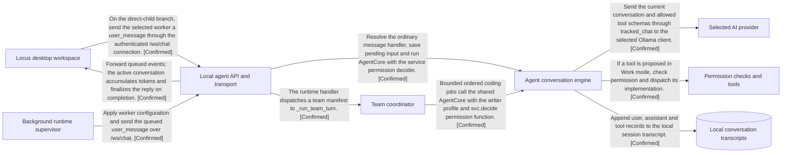
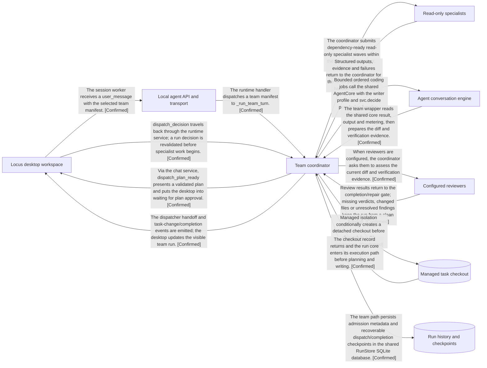

# X-Ray

## The 30-Second Explanation

Locus brings AI conversations, project files, a browser, tools and ongoing agent work into one Mac app. The native interface sends work to a Python agent backend. That backend chooses the configured model, runs permitted tools and keeps local conversation and run records. Teams add planning and review; recurring agents start from scheduled triggers. Other capabilities include saved goals and task plans, output libraries, extensions, Calendar, Board, mobile access and remote runtimes. A local workspace does not mean every selected model runs locally.

Confidence: **Confirmed**. Evidence: [E1](#e1), [E2](#e2), [E3](#e3), [E4](#e4), [E5](#e5), [E6](#e6), [E7](#e7), [E8](#e8), [E9](#e9), [E10](#e10), [E11](#e11).

## What This Project Can Do

These are the capabilities identified in the inspected scope. Trace coverage describes how far X-Ray followed the code; it does not establish that a feature works in production.

| Capability | What it does | Trace coverage | In this report | Confidence | Evidence |
| --- | --- | --- | --- | --- | --- |
| Chat and work with AI | Send a request, receive a streamed answer and let permitted tools act on the workspace. Ask/Just Chat limits tool access; provider and execution mode select different routes. The representative trace follows local Ollama with a direct child worker. | Traced | Selected walkthrough | Confirmed | [E12](#e12), [E13](#e13), [E14](#e14), [E15](#e15), [E16](#e16), [E17](#e17), [E18](#e18) |
| Plan work on a shared board | Use workspace-scoped cards, open their details and create or organize work through the Board panel. | Not traced yet | Available to focus on | Confirmed | [E6](#e6), [E19](#e19) |
| Browse and inspect websites | Use session browser tabs, attach captures, and inspect console/network information. The full agent-driven browser round trip is not traced here. | Not traced yet | Available to focus on | Confirmed | [E20](#e20), [E21](#e21) |
| View and create calendar events | Use macOS calendars after EventKit access is granted; creation validates fields and a writable calendar. | Not traced yet | Available to focus on | Confirmed | [E6](#e6), [E22](#e22), [E23](#e23) |
| Choose models and accounts | Select local Ollama or a configured remote/managed account and inspect per-account model catalogs. Availability depends on setup. | Not traced yet | Available to focus on | Confirmed | [E24](#e24), [E4](#e4), [E25](#e25) |
| Let agents use Mac apps | Native computer actions require enabled task access and macOS Accessibility permission, then return a result to the conversation. | Not traced yet | Available to focus on | Confirmed | [E26](#e26), [E27](#e27) |
| Connect tools, plugins and skills | Manage plugins/skills and MCP server connections, resources and prompts through registered extension operations. | Not traced yet | Available to focus on | Confirmed | [E28](#e28), [E9](#e9) |
| Delegate work to a team | Choose specialist profiles and a team to plan a task, gather independent evidence, assign coding jobs, and produce a reviewed handoff with visible run progress. | Traced | Selected walkthrough | Confirmed | [E29](#e29), [E30](#e30), [E31](#e31), [E32](#e32), [E33](#e33), [E34](#e34), [E35](#e35), [E36](#e36) |
| Revisit and revise outputs | Open saved documents and output versions, preview them, or attach a saved version to prepare a revision. Image editing is conditional on backend support. | Not traced yet | Available to focus on | Confirmed | [E8](#e8), [E37](#e37), [E38](#e38) |
| Keep working toward a goal | Create an objective bound to a chat, workspace, model and optional team; continuation is gated by chat and account state. | Not traced yet | Available to focus on | Confirmed | [E7](#e7), [E39](#e39), [E40](#e40) |
| Continue from a phone | Enable Mobile Access, pair a companion, and dispatch chat, activity, approval and schedule requests. Device transport is not traced end to end. | Not traced yet | Available to focus on | Confirmed | [E41](#e41), [E42](#e42), [E10](#e10) |
| Work with project files and changes | Browse files, attach context, review changes and open a terminal beside the conversation. | Not traced yet | Available to focus on | Confirmed | [E38](#e38), [E6](#e6), [E43](#e43) |
| Run recurring agents | Schedule agent work once or on a recurring timetable, continue each agent’s dedicated conversation, and inspect saved run history. Runtime/account availability and permission requests can delay or pause work. | Partly traced | Selected walkthrough | Confirmed | [E44](#e44), [E45](#e45), [E46](#e46), [E47](#e47), [E48](#e48), [E49](#e49) |
| Run agents on another host | When independent runtimes are enabled, use remote deployment controls and retrieve returned changes. No real host was contacted. | Not traced yet | Available to focus on | Confirmed | [E50](#e50), [E11](#e11), [E51](#e51) |
| Save and revisit task plans | Open saved Task Capsules and create, update or validate their recipes. Recovery and verification internals are outside this first trace. | Not traced yet | Available to focus on | Confirmed | [E40](#e40), [E52](#e52), [E53](#e53) |
| Preview an iOS simulator | Open a device picker or attached simulator workspace and start/stop its preview. A working installed simulator was not tested. | Not traced yet | Available to focus on | Confirmed | [E6](#e6), [E54](#e54) |
| Dictate or use voice mode | Composer controls start dictation or voice mode; live audio/recognition behavior was not followed. | Not traced yet | Available to focus on | Confirmed | [E55](#e55) |

### Where to Start

X-Ray selects up to three recorded flows using the capability priorities and reasons below. These are editorial starting points, not measured usage rankings. Other capabilities stay in the overview, including ones that still need tracing.

- **Chat and work with AI**: Explains the main message path: desktop, agent, model, permitted tools and saved chat. Walkthrough: Work with AI: local Ollama path.
- **Delegate work to a team**: Adds planning, specialist evidence and code review to ordinary conversation work. Walkthrough: Give a coding task to a team.
- **Run recurring agents**: Shows a different starting point: time, durable claims and background admission. Walkthrough: When a recurring agent becomes due.

### Explore One Capability

In Codex, use `$x-ray focus "board"`. In Claude Code, use `/x-ray focus "board"`. You can also ask in ordinary language. X-Ray reuses current evidence and inspects missing or changed parts of that capability.

| Capability | Use this ID | Why this priority |
| --- | --- | --- |
| Chat and work with AI | work\_with\_ai | Explains the main message path: desktop, agent, model, permitted tools and saved chat. |
| Plan work on a shared board | board | A user-facing planning surface whose full persistence and agent-tool path can be explored separately. |
| Browse and inspect websites | browse\_web | A useful independent follow-up for understanding how native browser actions reach the agent. |
| View and create calendar events | calendar | A distinct native integration kept available for a focused request. |
| Choose models and accounts | choose\_models | Routing is central to the product, but tracing every provider would repeat much of the main AI-work story. |
| Let agents use Mac apps | computer\_control | Native permission and action handling is an additional boundary that can be focused on separately. |
| Connect tools, plugins and skills | connect\_tools | Extends the agent toolbox; individual extension execution paths can be inspected on demand. |
| Delegate work to a team | delegate\_work | Adds planning, specialist evidence and code review to ordinary conversation work. |
| Revisit and revise outputs | outputs\_library | Shows the deliverable lifecycle; individual extraction/export/image-generation paths are not traced in the default three examples. |
| Keep working toward a goal | persistent\_goals | Durable continuation is a separate deep dive from the three representative first-look flows. |
| Continue from a phone | phone\_access | Optional companion integration; its boundary stays visible without taking a default walkthrough slot. |
| Work with project files and changes | project\_workspace | These supporting workspace actions are visible entrypoints; the main AI-work example shows the broader request path. |
| Run recurring agents | recurring\_agents | Shows a different starting point: time, durable claims and background admission. |
| Run agents on another host | remote\_agents | Optional execution topology deserves its own later trace; endpoint presence does not establish a deployed remote host. |
| Save and revisit task plans | task\_capsules | A useful focused follow-up for saved progress and validation, without duplicating team execution in the overview. |
| Preview an iOS simulator | simulator | Specialized development tool, available for a dedicated trace. |
| Dictate or use voice mode | voice | Optional input mode; the core work flow is representative of what happens after a request is submitted. |

## How the main parts connect (Simple)

The native workspace talks to the agent backend. Conversation work reaches a selected model, permissioned tools and local transcripts; team and recurring work reuse execution paths. This small view omits feature panels, schedule claiming, team specialists/reviewers and many return edges. It shows connections, not one execution order.

Confidence: **Confirmed**. Evidence: [E56](#e56), [E57](#e57), [E58](#e58), [E59](#e59), [E60](#e60), [E61](#e61), [E62](#e62), [E63](#e63), [E64](#e64), [E65](#e65), [E66](#e66), [E67](#e67), [E13](#e13), [E16](#e16), [E68](#e68), [E69](#e69), [E70](#e70), [E71](#e71), [E17](#e17), [E72](#e72), [E73](#e73), [E74](#e74), [E75](#e75), [E76](#e76), [E18](#e18), [E77](#e77), [E78](#e78), [E79](#e79), [E80](#e80), [E81](#e81), [E82](#e82), [E83](#e83), [E84](#e84), [E85](#e85), [E34](#e34), [E86](#e86), [E87](#e87), [E88](#e88), [E89](#e89), [E90](#e90).



Plain-text version:

```text
How the main parts connect (Simple; Confirmed)

[n0] Locus desktop workspace
[n1] Local agent API and transport
[n2] Agent conversation engine
[n3] Selected AI provider
[n4] Permission checks and tools
[n5] Local conversation transcripts
[n6] Team coordinator
[n7] Background runtime supervisor

[n0] -> [n1] : On the direct-child branch, send the selected worker a user_message through the authenticated /ws/chat connection. [Confirmed] (Locus desktop workspace -> Local agent API and transport)
[n1] -> [n2] : Resolve the ordinary message handler, save pending input and run AgentCore with the service permission decider. [Confirmed] (Local agent API and transport -> Agent conversation engine)
[n2] -> [n3] : Send the current conversation and allowed tool schemas through tracked_chat to the selected Ollama client. [Confirmed] (Agent conversation engine -> Selected AI provider)
[n2] -> [n4] : If a tool is proposed in Work mode, check permission and dispatch its implementation. [Confirmed] (Agent conversation engine -> Permission checks and tools)
[n2] -> [n5] : Append user, assistant and tool records to the local session transcript. [Confirmed] (Agent conversation engine -> Local conversation transcripts)
[n1] -> [n0] : Forward queued events; the active conversation accumulates tokens and finalizes the reply on completion. [Confirmed] (Local agent API and transport -> Locus desktop workspace)
[n1] -> [n6] : The runtime handler dispatches a team manifest to _run_team_turn. [Confirmed] (Local agent API and transport -> Team coordinator)
[n6] -> [n2] : Bounded ordered coding jobs call the shared AgentCore with the writer profile and svc.decide permission function. [Confirmed] (Team coordinator -> Agent conversation engine)
[n7] -> [n1] : Apply worker configuration and send the queued user_message over /ws/chat. [Confirmed] (Background runtime supervisor -> Local agent API and transport)

Links: -> confirmed; --~-> likely; --?-> unclear.
```

Claim evidence: [Major Systems and Components](#major-systems-and-components) and [How Everything Connects](#how-everything-connects). Full canonical data: [graph.json](graph.json).

## What This Project Is

**Locus** (Native macOS workspace with a Python agent backend). A local workspace for conversations, project tools, agent teams and recurring work, with optional native integrations, mobile access and remote execution.

Confidence: **Confirmed**. Evidence: [E1](#e1), [E38](#e38), [E3](#e3), [E6](#e6).

Scope: First-look source report of Locus: capability inventory across the native workspace and Python backend; three representative walkthroughs for local Ollama Work, an ordered team task, and a due recurring agent. Other capabilities are mapped at entrypoints, not fully traced.

Usage labels distinguish a declaration from a working connection: **Installed** means declared in a manifest; **Configured** means configuration exists; **Used** means a reachable code path invokes it. This is static repository evidence, not a claim that production was observed. **Likely unused** is a bounded inference; **Usage unknown** leaves usage unresolved.

## What the Code Is Made Of

Recognized source files in the supplied repository inventory, including tests and tools. Physical lines include comments and blank lines; this is code volume, not importance.

802 source files; 386,904 physical lines, including blanks and comments.

| Language | Files | Physical lines | Share | Role |
| --- | --- | --- | --- | --- |
| Swift | 423 | 249,153 | 64.4% | Swift source |
| Python | 262 | 115,961 | 30.0% | Python source |
| TypeScript | 54 | 8,387 | 2.2% | TypeScript source |
| Shell | 28 | 4,174 | 1.1% | Shell source |
| Rust | 8 | 3,514 | 0.9% | Rust source |
| Dart | 12 | 3,320 | 0.9% | Dart source |
| Objective-C | 2 | 869 | 0.2% | Objective-C source |
| CSS | 3 | 739 | 0.2% | CSS source |
| JavaScript | 2 | 476 | 0.1% | JavaScript source |
| HTML | 3 | 196 | 0.1% | HTML source |
| Solidity | 1 | 72 | 0.0% | Solidity source |
| C++ | 2 | 37 | 0.0% | C++ source |
| Kotlin | 1 | 5 | 0.0% | Kotlin source |
| C/C++ headers | 1 | 1 | 0.0% | C/C++ headers source |

Excluded: Ignored or absent inventory entries; Vendor, third-party, bundled skills, build and generated directories; named bundles and minified JS/CSS; Manifests, documentation, data, media and other non-source formats; Secret files, symlinks, unreadable/binary files and source files over 8 MB (minified means a JS/CSS line over 20k bytes).

Confidence: **Confirmed**. Evidence: [E1](#e1), [E91](#e91), [E92](#e92).

Per-file measurement fingerprints are retained in graph.json. Counting a source file does not mean its behavior was inspected.

**What the code is for**

| Purpose | Files | Physical lines | Share |
|---|---:|---:|---:|
| Product | 460 | 254,238 | 65.7% |
| Tests | 247 | 113,363 | 29.3% |
| Developer tools | 13 | 2,418 | 0.6% |
| Unclassified | 82 | 16,885 | 4.4% |

Roles use explicit evidence-backed assignments; unmatched source stays unclassified. Shares use the same physical-line total as the language chart, including comments and blank lines.

## Technology Stack

| Technology | Purpose | Category | Usage | Confidence | Evidence |
| --- | --- | --- | --- | --- | --- |
| SwiftUI | Builds native workspace panels. | frontend | Used (reachable code) | Confirmed | [E6](#e6), [E55](#e55) |
| Python | Runs the local agent backend. | runtime | Configured | Confirmed | [E91](#e91), [E92](#e92) |
| FastAPI | Composes domain API routes and agent transport. | backend | Used (reachable code) | Confirmed | [E93](#e93), [E3](#e3) |
| EventKit | Reads and creates permitted calendar events. | native integration | Used (reachable code) | Confirmed | [E22](#e22), [E23](#e23) |
| Ollama | Streams the selected local model in the traced Ollama branch. | AI provider | Used (reachable code) | Confirmed | [E69](#e69), [E70](#e70) |
| SQLite | Stores run metadata, checkpoints and schedule records. Chat transcripts are separate JSONL files. | database | Used (reachable code) | Confirmed | [E94](#e94), [E95](#e95), [E96](#e96) |

**Important parts and their files**

Start here to understand the inspected program. These are reading priorities, not measured popularity or code quality.

| Part | Why it matters | Start with these files |
| --- | --- | --- |
| Locus desktop workspace | Connects the Mac workspace to each request and turns streamed backend events into visible replies\. | Locus/LocusApp\.swift<br>Locus/AppModel\+SendPipeline\.swift<br>Locus/AppModel\+BackendEvents\.swift<br>+ 7 other associated files in the full directory |
| Local agent API and transport | Registers backend feature routes and gates incoming chat connections before handing work to services\. | agent/ollama\_code/server\.py<br>agent/ollama\_code/api/\_\_init\_\_\.py<br>agent/ollama\_code/api/chat\_transport\.py<br>+ 6 other associated files in the full directory |
| Agent conversation engine | Runs conversations, selects the managed or classic provider path, and repeats model/tool steps on the classic path\. | agent/ollama\_code/core\.py<br>agent/ollama\_code/chat\_service\.py<br>+ 1 other associated file in the full directory |
| Permission checks and tools | Controls which proposed actions may run, requests permission when required, and dispatches tools\. | agent/ollama\_code/core\.py<br>agent/ollama\_code/tools\.py<br>agent/ollama\_code/chat\_service\.py |
| Run records and checkpoints | Keeps durable run events and recovery checkpoints in SQLite; chat transcripts live separately\. | agent/ollama\_code/runstore\.py |

| Part | Confidence | Evidence |
| --- | --- | --- |
| Locus desktop workspace | Confirmed | [E38](#e38), [E59](#e59), [E81](#e81) |
| Local agent API and transport | Confirmed | [E93](#e93), [E3](#e3), [E63](#e63) |
| Agent conversation engine | Confirmed | [E14](#e14), [E75](#e75), [E76](#e76), [E67](#e67) |
| Permission checks and tools | Confirmed | [E17](#e17), [E97](#e97), [E72](#e72), [E73](#e73) |
| Run records and checkpoints | Confirmed | [E98](#e98), [E99](#e99), [E96](#e96) |

## Major Systems and Components

| System | What it does | Usage | Confidence | Evidence |
| --- | --- | --- | --- | --- |
| Locus desktop workspace | Native SwiftUI workspace owns visible panels, user input and local tools. | Used (reachable code) | Confirmed | [E38](#e38), [E6](#e6), [E2](#e2) |
| Local agent API and transport | Python FastAPI routes and WebSocket entrypoints coordinate agent services; the desktop may attach to an independent runtime or launch a child backend. | Used (reachable code) | Confirmed | [E91](#e91), [E3](#e3), [E93](#e93) |
| Project files and review tools | Open workspace files, attach context, review changes, and reach the terminal. | Used (reachable code) | Confirmed | [E43](#e43), [E6](#e6), [E38](#e38) |
| Shared browser | Session browser panel shares tabs and captures with the conversation. | Used (reachable code) | Confirmed | [E20](#e20), [E21](#e21) |
| Model and account selection | Native account catalogs and server provider selection choose the inference route. | Used (reachable code) | Confirmed | [E24](#e24), [E4](#e4), [E25](#e25) |
| Plugins, skills and MCP | Registered routes install/manage extensions and expose MCP resources and connection operations. | Used (reachable code) | Confirmed | [E28](#e28), [E9](#e9) |
| Goals and saved task plans | Native workflow controls and backend routes support durable objectives and saved, validated task recipes. | Used (reachable code) | Confirmed | [E7](#e7), [E39](#e39), [E53](#e53), [E40](#e40) |
| Workspace library | Opens saved outputs and versions, previews documents and prepares saved versions for a new revision. | Used (reachable code) | Confirmed | [E8](#e8), [E37](#e37) |
| Calendar and workspace board | Native panels show permissioned EventKit calendars and workspace-scoped planning cards. | Used (reachable code) | Confirmed | [E6](#e6), [E22](#e22), [E23](#e23), [E19](#e19) |
| Mobile companion access | Opt-in pairing and a native command dispatcher connect companion requests to chat/activity/schedule actions. | Used (reachable code) | Confirmed | [E41](#e41), [E42](#e42), [E10](#e10) |
| Remote runtime controls | Optional remote-runtime panel and registered API routes expose deployment and returned-change operations. | Used (reachable code) | Confirmed | [E50](#e50), [E11](#e11), [E51](#e51) |
| Computer, voice and simulator controls | Native controls support task-scoped computer actions, voice input controls and attached simulator previews. These have separate availability and permission gates. | Used (reachable code) | Confirmed | [E26](#e26), [E27](#e27), [E55](#e55), [E54](#e54) |
| Agent conversation engine | Owns the conversation, chooses the managed or classic provider path, loops over model/tool results and emits progress. The walkthrough follows ordinary Work with a selected Ollama model. | Used (reachable code) | Confirmed | [E14](#e14), [E75](#e75), [E76](#e76), [E100](#e100) |
| Selected AI provider | Generates streamed replies and proposed tool calls. The traced implementation is the configured Ollama endpoint; remote API and managed ChatGPT/Claude account paths are separate branches. | Used (reachable code) | Confirmed | [E101](#e101), [E14](#e14), [E16](#e16), [E68](#e68), [E70](#e70) |
| Permission checks and tools | Checks whether a proposed action is allowed, waits for required permission and dispatches built-in or registered tools. File reading is the concrete implementation sampled here. | Used (reachable code) | Confirmed | [E17](#e17), [E72](#e72), [E73](#e73), [E102](#e102), [E97](#e97) |
| Local conversation transcripts | SessionStore appends JSONL conversation records. User input and execution-critical history can require strict persistence; ordinary transcript writes are best effort. This node does not represent all Locus storage. | Used (reachable code) | Confirmed | [E74](#e74), [E5](#e5), [E18](#e18) |
| Team coordinator | TeamOrchestrator and \_run\_team\_turn turn a validated team request into a plan, bounded jobs, reviews and a final handoff. | Used (reachable code) | Confirmed | [E103](#e103), [E32](#e32), [E85](#e85), [E36](#e36) |
| Read-only specialists | Structured specialist calls process bounded workspace and dependency evidence; optional child waves are constrained by the selected swarm policy. | Used (reachable code) | Confirmed | [E33](#e33), [E104](#e104), [E105](#e105) |
| Configured reviewers | Read-only reviewer calls assess the diff and supplied verification evidence; review count and unchanged-workspace checks gate completion when reviewers are configured. | Used (reachable code) | Confirmed | [E35](#e35), [E106](#e106) |
| Managed task checkout | TaskCheckoutStore creates a detached Git worktree and a recorded private baseline when managed isolation is requested for a Git project. | Used (reachable code) | Confirmed | [E107](#e107), [E108](#e108) |
| Run records and checkpoints | Shared RunStore SQLite persistence for orchestration run metadata, ordered events, job attempts and recoverable checkpoints. This is separate from chat transcript JSONL files. | Used (reachable code) | Confirmed | [E98](#e98), [E99](#e99), [E95](#e95), [E96](#e96), [E109](#e109), [E84](#e84) |
| Scheduled agent controls | Create or edit a recurring agent, choose its workspace/model/cadence, and inspect its saved history. | Used (reachable code) | Confirmed | [E44](#e44), [E110](#e110), [E111](#e111), [E112](#e112) |
| Schedule API | Validates schedule configuration, maintains a dedicated chat, claims due occurrences and exposes run history. | Used (reachable code) | Confirmed | [E113](#e113), [E114](#e114), [E115](#e115), [E116](#e116) |
| Schedule and occurrence records | RunStore operations persist schedules, claim each occurrence and relate history to runs and workflows in SQLite. | Used (reachable code) | Confirmed | [E117](#e117), [E118](#e118), [E119](#e119), [E49](#e49), [E94](#e94) |
| Due-time coordinator | Checks enabled schedules and queues due work when a desktop controller or keep-running policy allows it; also advances workflow steps. | Used (reachable code) | Confirmed | [E47](#e47), [E120](#e120), [E121](#e121) |
| Scheduled workflow execution | Snapshots a stored workflow and turns its next agent step into a durable run while synchronizing schedule history. | Used (reachable code) | Confirmed | [E122](#e122), [E123](#e123), [E124](#e124) |
| Background runtime supervisor | Admits queued work to session workers, applies saved configuration, sends commands and records waiting/completion events. | Used (reachable code) | Confirmed | [E125](#e125), [E87](#e87), [E126](#e126), [E89](#e89), [E48](#e48) |

## Component Technologies

| Component | Technology | Label / scope | Confidence | Evidence |
| --- | --- | --- | --- | --- |
| Locus desktop workspace | SwiftUI | SwiftUI | Confirmed | [E38](#e38) |
| Local agent API and transport | FastAPI | FastAPI | Confirmed | [E93](#e93) |
| Local agent API and transport | Python | Python | Confirmed | [E93](#e93) |
| Agent conversation engine | Python | Python | Confirmed | [E75](#e75) |
| Selected AI provider | Ollama | Ollama (traced path) | Confirmed | [E70](#e70) |
| Permission checks and tools | Python | Python | Confirmed | [E73](#e73) |
| Local conversation transcripts | Python | Python | Confirmed | [E5](#e5) |
| Local conversation transcripts | JSONL | JSONL | Confirmed | [E5](#e5) |
| Team coordinator | Python | Python | Confirmed | [E103](#e103) |
| Run records and checkpoints | SQLite | SQLite | Confirmed | [E98](#e98) |
| Background runtime supervisor | Python | Python | Confirmed | [E125](#e125) |

## How Everything Connects

| From | Connection | To | Confidence | Evidence |
| --- | --- | --- | --- | --- |
| Locus desktop workspace | Send authenticated HTTP requests or WebSocket messages | Local agent API and transport | Confirmed | [E127](#e127), [E2](#e2), [E93](#e93) |
| Locus desktop workspace | Open file, changes and terminal panels | Project files and review tools | Confirmed | [E38](#e38), [E6](#e6), [E43](#e43) |
| Locus desktop workspace | Open session browser and attach captures | Shared browser | Confirmed | [E6](#e6), [E20](#e20) |
| Locus desktop workspace | Open a workspace library or saved output version | Workspace library | Confirmed | [E38](#e38), [E8](#e8) |
| Locus desktop workspace | Open Calendar or Board | Calendar and workspace board | Confirmed | [E6](#e6), [E22](#e22), [E19](#e19) |
| Locus desktop workspace | Open a goal or saved task plan | Goals and saved task plans | Confirmed | [E40](#e40), [E7](#e7), [E52](#e52) |
| Local agent API and transport | Dispatch registered extension routes | Plugins, skills and MCP | Confirmed | [E3](#e3), [E9](#e9) |
| Local agent API and transport | Dispatch provider selection and model routes | Model and account selection | Confirmed | [E3](#e3), [E25](#e25) |
| Mobile companion access | Dispatch companion chat, activity and schedule requests | Locus desktop workspace | Confirmed | [E10](#e10) |
| Locus desktop workspace | Perform a gated native computer action and return its result | Computer, voice and simulator controls | Confirmed | [E26](#e26), [E27](#e27) |
| Locus desktop workspace | On the direct-child branch, send the selected worker a user\_message through the authenticated /ws/chat connection. | Local agent API and transport | Confirmed | [E56](#e56), [E57](#e57), [E58](#e58), [E59](#e59), [E60](#e60), [E61](#e61), [E62](#e62), [E63](#e63), [E64](#e64) |
| Local agent API and transport | Resolve the ordinary message handler, save pending input and run AgentCore with the service permission decider. | Agent conversation engine | Confirmed | [E65](#e65), [E66](#e66), [E67](#e67), [E13](#e13) |
| Agent conversation engine | Send the current conversation and allowed tool schemas through tracked\_chat to the selected Ollama client. | Selected AI provider | Confirmed | [E16](#e16), [E68](#e68), [E69](#e69), [E70](#e70) |
| Selected AI provider | Return streamed text through callbacks and the completed response with optional tool calls. | Agent conversation engine | Confirmed | [E70](#e70), [E128](#e128), [E76](#e76) |
| Agent conversation engine | If a tool is proposed in Work mode, check permission and dispatch its implementation. | Permission checks and tools | Confirmed | [E71](#e71), [E17](#e17), [E72](#e72), [E73](#e73) |
| Permission checks and tools | Return the tool output or denial/error text so the model can use it in the next iteration. | Agent conversation engine | Confirmed | [E71](#e71), [E73](#e73), [E17](#e17) |
| Agent conversation engine | Append user, assistant and tool records to the local session transcript. | Local conversation transcripts | Confirmed | [E74](#e74), [E75](#e75), [E76](#e76), [E71](#e71), [E18](#e18) |
| Local conversation transcripts | Return after append; ordinary transcript errors are swallowed while strict writes can raise. | Agent conversation engine | Confirmed | [E18](#e18), [E74](#e74) |
| Agent conversation engine | Emit progress during generation and a final turn\_done; ChatService queues these for the WebSocket event pump. | Local agent API and transport | Confirmed | [E128](#e128), [E100](#e100), [E129](#e129), [E130](#e130), [E77](#e77) |
| Local agent API and transport | Forward queued events; the active conversation accumulates tokens and finalizes the reply on completion. | Locus desktop workspace | Confirmed | [E77](#e77), [E78](#e78), [E79](#e79), [E80](#e80), [E81](#e81), [E82](#e82) |
| Locus desktop workspace | The session worker receives a user\_message with the selected team manifest. | Local agent API and transport | Confirmed | [E30](#e30), [E131](#e131), [E132](#e132), [E83](#e83) |
| Local agent API and transport | The runtime handler dispatches a team manifest to \_run\_team\_turn. | Team coordinator | Confirmed | [E83](#e83), [E84](#e84) |
| Team coordinator | Via the chat service, dispatch\_plan\_ready presents a validated plan and puts the desktop into waiting for plan approval. | Locus desktop workspace | Confirmed | [E32](#e32), [E133](#e133), [E134](#e134), [E135](#e135) |
| Locus desktop workspace | dispatch\_decision travels back through the runtime service; a run decision is revalidated before specialist work begins. | Team coordinator | Confirmed | [E136](#e136), [E137](#e137), [E133](#e133), [E32](#e32) |
| Team coordinator | The coordinator submits dependency-ready read-only specialist waves within the concurrency budget. | Read-only specialists | Confirmed | [E33](#e33), [E138](#e138), [E104](#e104) |
| Read-only specialists | Structured outputs, evidence and failures return to the coordinator for the writer prompt and final handoff. | Team coordinator | Confirmed | [E105](#e105), [E33](#e33) |
| Team coordinator | Bounded ordered coding jobs call the shared AgentCore with the writer profile and svc.decide permission function. | Agent conversation engine | Confirmed | [E85](#e85), [E34](#e34), [E86](#e86) |
| Agent conversation engine | The team wrapper reads the shared core result, output and metering, then prepares the diff and verification evidence. | Team coordinator | Confirmed | [E34](#e34), [E85](#e85) |
| Team coordinator | When reviewers are configured, the coordinator asks them to assess the current diff and verification evidence. | Configured reviewers | Confirmed | [E35](#e35), [E106](#e106) |
| Configured reviewers | Review results return to the completion/repair gate; missing verdicts, changed files or unresolved findings keep the run from a clean handoff. | Team coordinator | Confirmed | [E35](#e35), [E106](#e106), [E139](#e139) |
| Team coordinator | The dispatcher handoff and task-change/completion events are emitted; the desktop updates the visible team run. | Locus desktop workspace | Confirmed | [E140](#e140), [E36](#e36), [E141](#e141) |
| Team coordinator | Managed isolation conditionally creates a detached checkout before dispatch in a Git workspace. | Managed task checkout | Confirmed | [E107](#e107), [E108](#e108) |
| Managed task checkout | The checkout record returns and the run core enters its execution path before planning and writing. | Team coordinator | Confirmed | [E108](#e108), [E107](#e107) |
| Team coordinator | The team path persists admission metadata and recoverable dispatch/completion checkpoints in the shared RunStore SQLite database. | Run records and checkpoints | Confirmed | [E84](#e84), [E133](#e133), [E36](#e36), [E95](#e95), [E96](#e96), [E109](#e109) |
| Due-time coordinator | Dispatch the due enabled schedule when controller/keep-running eligibility permits. | Schedule API | Confirmed | [E47](#e47), [E115](#e115) |
| Schedule API | Claim an occurrence before creating outside work. | Schedule and occurrence records | Confirmed | [E115](#e115), [E118](#e118) |
| Schedule and occurrence records | Return schedule, occurrence and whether this caller owns the claim. | Schedule API | Confirmed | [E118](#e118), [E115](#e115) |
| Schedule API | For a stored workflow with capability enabled, start its execution. | Scheduled workflow execution | Confirmed | [E142](#e142), [E122](#e122) |
| Scheduled workflow execution | Create/advance workflow state, queue the agent step and bind its run. | Schedule and occurrence records | Confirmed | [E122](#e122), [E123](#e123), [E143](#e143) |
| Schedule and occurrence records | Return the saved run and bound workflow execution. | Scheduled workflow execution | Confirmed | [E123](#e123) |
| Scheduled workflow execution | Return workflow action/execution and any queued run to schedule dispatch. | Schedule API | Confirmed | [E122](#e122), [E123](#e123), [E142](#e142) |
| Schedule API | Return the linked occurrence and queued run; coordinator queues returned work. | Due-time coordinator | Confirmed | [E142](#e142), [E47](#e47) |
| Due-time coordinator | Resolve saved model/profile/account requirements and enqueue a user message for the schedule session. | Background runtime supervisor | Confirmed | [E120](#e120), [E126](#e126) |
| Background runtime supervisor | Apply worker configuration and send the queued user\_message over /ws/chat. | Local agent API and transport | Confirmed | [E87](#e87), [E88](#e88), [E89](#e89), [E90](#e90) |
| Local agent API and transport | A supported solo/profile user-message branch starts a user turn, which invokes AgentCore. | Agent conversation engine | Confirmed | [E90](#e90), [E144](#e144), [E145](#e145) |
| Scheduled agent controls | Create Agent submits POST /api/schedules after draft validation. | Schedule API | Confirmed | [E44](#e44), [E110](#e110), [E111](#e111), [E113](#e113) |
| Schedule API | Validate and persist the schedule including recurrence and optional workflow. | Schedule and occurrence records | Confirmed | [E114](#e114), [E117](#e117) |
| Schedule and occurrence records | Return the saved definition so the API can ensure its dedicated chat. | Schedule API | Confirmed | [E117](#e117), [E114](#e114) |
| Schedule API | Return the schedule; update its UI list, close the editor and refresh chat metadata. | Scheduled agent controls | Confirmed | [E114](#e114), [E111](#e111) |
| Scheduled agent controls | Read the selected agent history page. | Schedule API | Confirmed | [E112](#e112), [E113](#e113) |
| Schedule API | Fetch occurrences with current run/workflow states scoped to the selected schedule. | Schedule and occurrence records | Confirmed | [E116](#e116), [E49](#e49) |
| Schedule and occurrence records | Return paginated history, status counts and workflow links. | Schedule API | Confirmed | [E49](#e49), [E116](#e116) |
| Schedule API | Return history for the inspector snapshot. | Scheduled agent controls | Confirmed | [E116](#e116), [E112](#e112), [E146](#e146) |
| Schedule and occurrence records | Schedule and history operations execute against RunStore SQLite connections. | Run records and checkpoints | Confirmed | [E94](#e94), [E117](#e117), [E49](#e49) |
| Background runtime supervisor | Invoke automation tick while runtime is not paused or in maintenance. | Due-time coordinator | Confirmed | [E125](#e125) |

## Which Locus this report describes

This is a first-look source report of the native Locus workspace and its Python agent backend. The build separates ordinary Locus from the optional wallet-bearing LocusX edition. Wallet execution, mobile transport, deployed remote hosts, generated build products, and third-party internals are outside the traced scope. The capability inventory lists discovered entrypoints; a missing walkthrough does not mean a feature is absent.

Confidence: **Confirmed**. Evidence: [E147](#e147), [E148](#e148), [E1](#e1).

Systems: Locus desktop workspace, Local agent API and transport.

## One request can take different routes

Submitting a draft can send immediately, queue behind active work or remain unsent while the worker is unavailable. With the independent runtime enabled, the app attaches a worker and uses the returned transport path; otherwise it starts a child worker. AgentCore routes managed ChatGPT/Claude accounts differently from the classic Ollama/API loop. The selected walkthrough shows the direct-child Ollama branch so its steps stay concrete.

Confidence: **Confirmed**. Evidence: [E149](#e149), [E12](#e12), [E56](#e56), [E14](#e14), [E101](#e101).

Systems: Locus desktop workspace, Local agent API and transport, Agent conversation engine, Selected AI provider, Permission checks and tools, Local conversation transcripts.

## What can pause or end a Work request

The socket rejects invalid configured authentication or disallowed origins. A request that cannot be saved before admission is not started, and a busy worker rejects another turn. Tool permission may pause work until a decision; denial returns a tool result so the model can respond or choose another action. Just Chat blocks tool execution. A provider-stream error preserves visible partial text and emits an error. Ordinary transcript writes are best effort; strict input and execution-critical writes flush to disk and can fail the operation.

Confidence: **Confirmed**. Evidence: [E63](#e63), [E66](#e66), [E17](#e17), [E97](#e97), [E150](#e150), [E15](#e15), [E151](#e151), [E18](#e18).

Systems: Locus desktop workspace, Local agent API and transport, Agent conversation engine, Selected AI provider, Permission checks and tools, Local conversation transcripts.

## How team work differs from ordinary chat

A team adds a dispatcher, dependency-aware read-only specialist calls, coding assignments, and configured reviewers around the shared agent core. The desktop validates routes and consent, then previews one complete dispatch plan. Specialists and reviewers receive evidence through model calls without mutation tools; writers use the ordinary permission decision function with their profile and call budget. Managed Git worktrees are conditional, so selecting a team alone does not guarantee isolation. Review findings can trigger a bounded repair cycle or leave the run paused; the handoff describes applying an isolated checkout as a separate action.

Confidence: **Confirmed**. Evidence: [E31](#e31), [E152](#e152), [E32](#e32), [E104](#e104), [E34](#e34), [E86](#e86), [E107](#e107), [E106](#e106), [E139](#e139), [E140](#e140).

Systems: Locus desktop workspace, Local agent API and transport, Team coordinator, Read-only specialists, Agent conversation engine, Configured reviewers, Managed task checkout, Run records and checkpoints.

## When recurring work can run

The independent runtime checks due schedules at a five-second minimum cadence while it is active. Dispatch requires a connected controller or keep-running permission for the automation. The legacy desktop coordinator checks every 30 seconds and is disabled when the independent runtime is enabled. This establishes code paths, not that a particular machine’s runtime is installed, awake or provisioned.

Confidence: **Confirmed**. Evidence: [E47](#e47), [E125](#e125), [E153](#e153), [E154](#e154).

Systems: Due-time coordinator, Background runtime supervisor, Scheduled agent controls.

## What can stop a scheduled run

Schedule creation requires a valid future recurrence, an available workspace, and a configured model/account; worktree execution requires a Git workspace. A busy dedicated chat causes a skipped occurrence, with one-time slots rearmed. Missing account/profile prerequisites wait for attention, and runtime approval/native-tool requests enter waiting states. Stored workflows take their workflow path; older definitions use the direct queued-run path.

Confidence: **Confirmed**. Evidence: [E155](#e155), [E156](#e156), [E157](#e157), [E120](#e120), [E48](#e48), [E142](#e142), [E158](#e158).

Systems: Schedule API, Schedule and occurrence records, Due-time coordinator, Background runtime supervisor.

## Where recurring work is remembered

Each scheduled agent has a persistent dedicated chat. Occurrences are separately linked to runs/workflow executions, and the inspector requests a paginated history scoped to that schedule. Workflow origin synchronization is best effort; the execution record remains authoritative. A saved history row does not establish that every requested external effect succeeded.

Confidence: **Confirmed**. Evidence: [E46](#e46), [E112](#e112), [E49](#e49), [E124](#e124).

Systems: Schedule API, Schedule and occurrence records, Scheduled agent controls, Scheduled workflow execution.

## What Happens When You Use It

### Work with AI: local Ollama path

Trigger: Send an ordinary Work message with an Ollama model selected and the direct child-worker transport in use.

The native app admits the request and sends it to a Python worker. AgentCore alternates model responses with any permitted tools, saves conversation records and streams events back to the chat. Tool steps are conditional; progress and persistence happen throughout the turn. This is one confirmed static branch, not a claim about the currently active runtime or provider.

Trace: **Complete**. Confidence: **Confirmed**. Evidence: [E60](#e60), [E66](#e66), [E13](#e13), [E16](#e16), [E71](#e71), [E18](#e18), [E82](#e82).

| Step | What happens | System | Connection | Confidence | Evidence |
| --- | --- | --- | --- | --- | --- |
| 1 | Submit a Work request in an ordinary conversation, using the direct child-worker branch with an Ollama model selected. | Locus desktop workspace | Starting point | Confirmed | [E159](#e159), [E12](#e12), [E149](#e149), [E56](#e56) |
| 2 | Receive the user\_message on the authenticated local chat socket and validate its route. | Local agent API and transport | On the direct-child branch, send the selected worker a user\_message through the authenticated /ws/chat connection. (Confirmed; [E56](#e56), [E57](#e57), [E58](#e58), [E59](#e59), [E60](#e60), [E61](#e61), [E62](#e62), [E63](#e63), [E64](#e64)) | Confirmed | [E63](#e63), [E64](#e64), [E59](#e59), [E65](#e65) |
| 3 | Accept the turn, retain its input, load Work context and choose the classic provider loop. | Agent conversation engine | Resolve the ordinary message handler, save pending input and run AgentCore with the service permission decider. (Confirmed; [E65](#e65), [E66](#e66), [E67](#e67), [E13](#e13)) | Confirmed | [E66](#e66), [E67](#e67), [E13](#e13), [E75](#e75), [E14](#e14) |
| 4 | Send the conversation and available tools to the selected Ollama endpoint for a streamed answer. | Selected AI provider | Send the current conversation and allowed tool schemas through tracked\_chat to the selected Ollama client. (Confirmed; [E16](#e16), [E68](#e68), [E69](#e69), [E70](#e70)) | Confirmed | [E16](#e16), [E68](#e68), [E69](#e69), [E70](#e70) |
| 5 | Forward text as it arrives and inspect the completed response for requested actions. | Agent conversation engine | Return streamed text through callbacks and the completed response with optional tool calls. (Confirmed; [E70](#e70), [E128](#e128), [E76](#e76)) | Confirmed | [E128](#e128), [E76](#e76) |
| 6 | When the model requests a tool, check permission and execute the allowed action; a denial returns an explanation. | Permission checks and tools | If a tool is proposed in Work mode, check permission and dispatch its implementation. (Confirmed; [E71](#e71), [E17](#e17), [E72](#e72), [E73](#e73)) | Confirmed | [E17](#e17), [E72](#e72), [E73](#e73) |
| 7 | Add the tool result to the conversation and repeat the model/tool loop until it can finish; skip the tool branch when no action was requested. | Agent conversation engine | Return the tool output or denial/error text so the model can use it in the next iteration. (Confirmed; [E71](#e71), [E73](#e73), [E17](#e17)) | Confirmed | [E71](#e71), [E15](#e15), [E76](#e76) |
| 8 | Append conversation records throughout the turn, including assistant replies and tool output. | Local conversation transcripts | Append user, assistant and tool records to the local session transcript. (Confirmed; [E74](#e74), [E75](#e75), [E76](#e76), [E71](#e71), [E18](#e18)) | Confirmed | [E74](#e74), [E76](#e76), [E71](#e71), [E5](#e5), [E18](#e18) |
| 9 | Resume after persistence and publish the terminal reason when output processing is finished. | Agent conversation engine | Return after append; ordinary transcript errors are swallowed while strict writes can raise. (Confirmed; [E18](#e18), [E74](#e74)) | Confirmed | [E18](#e18), [E74](#e74), [E100](#e100) |
| 10 | Relay progress throughout the turn; send turn\_done only after the worker future finishes. | Local agent API and transport | Emit progress during generation and a final turn\_done; ChatService queues these for the WebSocket event pump. (Confirmed; [E128](#e128), [E100](#e100), [E129](#e129), [E130](#e130), [E77](#e77)) | Confirmed | [E129](#e129), [E130](#e130), [E77](#e77) |
| 11 | Display streamed text in the active conversation, finalize its blocks and clear the busy state on turn\_done. | Locus desktop workspace | Forward queued events; the active conversation accumulates tokens and finalizes the reply on completion. (Confirmed; [E77](#e77), [E78](#e78), [E79](#e79), [E80](#e80), [E81](#e81), [E82](#e82)) | Confirmed | [E78](#e78), [E79](#e79), [E80](#e80), [E81](#e81), [E82](#e82) |

#### From Work message to streamed answer (Simple)

Representative direct-child/Ollama path. The model/tool loop is conditional; progress events stream while the turn continues. Independent runtime and other provider internals are outside this walkthrough.

Confidence: **Confirmed**. Evidence: [E60](#e60), [E13](#e13), [E16](#e16), [E71](#e71), [E18](#e18), [E82](#e82).

```mermaid
sequenceDiagram
    participant n0 as Locus desktop workspace
    participant n1 as Local agent API and transport
    participant n2 as Agent conversation engine
    participant n3 as Selected AI provider
    participant n4 as Permission checks and tools
    participant n5 as Local conversation transcripts
    Note over n0: Start#58; Submit a Work request in an ordinary conversation, using the direct child-worker branch with an Ollama model selected. #91;Confirmed#93;
    n0->>n1: Receive the user_message on the authenticated local chat socket and validate its route. #124; On the direct-child branch, send the selected worker a user_message through the authenticated /ws/chat connection. #91;Confirmed#93;
    n1->>n2: Accept the turn, retain its input, load Work context and choose the classic provider loop. #124; Resolve the ordinary message handler, save pending input and run AgentCore with the service permission decider. #91;Confirmed#93;
    n2->>n3: Send the conversation and available tools to the selected Ollama endpoint for a streamed answer. #124; Send the current conversation and allowed tool schemas through tracked_chat to the selected Ollama client. #91;Confirmed#93;
    n3->>n2: Forward text as it arrives and inspect the completed response for requested actions. #124; Return streamed text through callbacks and the completed response with optional tool calls. #91;Confirmed#93;
    n2->>n4: When the model requests a tool, check permission and execute the allowed action#59; a denial returns an explanation. #124; If a tool is proposed in Work mode, check permission and dispatch its implementation. #91;Confirmed#93;
    n4->>n2: Add the tool result to the conversation and repeat the model/tool loop until it can finish#59; skip the tool branch when no action was requested. #124; Return the tool output or denial/error text so the model can use it in the next iteration. #91;Confirmed#93;
    n2->>n5: Append conversation records throughout the turn, including assistant replies and tool output. #124; Append user, assistant and tool records to the local session transcript. #91;Confirmed#93;
    n5->>n2: Resume after persistence and publish the terminal reason when output processing is finished. #124; Return after append#59; ordinary transcript errors are swallowed while strict writes can raise. #91;Confirmed#93;
    n2->>n1: Relay progress throughout the turn#59; send turn_done only after the worker future finishes. #124; Emit progress during generation and a final turn_done#59; ChatService queues these for the WebSocket event pump. #91;Confirmed#93;
    n1->>n0: Display streamed text in the active conversation, finalize its blocks and clear the busy state on turn_done. #124; Forward queued events#59; the active conversation accumulates tokens and finalizes the reply on completion. #91;Confirmed#93;
```



Plain-text version:

```text
From Work message to streamed answer (Simple; Confirmed)

[n0] Locus desktop workspace
[n1] Local agent API and transport
[n2] Agent conversation engine
[n3] Selected AI provider
[n4] Permission checks and tools
[n5] Local conversation transcripts

1. Start at [n0]: Submit a Work request in an ordinary conversation, using the direct child-worker branch with an Ollama model selected. [Confirmed]
2. [n0] -> [n1] : Receive the user_message on the authenticated local chat socket and validate its route. | On the direct-child branch, send the selected worker a user_message through the authenticated /ws/chat connection. [Confirmed] (Locus desktop workspace -> Local agent API and transport)
3. [n1] -> [n2] : Accept the turn, retain its input, load Work context and choose the classic provider loop. | Resolve the ordinary message handler, save pending input and run AgentCore with the service permission decider. [Confirmed] (Local agent API and transport -> Agent conversation engine)
4. [n2] -> [n3] : Send the conversation and available tools to the selected Ollama endpoint for a streamed answer. | Send the current conversation and allowed tool schemas through tracked_chat to the selected Ollama client. [Confirmed] (Agent conversation engine -> Selected AI provider)
5. [n3] -> [n2] : Forward text as it arrives and inspect the completed response for requested actions. | Return streamed text through callbacks and the completed response with optional tool calls. [Confirmed] (Selected AI provider -> Agent conversation engine)
6. [n2] -> [n4] : When the model requests a tool, check permission and execute the allowed action; a denial returns an explanation. | If a tool is proposed in Work mode, check permission and dispatch its implementation. [Confirmed] (Agent conversation engine -> Permission checks and tools)
7. [n4] -> [n2] : Add the tool result to the conversation and repeat the model/tool loop until it can finish; skip the tool branch when no action was requested. | Return the tool output or denial/error text so the model can use it in the next iteration. [Confirmed] (Permission checks and tools -> Agent conversation engine)
8. [n2] -> [n5] : Append conversation records throughout the turn, including assistant replies and tool output. | Append user, assistant and tool records to the local session transcript. [Confirmed] (Agent conversation engine -> Local conversation transcripts)
9. [n5] -> [n2] : Resume after persistence and publish the terminal reason when output processing is finished. | Return after append; ordinary transcript errors are swallowed while strict writes can raise. [Confirmed] (Local conversation transcripts -> Agent conversation engine)
10. [n2] -> [n1] : Relay progress throughout the turn; send turn_done only after the worker future finishes. | Emit progress during generation and a final turn_done; ChatService queues these for the WebSocket event pump. [Confirmed] (Agent conversation engine -> Local agent API and transport)
11. [n1] -> [n0] : Display streamed text in the active conversation, finalize its blocks and clear the busy state on turn_done. | Forward queued events; the active conversation accumulates tokens and finalizes the reply on completion. [Confirmed] (Local agent API and transport -> Locus desktop workspace)

Links: -> confirmed; --~-> likely; --?-> unclear.
```

Claim evidence: [Major Systems and Components](#major-systems-and-components) and [How Everything Connects](#how-everything-connects). Full canonical data: [graph.json](graph.json).

### Give a coding task to a team

Trigger: Choose a team in the composer and send a Work message. This representative path uses the Locus-managed engine, ordered coding jobs and a plan containing specialists and a reviewer.

Locus validates the team, presents its plan, collects read-only specialist evidence, runs permission-controlled coding jobs, checks configured review results, and returns a reviewable handoff. Managed checkout creation is conditional. Complete means the scoped source path is traced, not that a live run has passed.

Trace: **Complete**. Confidence: **Confirmed**. Evidence: [E30](#e30), [E31](#e31), [E83](#e83), [E103](#e103), [E32](#e32), [E33](#e33), [E104](#e104), [E34](#e34), [E35](#e35), [E106](#e106), [E36](#e36), [E141](#e141).

| Step | What happens | System | Connection | Confidence | Evidence |
| --- | --- | --- | --- | --- | --- |
| 1 | Choose a team and submit the task; build a valid manifest with provider-routing consent and configured limits. | Locus desktop workspace | Starting point | Confirmed | [E29](#e29), [E30](#e30), [E31](#e31), [E152](#e152) |
| 2 | Receive the team-bearing message through the session worker transport. | Local agent API and transport | The session worker receives a user\_message with the selected team manifest. (Confirmed; [E30](#e30), [E131](#e131), [E132](#e132), [E83](#e83)) | Confirmed | [E131](#e131), [E132](#e132), [E83](#e83) |
| 3 | Record the run, optionally enter a managed Git checkout, and prepare a validated dispatch plan. | Team coordinator | The runtime handler dispatches a team manifest to \_run\_team\_turn. (Confirmed; [E83](#e83), [E84](#e84)) | Confirmed | [E84](#e84), [E107](#e107), [E103](#e103) |
| 4 | Present the plan and wait for the user to run it, request a new plan, or cancel. | Locus desktop workspace | Via the chat service, dispatch\_plan\_ready presents a validated plan and puts the desktop into waiting for plan approval. (Confirmed; [E32](#e32), [E133](#e133), [E134](#e134), [E135](#e135)) | Confirmed | [E133](#e133), [E134](#e134), [E135](#e135) |
| 5 | Accept a Run decision and revalidate the chosen plan and its limits. | Team coordinator | dispatch\_decision travels back through the runtime service; a run decision is revalidated before specialist work begins. (Confirmed; [E136](#e136), [E137](#e137), [E133](#e133), [E32](#e32)) | Confirmed | [E136](#e136), [E137](#e137), [E32](#e32) |
| 6 | Execute dependency-ready read-only specialist waves with bounded workspace evidence. | Read-only specialists | The coordinator submits dependency-ready read-only specialist waves within the concurrency budget. (Confirmed; [E33](#e33), [E138](#e138), [E104](#e104)) | Confirmed | [E33](#e33), [E138](#e138), [E104](#e104) |
| 7 | Collect specialist results and use them to prepare ordered coding assignments. | Team coordinator | Structured outputs, evidence and failures return to the coordinator for the writer prompt and final handoff. (Confirmed; [E105](#e105), [E33](#e33)) | Confirmed | [E105](#e105), [E33](#e33), [E85](#e85) |
| 8 | Run each coding job through the shared agent core with its profile, permission function and model-call allowance. | Agent conversation engine | Bounded ordered coding jobs call the shared AgentCore with the writer profile and svc.decide permission function. (Confirmed; [E85](#e85), [E34](#e34), [E86](#e86)) | Confirmed | [E34](#e34), [E86](#e86) |
| 9 | Collect coding output and usage, then gather the current diff and verification evidence. | Team coordinator | The team wrapper reads the shared core result, output and metering, then prepares the diff and verification evidence. (Confirmed; [E34](#e34), [E85](#e85)) | Confirmed | [E34](#e34), [E85](#e85) |
| 10 | Have configured reviewers assess the diff and verification evidence. | Configured reviewers | When reviewers are configured, the coordinator asks them to assess the current diff and verification evidence. (Confirmed; [E35](#e35), [E106](#e106)) | Confirmed | [E35](#e35), [E106](#e106) |
| 11 | Check reviewer verdicts and unchanged files; repair/re-review when required within the remaining budget, then synthesize the handoff. | Team coordinator | Review results return to the completion/repair gate; missing verdicts, changed files or unresolved findings keep the run from a clean handoff. (Confirmed; [E35](#e35), [E106](#e106), [E139](#e139)) | Confirmed | [E106](#e106), [E139](#e139), [E140](#e140), [E36](#e36) |
| 12 | Show the handoff, per-agent completion state and task changes. | Locus desktop workspace | The dispatcher handoff and task-change/completion events are emitted; the desktop updates the visible team run. (Confirmed; [E140](#e140), [E36](#e36), [E141](#e141)) | Confirmed | [E36](#e36), [E141](#e141) |

#### Team task: plan, specialist evidence, coding and review (Simple)

Representative ordered Locus-managed team path. Plan review is explicit; specialist and reviewer calls are read-only. Workspace isolation is conditional and final application to the source checkout is outside this trace.

Confidence: **Confirmed**. Evidence: [E30](#e30), [E31](#e31), [E83](#e83), [E103](#e103), [E32](#e32), [E33](#e33), [E104](#e104), [E34](#e34), [E35](#e35), [E106](#e106), [E36](#e36), [E141](#e141), [E107](#e107), [E108](#e108).

Shown as a connection graph because the selected relationships do not establish a complete event order.



Plain-text version:

```text
Team task: plan, specialist evidence, coding and review (Simple; Confirmed)

[n0] Locus desktop workspace
[n1] Local agent API and transport
[n2] Team coordinator
[n3] Read-only specialists
[n4] Agent conversation engine
[n5] Configured reviewers
[n6] Managed task checkout
[n7] Run history and checkpoints

[n0] -> [n1] : The session worker receives a user_message with the selected team manifest. [Confirmed] (Locus desktop workspace -> Local agent API and transport)
[n1] -> [n2] : The runtime handler dispatches a team manifest to _run_team_turn. [Confirmed] (Local agent API and transport -> Team coordinator)
[n2] -> [n0] : Via the chat service, dispatch_plan_ready presents a validated plan and puts the desktop into waiting for plan approval. [Confirmed] (Team coordinator -> Locus desktop workspace)
[n0] -> [n2] : dispatch_decision travels back through the runtime service; a run decision is revalidated before specialist work begins. [Confirmed] (Locus desktop workspace -> Team coordinator)
[n2] -> [n3] : The coordinator submits dependency-ready read-only specialist waves within the concurrency budget. [Confirmed] (Team coordinator -> Read-only specialists)
[n3] -> [n2] : Structured outputs, evidence and failures return to the coordinator for the writer prompt and final handoff. [Confirmed] (Read-only specialists -> Team coordinator)
[n2] -> [n4] : Bounded ordered coding jobs call the shared AgentCore with the writer profile and svc.decide permission function. [Confirmed] (Team coordinator -> Agent conversation engine)
[n4] -> [n2] : The team wrapper reads the shared core result, output and metering, then prepares the diff and verification evidence. [Confirmed] (Agent conversation engine -> Team coordinator)
[n2] -> [n5] : When reviewers are configured, the coordinator asks them to assess the current diff and verification evidence. [Confirmed] (Team coordinator -> Configured reviewers)
[n5] -> [n2] : Review results return to the completion/repair gate; missing verdicts, changed files or unresolved findings keep the run from a clean handoff. [Confirmed] (Configured reviewers -> Team coordinator)
[n2] -> [n0] : The dispatcher handoff and task-change/completion events are emitted; the desktop updates the visible team run. [Confirmed] (Team coordinator -> Locus desktop workspace)
[n2] -> [n6] : Managed isolation conditionally creates a detached checkout before dispatch in a Git workspace. [Confirmed] (Team coordinator -> Managed task checkout)
[n6] -> [n2] : The checkout record returns and the run core enters its execution path before planning and writing. [Confirmed] (Managed task checkout -> Team coordinator)
[n2] -> [n7] : The team path persists admission metadata and recoverable dispatch/completion checkpoints in the shared RunStore SQLite database. [Confirmed] (Team coordinator -> Run history and checkpoints)

Links: -> confirmed; --~-> likely; --?-> unclear.
```

Claim evidence: [Major Systems and Components](#major-systems-and-components) and [How Everything Connects](#how-everything-connects). Full canonical data: [graph.json](graph.json).

### When a recurring agent becomes due

Trigger: An enabled schedule reaches its next run time while the runtime is eligible to run it.

The coordinator claims a due slot, reuses the agent’s conversation, queues a stored workflow’s first agent step and hands it to the conversation engine. This trace stops at agent execution; history retrieval and workflow follow-up calls were inspected separately.

Trace: **Partial**. Confidence: **Confirmed**. Evidence: [E47](#e47), [E118](#e118), [E142](#e142), [E123](#e123), [E120](#e120), [E89](#e89), [E145](#e145).

| Step | What happens | System | Connection | Confidence | Evidence |
| --- | --- | --- | --- | --- | --- |
| 1 | Find an enabled due schedule. Continue only when a desktop controller is present or this automation may keep running. | Due-time coordinator | Starting point | Confirmed | [E47](#e47), [E125](#e125) |
| 2 | Lock the schedule and request its due occurrence. | Schedule API | Dispatch the due enabled schedule when controller/keep-running eligibility permits. (Confirmed; [E47](#e47), [E115](#e115)) | Confirmed | [E115](#e115) |
| 3 | Claim one occurrence transactionally and calculate the following run time. | Schedule and occurrence records | Claim an occurrence before creating outside work. (Confirmed; [E115](#e115), [E118](#e118)) | Confirmed | [E118](#e118) |
| 4 | Reuse the dedicated chat; skip this occurrence if it is busy, and verify its execution location. | Schedule API | Return schedule, occurrence and whether this caller owns the claim. (Confirmed; [E118](#e118), [E115](#e115)) | Confirmed | [E115](#e115), [E46](#e46), [E157](#e157) |
| 5 | For a stored workflow with workflow support enabled, snapshot it and advance toward its first agent step. | Scheduled workflow execution | For a stored workflow with capability enabled, start its execution. (Confirmed; [E142](#e142), [E122](#e122)) | Confirmed | [E142](#e142), [E122](#e122) |
| 6 | Prepare the agent action, save a queued run and bind it to the workflow step. | Schedule and occurrence records | Create/advance workflow state, queue the agent step and bind its run. (Confirmed; [E122](#e122), [E123](#e123), [E143](#e143)) | Confirmed | [E123](#e123), [E143](#e143) |
| 7 | Return the queued run and updated execution record. | Scheduled workflow execution | Return the saved run and bound workflow execution. (Confirmed; [E123](#e123)) | Confirmed | [E123](#e123) |
| 8 | Record the schedule occurrence and return the queued agent run. | Schedule API | Return workflow action/execution and any queued run to schedule dispatch. (Confirmed; [E122](#e122), [E123](#e123), [E142](#e142)) | Confirmed | [E142](#e142) |
| 9 | Resolve the saved model/account/profile and build this run’s user message; missing prerequisites wait for attention. | Due-time coordinator | Return the linked occurrence and queued run; coordinator queues returned work. (Confirmed; [E142](#e142), [E47](#e47)) | Confirmed | [E47](#e47), [E120](#e120) |
| 10 | Queue the command, then admit it when a worker and execution slot are available. | Background runtime supervisor | Resolve saved model/profile/account requirements and enqueue a user message for the schedule session. (Confirmed; [E120](#e120), [E126](#e126)) | Confirmed | [E120](#e120), [E126](#e126), [E125](#e125) |
| 11 | Apply runtime configuration and accept the user message through the session worker’s chat transport. | Local agent API and transport | Apply worker configuration and send the queued user\_message over /ws/chat. (Confirmed; [E87](#e87), [E88](#e88), [E89](#e89), [E90](#e90)) | Confirmed | [E87](#e87), [E89](#e89), [E90](#e90) |
| 12 | Start the solo/profile agent turn using the same conversation engine as an interactive task. | Agent conversation engine | A supported solo/profile user-message branch starts a user turn, which invokes AgentCore. (Confirmed; [E90](#e90), [E144](#e144), [E145](#e145)) | Confirmed | [E144](#e144), [E145](#e145) |

Unresolved parts of this flow:

- The trace covers the first solo/profile agent step of a stored workflow. Later workflow conditions, approvals, team execution and complete end-to-end outcome reconciliation are not traced here.
- Runtime follow-up calls and history queries are evidenced, but actual completion, delivery of notifications and deployed availability were not exercised.

#### When a recurring agent becomes due (Simple)

The coordinator claims a due slot, reuses the agent’s conversation, queues a stored workflow’s first agent step and hands it to the conversation engine. This trace stops at agent execution; history retrieval and workflow follow-up calls were inspected separately.

Confidence: **Confirmed**. Evidence: [E47](#e47), [E118](#e118), [E142](#e142), [E123](#e123), [E120](#e120), [E89](#e89), [E145](#e145).

```mermaid
sequenceDiagram
    participant n0 as Due-time coordinator
    participant n1 as Schedule API
    participant n2 as Schedule and occurrence records
    participant n3 as Scheduled workflow execution
    participant n4 as Background runtime supervisor
    participant n5 as Local agent API and transport
    participant n6 as Agent conversation engine
    Note over n0: Start#58; Find an enabled due schedule. Continue only when a desktop controller is present or this automation may keep running. #91;Confirmed#93;
    n0->>n1: Lock the schedule and request its due occurrence. #124; Dispatch the due enabled schedule when controller/keep-running eligibility permits. #91;Confirmed#93;
    n1->>n2: Claim one occurrence transactionally and calculate the following run time. #124; Claim an occurrence before creating outside work. #91;Confirmed#93;
    n2->>n1: Reuse the dedicated chat#59; skip this occurrence if it is busy, and verify its execution location. #124; Return schedule, occurrence and whether this caller owns the claim. #91;Confirmed#93;
    n1->>n3: For a stored workflow with workflow support enabled, snapshot it and advance toward its first agent step. #124; For a stored workflow with capability enabled, start its execution. #91;Confirmed#93;
    n3->>n2: Prepare the agent action, save a queued run and bind it to the workflow step. #124; Create/advance workflow state, queue the agent step and bind its run. #91;Confirmed#93;
    n2->>n3: Return the queued run and updated execution record. #124; Return the saved run and bound workflow execution. #91;Confirmed#93;
    n3->>n1: Record the schedule occurrence and return the queued agent run. #124; Return workflow action/execution and any queued run to schedule dispatch. #91;Confirmed#93;
    n1->>n0: Resolve the saved model/account/profile and build this run’s user message#59; missing prerequisites wait for attention. #124; Return the linked occurrence and queued run#59; coordinator queues returned work. #91;Confirmed#93;
    n0->>n4: Queue the command, then admit it when a worker and execution slot are available. #124; Resolve saved model/profile/account requirements and enqueue a user message for the schedule session. #91;Confirmed#93;
    n4->>n5: Apply runtime configuration and accept the user message through the session worker’s chat transport. #124; Apply worker configuration and send the queued user_message over /ws/chat. #91;Confirmed#93;
    n5->>n6: Start the solo/profile agent turn using the same conversation engine as an interactive task. #124; A supported solo/profile user-message branch starts a user turn, which invokes AgentCore. #91;Confirmed#93;
    Note over n0: Partial flow - unresolved boundaries remain
```



Plain-text version:

```text
When a recurring agent becomes due (Simple; Confirmed)

[n0] Due-time coordinator
[n1] Schedule API
[n2] Schedule and occurrence records
[n3] Scheduled workflow execution
[n4] Background runtime supervisor
[n5] Local agent API and transport
[n6] Agent conversation engine

1. Start at [n0]: Find an enabled due schedule. Continue only when a desktop controller is present or this automation may keep running. [Confirmed]
2. [n0] -> [n1] : Lock the schedule and request its due occurrence. | Dispatch the due enabled schedule when controller/keep-running eligibility permits. [Confirmed] (Due-time coordinator -> Schedule API)
3. [n1] -> [n2] : Claim one occurrence transactionally and calculate the following run time. | Claim an occurrence before creating outside work. [Confirmed] (Schedule API -> Schedule and occurrence records)
4. [n2] -> [n1] : Reuse the dedicated chat; skip this occurrence if it is busy, and verify its execution location. | Return schedule, occurrence and whether this caller owns the claim. [Confirmed] (Schedule and occurrence records -> Schedule API)
5. [n1] -> [n3] : For a stored workflow with workflow support enabled, snapshot it and advance toward its first agent step. | For a stored workflow with capability enabled, start its execution. [Confirmed] (Schedule API -> Scheduled workflow execution)
6. [n3] -> [n2] : Prepare the agent action, save a queued run and bind it to the workflow step. | Create/advance workflow state, queue the agent step and bind its run. [Confirmed] (Scheduled workflow execution -> Schedule and occurrence records)
7. [n2] -> [n3] : Return the queued run and updated execution record. | Return the saved run and bound workflow execution. [Confirmed] (Schedule and occurrence records -> Scheduled workflow execution)
8. [n3] -> [n1] : Record the schedule occurrence and return the queued agent run. | Return workflow action/execution and any queued run to schedule dispatch. [Confirmed] (Scheduled workflow execution -> Schedule API)
9. [n1] -> [n0] : Resolve the saved model/account/profile and build this run?s user message; missing prerequisites wait for attention. | Return the linked occurrence and queued run; coordinator queues returned work. [Confirmed] (Schedule API -> Due-time coordinator)
10. [n0] -> [n4] : Queue the command, then admit it when a worker and execution slot are available. | Resolve saved model/profile/account requirements and enqueue a user message for the schedule session. [Confirmed] (Due-time coordinator -> Background runtime supervisor)
11. [n4] -> [n5] : Apply runtime configuration and accept the user message through the session worker?s chat transport. | Apply worker configuration and send the queued user_message over /ws/chat. [Confirmed] (Background runtime supervisor -> Local agent API and transport)
12. [n5] -> [n6] : Start the solo/profile agent turn using the same conversation engine as an interactive task. | A supported solo/profile user-message branch starts a user turn, which invokes AgentCore. [Confirmed] (Local agent API and transport -> Agent conversation engine)
Partial flow: unresolved boundaries remain.

Links: -> confirmed; --~-> likely; --?-> unclear.
```

Claim evidence: [Major Systems and Components](#major-systems-and-components) and [How Everything Connects](#how-everything-connects). Full canonical data: [graph.json](graph.json).

## Other Recorded Flows

These flows were not selected for the default walkthroughs. Their complete traces remain in [graph.json](graph.json); ask X-Ray to focus on a capability or flow title to explore one.

| Flow | Trace | Confidence | Evidence |
| --- | --- | --- | --- |
| Create a recurring agent | Complete | Confirmed | [E110](#e110), [E111](#e111), [E114](#e114), [E117](#e117), [E46](#e46) |
| Inspect a recurring agent’s run history | Complete | Confirmed | [E112](#e112), [E116](#e116), [E49](#e49), [E146](#e146) |

## More Visual Views

Open another level of detail without repeating the overview:

| View | Level | What it shows | Formats | Confidence | Evidence |
| --- | --- | --- | --- | --- | --- |
| Create a recurring agent | Simple | The desktop sends a schedule definition, the backend persists its recurrence and dedicated chat, and the saved agent appears in the UI. | [Mermaid](diagrams/schedule_create_view.mmd) / [ASCII](diagrams/schedule_create_view.txt) | Confirmed | [E110](#e110), [E111](#e111), [E114](#e114), [E117](#e117), [E46](#e46) |
| Inspect a recurring agent’s run history | Simple | The inspector requests agent-scoped history, and the backend joins occurrences to execution status before returning a bounded page. | [Mermaid](diagrams/schedule_history_view.mmd) / [ASCII](diagrams/schedule_history_view.txt) | Confirmed | [E112](#e112), [E116](#e116), [E49](#e49), [E146](#e146) |

## Important Files

| Role | Path | Why it matters | Confidence | Evidence |
| --- | --- | --- | --- | --- |
| Core | Locus/AppModel+SendPipeline.swift | Admission, queueing, prompt construction and worker dispatch. | Confirmed | [E59](#e59) |
| Core | Locus/AppModel+ChatWorkers.swift | Worker attachment/launch and event routing to the correct conversation. | Confirmed | [E56](#e56) |
| Core | Locus/BackendService.swift | Authenticated duplex transport and decoded event delivery. | Confirmed | [E58](#e58) |
| Core | Locus/AppModel+BackendEvents.swift | Visible reply, tool card and completion state handling. | Confirmed | [E81](#e81) |
| Core | agent/ollama\_code/api/chat\_transport.py | WebSocket authentication and command dispatch. | Confirmed | [E63](#e63) |
| Core | agent/ollama\_code/server.py | Chooses turn routes and admits ordinary messages. | Confirmed | [E66](#e66) |
| Core | agent/ollama\_code/chat\_service.py | Threaded turn execution, event bridge and pending permissions. | Confirmed | [E67](#e67) |
| Core | agent/ollama\_code/core.py | Conversation/provider loop, tool permission checks and transcript writes. | Confirmed | [E75](#e75) |
| Core | agent/ollama\_code/ollama.py | Ollama streaming request and response adapter. | Confirmed | [E70](#e70) |
| Core | agent/ollama\_code/tools.py | Built-in tool implementation dispatch and bounded file-reading example. | Confirmed | [E73](#e73) |
| Core | agent/ollama\_code/sessions.py | Local JSONL conversation persistence. | Confirmed | [E18](#e18) |
| Core | Locus/AppModel+SendPipeline.swift | Chooses team dispatch and transports its manifest. | Confirmed | [E30](#e30), [E131](#e131), [E132](#e132) |
| Core | agent/ollama\_code/server.py | Routes team requests and runs writer, review, repair and handoff stages. | Confirmed | [E83](#e83), [E84](#e84), [E107](#e107), [E137](#e137), [E85](#e85), [E34](#e34), [E86](#e86), [E106](#e106), [E139](#e139), [E36](#e36), [E160](#e160) |
| Core | agent/ollama\_code/chat\_service.py | Brokers plan decisions and recoverable waiting checkpoints. | Confirmed | [E133](#e133), [E109](#e109) |
| Core | agent/ollama\_code/orchestration.py | Defines team validation, scheduling, read-only jobs and synthesis. | Confirmed | [E103](#e103), [E32](#e32), [E33](#e33), [E138](#e138), [E104](#e104), [E105](#e105), [E35](#e35), [E140](#e140), [E161](#e161) |
| Core | agent/ollama\_code/runstore.py | Stores orchestration run metadata, events, job attempts and checkpoints in SQLite, separately from chat transcripts. | Confirmed | [E98](#e98), [E99](#e99), [E95](#e95), [E96](#e96) |
| Core | Locus/ScheduleModel.swift | Owns saving, listing and legacy desktop dispatch of scheduled agents. | Confirmed | [E111](#e111), [E153](#e153) |
| Core | agent/ollama\_code/api/schedules.py | Creates agent conversations, claims schedule dispatches and exposes history. | Confirmed | [E114](#e114), [E115](#e115), [E116](#e116) |
| Core | agent/ollama\_code/runtime\_automation.py | Finds due schedules and converts queued runs into runtime commands. | Confirmed | [E47](#e47), [E120](#e120) |
| Core | agent/ollama\_code/runstore.py | Persists definitions, occurrence claims and workflow/run links. | Confirmed | [E117](#e117), [E118](#e118), [E119](#e119) |
| Core | agent/ollama\_code/runtime.py | Controls worker admission, transport, waiting states and controller-disconnect behavior. | Confirmed | [E125](#e125), [E89](#e89), [E48](#e48), [E154](#e154) |
| Important | Locus/ComposerView.swift | Send control and composer behavior. | Confirmed | [E159](#e159) |
| Important | agent/ollama\_code/chat\_transport\_runtime.py | Ordered progress and terminal event delivery. | Confirmed | [E77](#e77) |
| Important | agent/ollama\_code/model\_usage.py | Wraps model invocations with usage bookkeeping. | Confirmed | [E68](#e68) |
| Important | Locus/ComposerView.swift | Offers the team choice in the composer. | Confirmed | [E29](#e29) |
| Important | Locus/AppModel+TeamOps.swift | Validates team/provider routes, serializes policy and sends plan decisions. | Confirmed | [E31](#e31), [E152](#e152), [E136](#e136) |
| Important | Locus/AppModel+BackendEvents.swift | Turns team events into desktop run state. | Confirmed | [E134](#e134), [E141](#e141) |
| Important | Locus/TeamRunLiveModel.swift | Maintains the pending dispatch plan and live per-agent presentation. | Confirmed | [E135](#e135) |
| Important | agent/ollama\_code/worktrees.py | Creates and records managed Git task checkouts. | Confirmed | [E108](#e108) |
| Important | agent/ollama\_code/schedules.py | Defines accepted recurrence rules and computes next occurrences. | Confirmed | [E45](#e45), [E156](#e156) |
| Important | agent/ollama\_code/api/automation\_workflows.py | Converts a workflow agent step into a durable run and synchronizes origin state. | Confirmed | [E123](#e123), [E124](#e124) |
| Important | Locus/Models/InspectorModels.swift | Defines inspector destinations, their labels and workspace roles. | Confirmed | [E162](#e162) |
| Important | Locus/AppModel+RunQueueAndActivity.swift | Checks schedule drafts and existing tasks against workspace, model, team and account requirements. | Confirmed | [E163](#e163) |
| Supporting | Locus/TaskWorkerRuntime.swift | Per-conversation service selection. | Confirmed | [E57](#e57) |

## Where Do I Change...?

Connected systems are known relationships to check, not a guarantee of what will break.

| If you want to... | Start here | Why | Connected systems to check | Suggested verification (not run) | Confidence | Evidence |
| --- | --- | --- | --- | --- | --- | --- |
| Change the workspace panels | Locus/InspectorView.swift, Locus/Models/InspectorModels.swift | Panel registration and visible workspace destinations live here. | Locus desktop workspace, Project files and review tools | Open each affected panel and confirm its menu label selects the intended destination. | Confirmed | [E6](#e6), [E162](#e162) |
| Change model selection | agent/ollama\_code/api/providers.py, Locus/ProviderAccountsModel.swift | The server accepts provider changes while native state owns catalogs/account status. | Local agent API and transport, Model and account selection | Switch providers in a disposable profile; confirm native catalog and account state match the server's accepted provider branch. | Confirmed | [E4](#e4), [E24](#e24) |
| Change extension management | agent/ollama\_code/api/extensions.py | Start with registered operations and extension mutation handling. | Local agent API and transport, Plugins, skills and MCP | Install and remove a disposable extension; verify tool and MCP listings refresh after each mutation. | Confirmed | [E28](#e28), [E9](#e9) |
| Change saved-output behavior | Locus/AppModel+LibraryIntegration.swift | This connects conversation outputs, versions and library actions. | Locus desktop workspace, Workspace library | Request a revision from a saved version; confirm busy chats or occupied drafts reject it without replacing draft content. | Confirmed | [E8](#e8), [E37](#e37) |
| Change Calendar or Board | Locus/InspectorCalendarTab.swift, Locus/InspectorBoardTab.swift | These are separate native panels despite sharing the inspector. | Locus desktop workspace, Calendar and workspace board | Check that invalid calendar details are rejected and valid entries use a writable calendar; confirm Board changes stay in the selected workspace. | Confirmed | [E23](#e23), [E19](#e19) |
| Change what Send includes or when requests queue | Locus/AppModel+SendPipeline.swift | The pipeline constructs the user\_message payload after admission and mode/provider preparation. Keep the backend request contract in sync. | Local agent API and transport | With the backend offline, verify input stays unsent; while a run is busy, verify a second request queues and preserves its selected mode. | Confirmed | [E59](#e59), [E60](#e60), [E149](#e149) |
| Change model/tool iteration or completion behavior | agent/ollama\_code/core.py | The classic loop creates assistant/tool messages and determines when to stop; managed provider routing is separate. | Selected AI provider, Permission checks and tools, Local conversation transcripts, Local agent API and transport | On the traced local Ollama branch, verify a tool result returns to the next model step and turn\_done ends the turn. | Confirmed | [E14](#e14), [E76](#e76), [E71](#e71), [E100](#e100) |
| Change action permissions or built-in tools | agent/ollama\_code/core.py, agent/ollama\_code/tools.py, agent/ollama\_code/chat\_service.py | Keep permission decision events and tool return text compatible with the UI and conversation loop. | Agent conversation engine, Locus desktop workspace | For an action requiring approval, compare allow and deny; denial should return a tool result without executing the action. | Confirmed | [E17](#e17), [E97](#e97), [E72](#e72), [E73](#e73) |
| Change local chat retention or persistence guarantees | agent/ollama\_code/sessions.py, agent/ollama\_code/core.py | Ordinary and strict append have different failure behavior. User inputs and execution-critical records rely on strict persistence. | Agent conversation engine, Local agent API and transport | In a disposable profile, make transcript writes fail; verify strict input admission stops before execution while ordinary append follows its recorded fallback. | Confirmed | [E74](#e74), [E18](#e18), [E66](#e66) |
| Change how streaming answers appear | Locus/AppModel+BackendEvents.swift, Locus/BackendService.swift | Progress starts a reply, accumulates tokens and commits authoritative final content; completion clears busy state. | Local agent API and transport | Stream a reply and finish it; verify final content replaces partial text and completion clears busy state. | Confirmed | [E78](#e78), [E81](#e81), [E82](#e82) |
| Change how a team divides and reviews work | agent/ollama\_code/orchestration.py, agent/ollama\_code/server.py, Locus/AppModel+TeamOps.swift | Plan validation and dependency scheduling live in the orchestrator; writer budgets, review/repair and completion live in the server; the desktop constructs the team policy and sends plan decisions. | Locus desktop workspace, Agent conversation engine, Managed task checkout, Run records and checkpoints | Use the Locus-managed ordered path with a reviewer; verify dependency order and that missing verdicts or exhausted repairs pause completion. | Confirmed | [E152](#e152), [E32](#e32), [E33](#e33), [E161](#e161), [E34](#e34), [E106](#e106), [E139](#e139) |
| Change where delegated coding work runs | agent/ollama\_code/worktrees.py, agent/ollama\_code/server.py | Checkout creation records the private baseline; the team runner conditionally enters it and separately chooses ordered or parallel writers. Source-workspace integration needs its own trace before changing apply behavior. | Agent conversation engine, Run records and checkpoints | Enable managed isolation in a Git workspace with no active task; verify execution enters the new private checkout. Trace source-workspace apply separately. | Confirmed | [E108](#e108), [E107](#e107), [E160](#e160) |
| Change which recurrence patterns an agent can use | agent/ollama\_code/schedules.py, Locus/AppModel+RunQueueAndActivity.swift | Keep recurrence validation/calculation and the desktop’s draft checks consistent; callers depend on the saved next-run time. | Due-time coordinator, Schedule API | Compare valid and rejected recurrence drafts; verify native checks and backend agree on a future next-run time. | Confirmed | [E45](#e45), [E156](#e156), [E163](#e163), [E118](#e118) |
| Change how overlapping scheduled runs are handled | agent/ollama\_code/api/schedules.py, agent/ollama\_code/runstore.py | The dispatcher skips a busy conversation and uses durable occurrence claims. Changing overlap behavior affects cadence, history and the one-time rearm path. | Due-time coordinator, Background runtime supervisor | Dispatch while the scheduled chat is busy; verify a recorded skip and one-time rearming without duplicate occurrence claims. | Confirmed | [E115](#e115), [E157](#e157), [E118](#e118) |
| Change when scheduled work can keep running | agent/ollama\_code/runtime\_automation.py, agent/ollama\_code/runtime.py | Due dispatch and worker admission both check controller presence or keep-running policy; waiting states and workspace concurrency also affect admission. | Schedule API, Local agent API and transport | Disconnect with keep-running off and on; verify admission follows that policy and retains one writer per workspace. Final workflow reconciliation remains untraced. | Confirmed | [E47](#e47), [E125](#e125), [E154](#e154) |

For a focused handoff with a copyable coding request, use a change ID below:

| Change | Command |
| --- | --- |
| Change the workspace panels | `$x-ray change "root_change_workspace"` / `/x-ray change "root_change_workspace"` |
| Change model selection | `$x-ray change "root_change_model_selection"` / `/x-ray change "root_change_model_selection"` |
| Change extension management | `$x-ray change "root_change_extensions"` / `/x-ray change "root_change_extensions"` |
| Change saved-output behavior | `$x-ray change "root_change_library"` / `/x-ray change "root_change_library"` |
| Change Calendar or Board | `$x-ray change "root_change_calendar_board"` / `/x-ray change "root_change_calendar_board"` |
| Change what Send includes or when requests queue | `$x-ray change "chat_change_sending"` / `/x-ray change "chat_change_sending"` |
| Change model/tool iteration or completion behavior | `$x-ray change "chat_change_reply_loop"` / `/x-ray change "chat_change_reply_loop"` |
| Change action permissions or built-in tools | `$x-ray change "chat_change_tools"` / `/x-ray change "chat_change_tools"` |
| Change local chat retention or persistence guarantees | `$x-ray change "chat_change_transcript"` / `/x-ray change "chat_change_transcript"` |
| Change how streaming answers appear | `$x-ray change "chat_change_reply_display"` / `/x-ray change "chat_change_reply_display"` |
| Change how a team divides and reviews work | `$x-ray change "team_change_coordination"` / `/x-ray change "team_change_coordination"` |
| Change where delegated coding work runs | `$x-ray change "team_change_isolation"` / `/x-ray change "team_change_isolation"` |
| Change which recurrence patterns an agent can use | `$x-ray change "schedule_change_rules"` / `/x-ray change "schedule_change_rules"` |
| Change how overlapping scheduled runs are handled | `$x-ray change "schedule_change_overlap"` / `/x-ray change "schedule_change_overlap"` |
| Change when scheduled work can keep running | `$x-ray change "schedule_change_background"` / `/x-ray change "schedule_change_background"` |

## Dependencies Explained

### Agent integrations

| Dependency | Purpose | Usage | Confidence | Evidence |
| --- | --- | --- | --- | --- |
| mcp | Declared MCP client/runtime dependency; connection management is exposed by extension routes. | Installed (declared) | Confirmed | [E92](#e92) |
| claude-agent-sdk | Declared dependency for Claude-managed agent execution; full provider branch is outside this first report. | Installed (declared) | Confirmed | [E92](#e92) |
| python-docx | Declared document support; this report does not trace package-level invocation. | Installed (declared) | Confirmed | [E92](#e92) |
| openpyxl | Declared spreadsheet support; this report does not trace package-level invocation. | Installed (declared) | Confirmed | [E92](#e92) |

## Project Understanding

These labels describe X-Ray's evidence coverage, not software quality. No numerical score is implied.

| Area | Confidence | What supports it | Still uninspected | Evidence |
| --- | --- | --- | --- | --- |
| Capability inventory and native surfaces | Confirmed | Checked visible menu/panel handlers and registered backend operations for the listed outcomes; selected three distinct journeys for deeper tracing. | Every panel action and provider variation; LocusX wallet edition; Mobile transport and live remote hosts; Real provider accounts and macOS grants | [E38](#e38), [E6](#e6), [E3](#e3), [E148](#e148) |
| Work message: direct child worker and local Ollama | Confirmed | Inspected a complete static path across 15 targeted Swift/Python files: native submit, transport, admission, classic provider streaming, permissioned tool dispatch, JSONL writes and return events. The app and model were not run; complete means linked source control flow for the scoped branch. | Independent-runtime relay internals and restart/reconnect replay; Remote API and managed ChatGPT/Claude provider implementations; Concrete execution of every built-in, MCP, native or extension tool; Actual selected provider/runtime, live model availability and production behavior; Full context compaction, image/media, budget ledger, goals and collaboration branches | [E60](#e60), [E66](#e66), [E13](#e13), [E16](#e16), [E72](#e72), [E18](#e18), [E82](#e82) |
| Team delegation and reviewable handoff | Confirmed | Static source trace covers composer selection, manifest and consent checks, session-worker message dispatch, plan approval, Locus-managed specialist waves, ordered writer calls, configured review gates, optional managed checkout creation, and completion events. No Locus application or service was executed. Shared run metadata and checkpoints were traced into RunStore SQLite, separately from chat transcript storage. | Live model/provider responses and end-to-end task success; Full downstream tool/permission enforcement and operating-system isolation; Parallel-writer merge/conflict path and hosted OpenAI Responses multi-agent path; Recovery, capsules and final Apply-to-source behavior | [E30](#e30), [E31](#e31), [E83](#e83), [E103](#e103), [E32](#e32), [E33](#e33), [E104](#e104), [E34](#e34), [E35](#e35), [E106](#e106), [E36](#e36), [E141](#e141), [E29](#e29), [E107](#e107), [E108](#e108), [E86](#e86), [E98](#e98), [E99](#e99), [E95](#e95), [E96](#e96), [E109](#e109) |
| Recurring agents | Confirmed | Read targeted ranges in 15 implementation files covering desktop creation, recurrence validation, durable claims, stored-workflow first-step admission, runtime eligibility, permission waits and history retrieval. No application, scheduler or provider was executed. | Live runtime installation and enabled capability/account settings; Complete multi-step workflow branches and team-run execution; Actual provider responses, notifications and external effects; All recurrence edge cases and recovery paths; source was inspected but tests were not run | [E111](#e111), [E118](#e118), [E123](#e123), [E120](#e120), [E49](#e49) |

## What X-Ray Couldn't Determine

| Area | Open question | Why unclear | Next check | Evidence |
| --- | --- | --- | --- | --- |
| Configured environment | Which accounts, runtimes, integrations and native permissions are enabled on a real installation? | Only repository source was inspected; no app, user data, accounts, devices or remote services were opened. | Inspect the relevant settings and one focused capability in an explicitly scoped live check. | No evidence recorded |
| Other chat execution branches | Which provider and worker transport are active for a particular user request? | The code supports direct child and independent-runtime worker transports plus several provider families. No saved credentials, runtime state or running app were inspected. | For a focused follow-up, inspect the chosen route and its relevant adapter/relay using non-secret configuration and then trace that branch. | [E56](#e56), [E14](#e14), [E101](#e101) |
| Live team execution | Does the selected team complete a real task with its configured providers and permissions? | Only static source was inspected; no Locus run, provider response, or current team configuration was read. | Use a disposable project and a representative team to verify plan review, a permitted coding change, reviewer output and final task changes. | [E34](#e34), [E106](#e106), [E36](#e36) |
| Alternative delegation engines and writer layouts | Do hosted delegation and parallel-writer integration preserve the same boundaries on all error/recovery paths? | The main trace follows the Locus-managed ordered path. Branch entrypoints exist but their full execution, conflict and recovery behavior was not traced. | Focus separately on the selected engine, parallel writer worktree integration, or resume/retry behavior before claiming full coverage. | [E33](#e33), [E160](#e160) |
| Writer permission enforcement | How are every writer tool and provider-native execution route restricted by the active access ceiling? | The team wrapper passes the permission function, configures the profile and MCP ceiling, and states a non-delegation contract. The complete downstream enforcement stack is outside this bounded team trace. | Trace AgentCore, tool policy and native-provider execution for each active permission mode. | [E34](#e34), [E86](#e86) |
| Runtime availability | Is the user’s actual runtime installed, running and provisioned to execute this schedule when the desktop is closed? | Source contains controller/keep-running, account/profile and maintenance gates. Private state and live services were deliberately not read or exercised. | If operational confirmation is needed, inspect the app’s runtime and scheduled-agent status with the user’s intended schedule. | [E47](#e47), [E120](#e120), [E125](#e125), [E154](#e154) |
| Scheduled workflow completion | How does each configured later step finish, and what exact result appears for the user? | First-agent-step admission and history read paths are traced. Follow-up reconciliation calls were located, but their complete execution-state transitions and notifications were outside the bounded inspection. | Focus on the chosen agent’s workflow and trace completion events through run state, workflow advancement and inspector presentation. | [E121](#e121), [E124](#e124), [E49](#e49), [E48](#e48) |

## Scope and Limits

Discovery limits:

- The standard scanner inventoried 1,616 files under project ignore rules and read a bounded high-signal sample. An inventory is not a full source review.
- Targeted explanations and code-purpose assignments cite 73 source, documentation and configuration files. Only recorded ranges and their relevant callers were interpreted; existing uninspected files can change behavior outside this model.
- No application, project scripts, dependencies, accounts, credentials, user databases, provider calls, devices or remote hosts were exercised. Complete flow means the stated static path was followed, not successful live operation.
- Work is illustrated by the direct child-worker and local Ollama branch. Team work uses the Locus-managed ordered path with a configured reviewer. Recurring work covers a stored workflow through its first agent step and remains partial at result reconciliation.
- The capability inventory is broader than the selected flows, but is not an exhaustive audit of every screen, plugin, build edition or error branch.
- Code-purpose assignments use recorded build targets, package entrypoints, test registrations and developer commands across repository editions. Unassigned measured files remain unclassified; this is not a runtime-use or shipped-size measurement.
- Change-guide verification steps are suggested future checks, not execution results. No Locus tests, application code or project scripts were run for this report.

Excluded from discovery:

- Real .env files, credentials, account data, local user stores and private configuration.
- Generated/vendor internals and build outputs were not interpreted; some third-party or companion filenames may be present in the inventory.
- LocusX wallet execution, live mobile transport, remote deployment operation and full provider-specific runtimes were not traced.

## Glossary

| Term | Meaning |
| --- | --- |
| Capability | Something a person can accomplish with the project; it may cross many files or services. |
| Flow | A traced sequence from a user action or background trigger to its recorded result or explicit stopping boundary. |
| MCP | A protocol that lets an agent connect to external tools and resources. |
| Worktree | A separate working checkout of a Git project used to keep a task’s edits apart until review. |
| Runtime | The process or host that keeps agent work running. |

## Evidence

This register expands each cited record once. Source paths are relative to the analyzed repository. All canonical records, fingerprints, and complete search snapshots remain in [graph.json](graph.json).

### E1

root\_readme: README.md:18-78 (documentation).

Describes native workspace outcomes, providers, optional companion, and current edition scope. Documentation is a discovery lead, with capabilities checked against code below.

### E2

root\_transport: Locus/BackendService.swift:45-90 (source).

BackendService sets up authenticated WebSocket transport with either chat or runtime path; the latter uses an event cursor.

### E3

root\_api: agent/ollama\_code/api/\_\_init\_\_.py:29-57 (source).

Backend registers domain route modules including sessions, schedules, goals, runtime, providers and extensions.

### E4

root\_provider: agent/ollama\_code/api/providers.py:266-319 (source).

Provider mutation validates the backend provider mode and invokes the local, remote or managed-account branch.

### E5

chat\_e\_session: agent/ollama\_code/sessions.py:567-584 (source).

SessionStore creates an individual JSONL transcript file.

### E6

root\_inspector: Locus/InspectorView.swift:26-70 (source).

Inspector switch constructs file, changes, terminal, browser, simulator, calendar, board, run and model-router panels.

### E7

root\_goal\_ui: Locus/AppModel+Goals.swift:34-93 (source).

Goal editor records chosen execution mode, provider and team; start/continue gates require an eligible idle chat and available capability.

### E8

root\_library: Locus/AppModel+LibraryIntegration.swift:5-46 (source).

Response outputs link to saved versions; library integration opens documents/outputs for a workspace and supports image-edit attachment when available.

### E9

root\_extension\_routes: agent/ollama\_code/api/extensions.py:504-556 (source).

Registered extension routes expose plugin/skill operations and MCP catalog, resources, prompts, tests and connection management.

### E10

root\_mobile\_requests: Locus/AppModel+MobileCompanion.swift:47-95 (source).

Native companion request dispatcher handles chat, activity, schedule and approval requests; this is not an end-to-end mobile transport trace.

### E11

root\_remote\_routes: agent/ollama\_code/api/runtime\_deploy.py:232-252 (source).

Registered remote runtime routes support validated connection, snapshot review, deploy, retrieve and apply.

### E12

chat\_e\_submit: Locus/AppModel+SendPipeline.swift:805-815 (source).

Submit sends the draft when idle and queues it while busy.

### E13

chat\_e\_run: agent/ollama\_code/server.py:703-717 (source).

Calls AgentCore.run\_turn with the service permission decider; Just Chat normally disables tools.

### E14

chat\_e\_provider\_branch: agent/ollama\_code/core.py:2133-2158 (source).

Managed ChatGPT and Claude Plan use a separate turn path; other providers use the classic response loop.

### E15

chat\_e\_no\_tools: agent/ollama\_code/core.py:3518-3543 (source).

A response without tools can finish; Just Chat blocks returned tool requests without executing them.

### E16

chat\_e\_model\_call: agent/ollama\_code/core.py:3836-3857 (source).

The classic path calls tracked\_chat with the selected client, model, messages, available tools and streaming callbacks.

### E17

chat\_e\_permission: agent/ollama\_code/core.py:4319-4364 (source).

After earlier hard-deny checks, safe/allowed calls may proceed; other calls request a decision and denial returns a tool result.

### E18

chat\_e\_append: agent/ollama\_code/sessions.py:610-631 (source).

Ordinary append swallows file errors; strict append writes, flushes and fsyncs the transcript.

### E19

root\_board: Locus/InspectorBoardTab.swift:26-92 (source).

Board shows workspace-scoped cards, opens detail/create sheets and dispatches changes through its store.

### E20

root\_browser: Locus/InspectorBrowserTab.swift:7-32 (source).

Browser panel uses the current session browser, attaches captures to chat, and exposes browser callbacks.

### E21

root\_browser\_actions: Locus/InspectorBrowserTab.swift:640-670 (source).

Browser menu invokes find, capture, history, downloads, tab restore, and console/network display.

### E22

root\_calendar: Locus/InspectorCalendarTab.swift:56-90 (source).

Calendar access requests and checks EventKit permission before retrieving calendars.

### E23

root\_calendar\_create: Locus/InspectorCalendarTab.swift:149-179 (source).

Calendar creation validates access/title/dates, selects a writable calendar and saves through EventKit.

### E24

root\_accounts: Locus/ProviderAccountsModel.swift:12-35 (source).

Native provider state separates local models and per-account catalogs/status. No live account data was read.

### E25

root\_provider\_routes: agent/ollama\_code/api/providers.py:462-479 (source).

Provider selection and model listing handlers are registered as API routes.

### E26

root\_computer\_bridge: Locus/AppModel+BackendEvents.swift:537-574 (source).

Computer action events gate native control by settings or task-scoped application access, call the native broker and send a result.

### E27

root\_computer: Locus/ComputerControlService.swift:80-113 (source).

Native broker checks capture privacy, execution state, Accessibility permission and live task scope before an action.

### E28

root\_extension\_install: agent/ollama\_code/api/extensions.py:135-151 (source).

Plugin install handler calls the extension manager under mutation control and refreshes tools/MCP.

### E29

team\_select: Locus/ComposerView.swift:1607-1625 (source).

The team picker button calls selectAgentTeam for the chosen team.

### E30

team\_send: Locus/AppModel+SendPipeline.swift:145-158 (source).

A selected team or team/agent mention chooses teamManifest for a non-Ask ordinary message; a failed manifest stops sending.

### E31

team\_manifest: Locus/AppModel+TeamOps.swift:45-83 (source).

Team resolution validates member routes and requires hosted-account routing consent before producing a manifest.

### E32

team\_approval: agent/ollama\_code/orchestration.py:898-964 (source).

Preview mode requests a plan decision. Cancel stops; redispatch regenerates; run revalidates the selected plan and budget before running specialists.

### E33

team\_specialists: agent/ollama\_code/orchestration.py:2026-2078 (source).

The Locus-managed path gathers bounded workspace evidence, schedules ready specialist dependency waves, and collects structured results; read-only child expansion is conditional on swarm policy.

### E34

team\_writer\_run: agent/ollama\_code/server.py:2074-2134 (source).

Each writer runs AgentCore.run\_turn with the current permission decision function, bounded model calls and tool access; the coordinator collects output and accounts for usage.

### E35

team\_review: agent/ollama\_code/orchestration.py:1342-1369 (source).

Configured reviewers receive the baseline-relative diff and verification evidence; the method returns no reviews when no reviewers are required.

### E36

team\_finish: agent/ollama\_code/server.py:1067-1112 (source).

The server runs synthesis, refuses a result changed since review, streams the dispatcher answer, records its completion checkpoint, and emits task-change and orchestration completion events.

### E37

root\_library\_revision: Locus/AppModel+LibraryIntegration.swift:59-89 (source).

Output revision attaches a saved version and extracts supported documents, while refusing busy state or an occupied draft.

### E38

root\_menu: Locus/LocusApp.swift:145-207 (source).

Menu handlers open the library, changes, terminal, saved sessions and inspector destinations.

### E39

root\_goal\_api: agent/ollama\_code/api/goals.py:47-80 (source).

Goal creation binds to an existing chat/workspace and rejects unavailable or active sessions before storing the objective.

### E40

root\_work\_menu: Locus/ComposerView.swift:937-952 (source).

Composer workflow menu opens the goal editor, Task Capsules and team choices.

### E41

root\_mobile\_settings: Locus/CompanionSettingsView.swift:17-46 (source).

Mobile access setting gates pairing; the pair button invokes the native pairing flow.

### E42

root\_mobile\_dispatch: Locus/AppModel+MobileCompanion.swift:7-17 (source).

Native pairing handler invokes the companion gateway and captures success or error.

### E43

root\_workspace: Locus/AppModel+WorkspaceBrowser.swift:26-62 (source).

Opening a workspace entry resolves containment and displays file/library preview; adding an entry supplies context or an attachment.

### E44

schedule\_editor: Locus/WorkspaceView.swift:2267-2294 (source).

Create Agent calls save; validation and in-progress state can disable the button.

### E45

schedule\_recurrence: agent/ollama\_code/schedules.py:37-65 (source).

Recurrence validation supports once, daily, weekdays, weekly and bounded intervals.

### E46

schedule\_chat: agent/ollama\_code/api/schedules.py:285-368 (call).

Schedule creation or dispatch reuses a dedicated session or creates one, persists schedule-linked metadata and returns it.

### E47

schedule\_tick: agent/ollama\_code/runtime\_automation.py:14-34 (call).

Runtime tick scans due enabled schedules at a five-second minimum cadence, gated by controller presence or keep-running configuration, dispatches and queues returned runs.

### E48

schedule\_waits: agent/ollama\_code/runtime.py:264-292 (call).

Worker events persist approval/native-tool decisions and set waiting\_approval or waiting\_for\_locus; turn completion releases the active command and events are published.

### E49

schedule\_history\_query: agent/ollama\_code/agent\_inspector\_store.py:16-85 (call).

History joins schedule occurrences to run and workflow execution state, scopes by agent ID and returns paginated rows/counts.

### E50

root\_remote\_ui: Locus/RemoteRuntimesView.swift:71-103 (source).

Remote runtime view exposes deploy, control and retrieve operations through backend requests.

### E51

root\_remote\_gate: Locus/RuntimesSettingsView.swift:50-58 (source).

Remote runtime settings surface is conditional on RuntimeInstallation.enabled.

### E52

root\_capsule\_ui: Locus/TaskCapsuleView.swift:16-83 (source).

Task Capsule sheet shows draft/saved plans and refreshes its library.

### E53

root\_capsules: agent/ollama\_code/api/capsules.py:117-129 (source).

Registered Task Capsule operations include create, read, update and validation.

### E54

root\_simulator: Locus/InspectorSimulatorTab.swift:26-63 (source).

Simulator panel chooses device or attached workspace and starts/stops its preview through the simulator service.

### E55

root\_voice: Locus/VoiceComposerControls.swift:3-41 (source).

Composer buttons invoke dictation and voice-mode toggles; live recognition/provider behavior is outside this trace.

### E56

chat\_e\_worker: Locus/AppModel+ChatWorkers.swift:47-90 (source).

Chooses an attached independent-runtime worker when enabled, otherwise starts a child worker; the walkthrough follows the latter branch.

### E57

chat\_e\_worker\_service: Locus/TaskWorkerRuntime.swift:123-135 (source).

Without an override the worker creates BackendService for its endpoint.

### E58

chat\_e\_connection: Locus/BackendService.swift:46-90 (source).

Default chat WebSocket path is /ws/chat; connect attaches the local authentication header and starts receiving.

### E59

chat\_e\_payload: Locus/AppModel+SendPipeline.swift:403-419 (source).

Builds a user\_message request containing the decorated prompt, selected mode and reserved request ID.

### E60

chat\_e\_send: Locus/AppModel+SendPipeline.swift:520-552 (source).

Admits the reserved run, sends through the selected worker service and starts recovery when transport send fails.

### E61

chat\_e\_socket\_send: Locus/BackendService.swift:105-123 (source).

A validated connection serializes the payload and sends it over the socket.

### E62

chat\_e\_route: agent/ollama\_code/api/chat\_transport.py:312-314 (source).

Registers the /ws/chat WebSocket route.

### E63

chat\_e\_socket\_auth: agent/ollama\_code/api/chat\_transport.py:210-224 (source).

The chat socket rejects disallowed browser origins and incorrect configured authentication tokens before accepting.

### E64

chat\_e\_socket\_dispatch: agent/ollama\_code/api/chat\_transport.py:277-287 (source).

The socket pumps events and hands received JSON objects to the installed chat message handler.

### E65

chat\_e\_handler: agent/ollama\_code/server.py:2950-2957 (source).

Application construction installs \_handle\_client\_message as the chat message handler.

### E66

chat\_e\_admission: agent/ollama\_code/server.py:2559-2593 (source).

Ordinary messages select \_run\_user\_turn, strictly save pending input before starting, reject busy execution and acknowledge accepted requests.

### E67

chat\_e\_start: agent/ollama\_code/chat\_service.py:1653-1675 (source).

Reserves the turn slot and starts the selected function in an executor.

### E68

chat\_e\_tracked\_call: agent/ollama\_code/model\_usage.py:92-103 (source).

The usage wrapper invokes client.chat\_stream and returns the response after recording usage.

### E69

chat\_e\_ollama\_payload: agent/ollama\_code/ollama.py:334-358 (source).

Builds a streaming request including messages and optional tool schemas, then calls the Ollama stream adapter.

### E70

chat\_e\_ollama\_stream: agent/ollama\_code/ollama.py:382-418 (source).

Posts to the configured Ollama /api/chat endpoint, consumes streamed lines and invokes token callbacks.

### E71

chat\_e\_tool\_return: agent/ollama\_code/core.py:3574-3589 (source).

Tool output is returned to the loop and appended as a tool-role conversation message.

### E72

chat\_e\_tool\_dispatch: agent/ollama\_code/core.py:4489-4510 (source).

Dispatches built-in calls through execute\_tool, or extension/MCP calls through the tool registry.

### E73

chat\_e\_builtin: agent/ollama\_code/tools.py:1379-1388 (source).

Built-in dispatch resolves a named implementation and returns validation/execution errors as text.

### E74

chat\_e\_save: agent/ollama\_code/core.py:2084-2095 (source).

Conversation records are appended to SessionStore; user input and goal/capsule-critical records use strict append when available.

### E75

chat\_e\_prepare: agent/ollama\_code/core.py:2994-3058 (source).

Work reloads context, prepares tools, records the user message, checks context capacity and begins the response loop.

### E76

chat\_e\_response: agent/ollama\_code/core.py:3456-3490 (source).

The loop consumes a model response and records the assistant message including proposed tools.

### E77

chat\_e\_event\_pump: agent/ollama\_code/chat\_transport\_runtime.py:21-30 (source).

The event pump sends queued events over the WebSocket, waiting for worker completion before terminal events.

### E78

chat\_e\_receive: Locus/BackendService.swift:240-280 (source).

Socket receive decodes events and calls onEvent; native action requests have an additional runtime claim branch.

### E79

chat\_e\_worker\_receive: Locus/AppModel+ChatWorkers.swift:198-201 (source).

The worker transport callback routes received events to handleWorkerEvent.

### E80

chat\_e\_visible\_worker: Locus/AppModel+ChatWorkers.swift:543-553 (source).

The active session forwards worker events to the main UI handler; other sessions use background recording.

### E81

chat\_e\_render\_tokens: Locus/AppModel+BackendEvents.swift:206-237 (source).

Creates the assistant stream, queues incoming text and commits authoritative final message content.

### E82

chat\_e\_render\_done: Locus/AppModel+BackendEvents.swift:730-764 (source).

The terminal event flushes tokens, resolves dangling permissions, records completion and clears busy state.

### E83

team\_admission: agent/ollama\_code/server.py:2552-2592 (source).

The message handler selects \_run\_team\_turn for a team manifest and starts the worker turn; accepted delivery receives an acknowledgement.

### E84

team\_start: agent/ollama\_code/server.py:821-847 (source).

Team run entry validates the manifest and records its request, workspace, execution path, team and initial dispatching state.

### E85

team\_writer\_sequence: agent/ollama\_code/server.py:978-1002 (source).

After preparation the server runs prepared coding jobs, then collects the workspace diff and latest assistant output for review.

### E86

team\_writer\_scope: agent/ollama\_code/server.py:2248-2277 (source).

Writer configuration applies its access ceiling to MCP policy and installs its behavior, identity and assigned-scope/non-delegation role contract. This excerpt does not independently prove every downstream permission check.

### E87

schedule\_worker\_transport: agent/ollama\_code/runtime.py:121-171 (call).

Supervisor starts or reuses a worker, resumes the dedicated session and opens its /ws/chat transport.

### E88

schedule\_send\_transport: agent/ollama\_code/runtime.py:200-204 (call).

Supervisor send serializes the command over the worker WebSocket.

### E89

schedule\_send: agent/ollama\_code/runtime.py:437-453 (call).

Coordinator applies runtime configuration, marks the queued command sent/running and sends it to the worker.

### E90

schedule\_worker\_turn: agent/ollama\_code/server.py:2541-2593 (call).

User-message handling selects saved-profile, team or normal turn handling, persists pending input and starts the turn with an acknowledgement.

### E91

root\_launch: Locus/BackendProcess.swift:31-78 (source).

Native app attaches to an enabled independent runtime or resolves and starts the Python server on a local endpoint; unavailable runtime/port stops launch.

### E92

root\_backend\_packages: agent/pyproject.toml:6-36 (manifest).

Python backend manifest declares its runtime dependencies; declaration alone does not establish use.

### E93

root\_server: agent/ollama\_code/server.py:2935-2972 (source).

create\_app composes FastAPI, shared chat state, middleware and registered routes.

### E94

schedule\_sqlite: agent/ollama\_code/runstore.py:206-215 (call).

RunStore opens SQLite with foreign-key enforcement for record operations.

### E95

team\_runstore\_start: agent/ollama\_code/runstore.py:987-1034 (source).

start\_run accepts team/session/workspace metadata and inserts or updates the corresponding SQLite runs record under a lock.

### E96

team\_runstore\_checkpoint: agent/ollama\_code/runstore.py:1339-1356 (source).

checkpoint serializes sanitized state into the SQLite checkpoints table tied to its run ID and sequence.

### E97

chat\_e\_permission\_reply: agent/ollama\_code/chat\_service.py:578-606 (source).

The permission decider waits for a matching response; disconnect cleanup denies pending decisions.

### E98

team\_runstore\_sqlite: agent/ollama\_code/runstore.py:151-185 (source).

RunStore is a thread-safe SQLite facade shared by control and worker services, with a default agent-runs.sqlite3 database and migration/read-only handling.

### E99

team\_runstore\_schema: agent/ollama\_code/runstore.py:229-295 (source).

SQLite schema separates runs, run events, job attempts and checkpoints; these are orchestration records rather than chat JSONL transcripts.

### E100

chat\_e\_terminal: agent/ollama\_code/core.py:3648-3682 (source).

After output finalization the loop records and emits turn\_done with completion reason and usage.

### E101

chat\_e\_client: agent/ollama\_code/core.py:348-359 (source).

Creates an Ollama client and replaces it for the remote API provider branch.

### E102

chat\_e\_read\_file: agent/ollama\_code/tools.py:330-359 (source).

The read\_file implementation checks the target and size, then reads bounded bytes; this is an inspected example tool.

### E103

team\_prepare: agent/ollama\_code/orchestration.py:850-898 (source).

Preparation validates the manifest, emits dispatching state, builds or reuses a dispatch plan, supports fallback dispatching, and resolves its scorecard.

### E104

team\_specialist\_scope: agent/ollama\_code/orchestration.py:2306-2333 (source).

Specialist model calls receive read-only evidence and no mutation, MCP, extension or computer tools; workspace text is explicitly treated as untrusted data.

### E105

team\_specialist\_results: agent/ollama\_code/orchestration.py:2350-2389 (source).

The specialist response is parsed into output, evidence, uncertainties and child requests, emitted as a completed result, and returned to the coordinator.

### E106

team\_review\_guard: agent/ollama\_code/server.py:1853-1894 (source).

Review waits for required verdicts, compares workspace state before and after review, and records review evidence. Missing verdicts or changing files pause the run.

### E107

team\_workspace: agent/ollama\_code/server.py:858-875 (source).

A team requesting managed isolation creates a task checkout only when there is no current task and the workspace is Git; execution moves into that checkout.

### E108

team\_checkout: agent/ollama\_code/worktrees.py:297-363 (source).

TaskCheckoutStore creates a detached Git worktree, copies the starting source state and configured includes, records a private baseline, and returns the checkout.

### E109

team\_checkpoint\_bridge: agent/ollama\_code/chat\_service.py:561-573 (source).

The service checkpoint method delegates to RunStore.checkpoint and emits an orchestration checkpoint event.

### E110

schedule\_editor\_save: Locus/WorkspaceView.swift:2504-2527 (call).

The editor submits the prepared draft to ScheduleModel.saveSchedule and displays a save failure.

### E111

schedule\_ui\_create: Locus/ScheduleModel.swift:123-193 (call).

Save validates the draft, optionally includes a workflow, POSTs or PATCHes the schedule, then updates the list and refreshes session metadata.

### E112

schedule\_history\_ui: Locus/AgentInspectorModel.swift:279-292 (call).

Inspector selects schedule history endpoint and decodes the returned history page.

### E113

schedule\_routes: agent/ollama\_code/api/schedules.py:1039-1067 (route).

Registers create, list, update, dispatch, occurrence and history endpoints.

### E114

schedule\_api\_create: agent/ollama\_code/api/schedules.py:819-847 (call).

Creation checks capability gates, persists a validated schedule, creates its dedicated chat and removes the schedule if chat creation fails.

### E115

schedule\_claim: agent/ollama\_code/api/schedules.py:569-638 (call).

Dispatch holds a schedule lock, claims an occurrence, prepares the dedicated session and skips when that chat has an active run.

### E116

schedule\_history\_api: agent/ollama\_code/api/schedules.py:967-987 (call).

History endpoint returns the schedule-scoped history page; occurrence detail returns execution links and delivery/execution state.

### E117

schedule\_insert: agent/ollama\_code/runstore.py:3223-3274 (call).

RunStore validates schedule/workflow data and inserts schedule configuration and next-run time, then returns the saved row.

### E118

schedule\_atomic: agent/ollama\_code/runstore.py:3386-3505 (call).

Occurrence claim uses an immediate transaction, deterministic due-occurrence IDs, and advances cadence before outside work.

### E119

schedule\_finish: agent/ollama\_code/runstore.py:3507-3551 (call).

Occurrence updates persist state, chat/run links and errors; skipped overlaps do not overwrite the schedule last-run/error summary.

### E120

schedule\_admission: agent/ollama\_code/runtime\_automation.py:102-198 (call).

Queued run loads saved route/profile/account configuration, waits for missing prerequisites, applies provisioned permissions, builds a user\_message and enqueues it.

### E121

schedule\_workflow\_followup: agent/ollama\_code/runtime\_automation.py:69-92 (call).

Runtime watches workflow run terminal states, calls complete\_step with result/error and queues any following run.

### E122

schedule\_workflow\_start: agent/ollama\_code/api/automation\_workflows.py:304-327 (call).

Creates an execution snapshot, advances to its next action, queues an agent action and synchronizes origin status.

### E123

schedule\_workflow\_agent: agent/ollama\_code/api/automation\_workflows.py:173-262 (call).

A run\_agent action creates a deterministic run ID, queues the run with schedule metadata, binds it to the workflow step and returns it.

### E124

schedule\_workflow\_sync: agent/ollama\_code/api/automation\_workflows.py:265-301 (call).

Workflow origin synchronization updates the schedule occurrence; synchronization failure is best effort and does not repeat an action.

### E125

schedule\_runtime\_loop: agent/ollama\_code/runtime.py:407-436 (call).

Runtime coordinator invokes automation tick unless paused/in maintenance, respects execution limits and waiting states, and preserves a single writer per workspace.

### E126

schedule\_enqueue: agent/ollama\_code/runtime.py:232-238 (call).

Supervisor stores queued command intent and private command configuration.

### E127

root\_http: Locus/BackendService.swift:219-238 (source).

Native HTTP requests send the app authentication header, validate the response and decode JSON.

### E128

chat\_e\_tokens: agent/ollama\_code/core.py:3808-3826 (source).

Provider callbacks emit separate visible-token and thinking events.

### E129

chat\_e\_bridge\_register: agent/ollama\_code/chat\_service.py:215-217 (source).

ChatService subscribes its emit handler to core events.

### E130

chat\_e\_bridge\_queue: agent/ollama\_code/chat\_service.py:535-548 (source).

Core events are placed on the service queue, using thread-safe scheduling from the worker.

### E131

team\_payload: Locus/AppModel+SendPipeline.swift:413-437 (source).

The outgoing user\_message carries the selected team manifest and mode.

### E132

team\_transport: Locus/AppModel+SendPipeline.swift:528-548 (source).

The prepared request is sent through the session worker service; failed delivery preserves retry handling.

### E133

team\_approval\_bridge: agent/ollama\_code/chat\_service.py:1588-1625 (source).

The service emits dispatch\_plan\_ready and waits for a future that answer\_dispatch resolves, keeping a recoverable checkpoint.

### E134

team\_approval\_ui: Locus/AppModel+BackendEvents.swift:442-449 (source).

The desktop enters waitingDispatchApproval when dispatch\_plan\_ready arrives and gives the event to the live team model.

### E135

team\_live\_plan: Locus/TeamRunLiveModel.swift:132-137 (source).

The live team model decodes the pending dispatch plan for presentation.

### E136

team\_approval\_send: Locus/AppModel+TeamOps.swift:516-544 (source).

The user decision is sent as dispatch\_decision; run, redispatch, and cancellation have separate handling.

### E137

team\_approval\_handler: agent/ollama\_code/server.py:2630-2641 (source).

The runtime accepts run, redispatch or cancel dispatch decisions and resolves the waiting service decision.

### E138

team\_specialist\_calls: agent/ollama\_code/orchestration.py:2239-2266 (source).

Specialist waves use a bounded ThreadPoolExecutor and collect completed results; failed jobs are recorded as result evidence.

### E139

team\_repair: agent/ollama\_code/server.py:1952-1962 (source).

Unresolved or malformed review findings remain review-required; the repair loop returns only when no revision remains and pauses if repair or call allowances are exhausted.

### E140

team\_synthesis: agent/ollama\_code/orchestration.py:1399-1431 (source).

The final handoff is based on the request, plan, specialist results, writer results, review results and diff. It distinguishes applying an isolated checkout from finishing the team run; a budget fallback skips the final model call.

### E141

team\_finish\_ui: Locus/AppModel+BackendEvents.swift:475-499 (source).

The desktop routes agent job results to the live team model and updates terminal team state when orchestration\_completed arrives.

### E142

schedule\_workflow\_dispatch: agent/ollama\_code/api/schedules.py:642-687 (call).

When workflow capability and stored workflow are present, schedule dispatch calls start\_execution, associates occurrence state/run and returns the result.

### E143

schedule\_workflow\_advance: agent/ollama\_code/runstore.py:2791-2821 (call).

Workflow advancement prepares an agent prompt, marks awaiting\_run and returns the first agent action.

### E144

schedule\_profile\_turn: agent/ollama\_code/server.py:410-430 (call).

Saved-profile turn enters its profile boundary and calls the ordinary user-turn function.

### E145

schedule\_core\_turn: agent/ollama\_code/server.py:703-717 (call).

User-turn execution invokes AgentCore.run\_turn with text, permission decision callback and tool eligibility.

### E146

schedule\_history\_display: Locus/AgentInspectorModel.swift:263-275 (source).

Loaded inspector results update the published snapshot/cache; failed refresh retains the last saved information.

### E147

root\_edition\_sources: project.yml:70-86 (config).

Common Swift sources exclude Wallet-prefixed files; common packages include SwiftTerm and Markdown.

### E148

root\_edition\_targets: project.yml:275-304 (config).

Locus and LocusX targets use different source templates; wallet sources are added to LocusX.

### E149

chat\_e\_gates: Locus/AppModel+SendPipeline.swift:68-123 (source).

Rejects empty input, handles local slash commands, queues busy requests and preserves unsent input if the agent is offline.

### E150

chat\_e\_permission\_command: agent/ollama\_code/server.py:2612-2616 (source).

A permission\_decision message is passed to ChatService.answer\_permission.

### E151

chat\_e\_provider\_error: agent/ollama\_code/core.py:3949-3957 (source).

A failed model stream preserves any partial answer, emits an error and ends that response.

### E152

team\_manifest\_policy: Locus/AppModel+TeamOps.swift:152-198 (source).

Desktop manifests include managed-worktree preference, optional parallel writers, preview approval, swarm policy and budgets.

### E153

schedule\_desktop\_fallback: Locus/ScheduleModel.swift:282-312 (call).

Legacy desktop scheduling polls every 30 seconds but is bypassed when the independent runtime is enabled.

### E154

schedule\_disconnect: agent/ollama\_code/runtime.py:376-387 (call).

When the controller disconnects, workers lacking keep-running are interrupted and paused.

### E155

schedule\_workspace: agent/ollama\_code/api/schedules.py:32-68 (source).

Disabled API capabilities reject the request; workspace must exist, and worktree schedules require a Git workspace.

### E156

schedule\_normalize: agent/ollama\_code/schedules.py:68-110 (source).

Schedule validation checks fields, runner, provider/account, model, timezone and a future next occurrence.

### E157

schedule\_skip: agent/ollama\_code/api/schedules.py:371-415 (call).

Busy chats record skipped occurrences; a one-time slot is rearmed, and idle-check plus queue reservation is atomic in the store.

### E158

schedule\_plain\_dispatch: agent/ollama\_code/api/schedules.py:689-752 (call).

Non-workflow schedules queue a run, persist occurrence linkage and return; failures record an error and selected workspace errors pause the schedule.

### E159

chat\_e\_composer: Locus/ComposerView.swift:1413-1422 (source).

Submit invokes the command router after checking the active composer action.

### E160

team\_parallel\_branch: agent/ollama\_code/server.py:1412-1435 (source).

Parallel writers are a conditional branch requiring parallel\_writers, managed worktrees, an existing task and multiple dependency-ready coding jobs.

### E161

team\_role\_validation: agent/ollama\_code/orchestration.py:2638-2668 (source).

Dispatch validation requires write-capable profiles for coding jobs and read-only profiles for non-writer jobs, validates reviewer roles and rejects dependency cycles.

### E162

root\_panel\_names: Locus/Models/InspectorModels.swift:18-104 (source).

Inspector destinations define their user labels and workspace roles.

### E163

schedule\_ui\_checks: Locus/AppModel+RunQueueAndActivity.swift:209-279 (source).

Draft and existing-task checks require available workspace, model, team and account as applicable; intervals are bounded.
