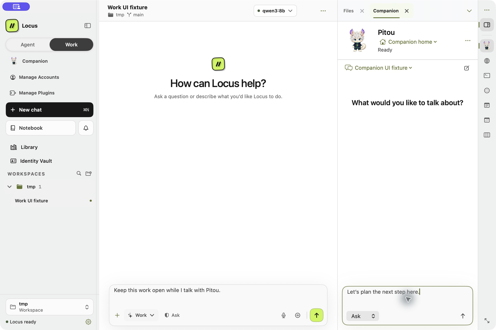
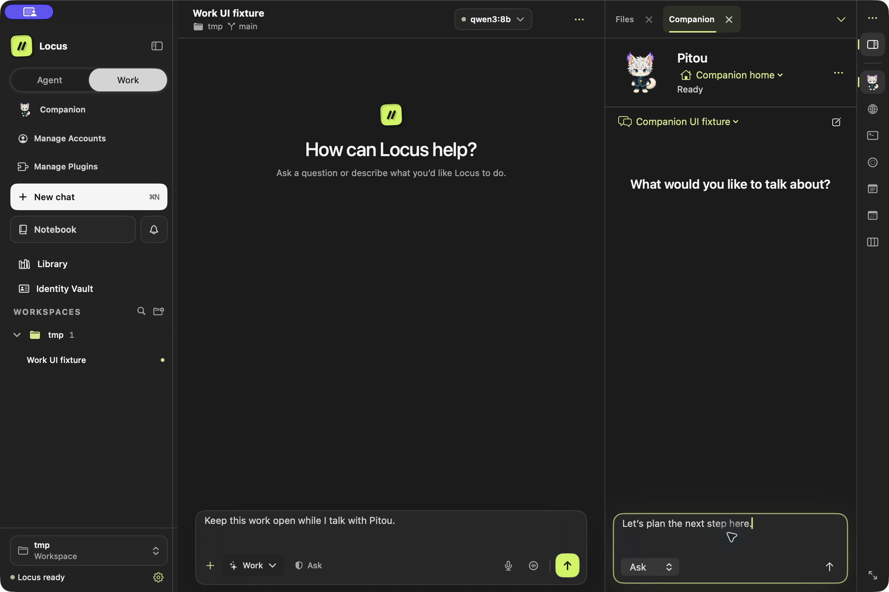

# Companion panel, Scout, and cursor reactions

Updated October 5, 2026 with Xcode 26.6 on macOS. The deployment target remains
macOS 14. This follows the original [companion verification](YourCompanionVerification.md).
The completed full run passed **1,966 native tests** and **seven companion UI
tests**, with **one explicit UI skip** and zero failures. The skipped menu-bar
case was obstructed by this MacBook's display notch, so click/type/Escape/reopen
remains unverified locally. The Python suite passed **3,083 tests plus 31 subtests**.
This full native/UI run covers folders, output isolation, sizing, palette, gallery,
activity scoping, and menu activity. A subsequent pointer guard change passed its
focused rerun with **13 passes, one explicit skip, and zero failures**; the hosted
event-delivery case could not activate its fixture in that later run.
Fresh light/dark captures below show the latest local build with isolated fixture data.

## Completed full run

`companion-final-verified.log` and `.xcresult` in
`/tmp/locus-companion-panel-verification` record `TEST SUCCEEDED`, exit 0:

- Native: **1,966 tests, zero failures**, 352.401 seconds (353.180 elapsed).
- UI: **eight cases, seven passed, one skipped, zero failures**, 126.975 seconds
  (126.982 elapsed). The skip is the actual menu-bar interaction case, not a pass.

```sh
xcodebuild -project Locus.xcodeproj -scheme Locus -configuration Debug \
  -destination 'platform=macOS' -derivedDataPath /tmp/locus-companion-build \
  -disableAutomaticPackageResolution -skipPackageUpdates -jobs 2 \
  CODE_SIGN_IDENTITY=- DEVELOPMENT_TEAM= LOCUS_BUNDLE_MODE=skip test \
  -only-testing:LocusTests -only-testing:LocusUITests/CompanionOnboardingUITests \
  -test-timeouts-enabled YES -maximum-test-execution-time-allowance 120 \
  -resultBundlePath /tmp/locus-companion-panel-verification/companion-final-verified.xcresult
```

The main shortcut, right-panel drafts and folder isolation, six-character picker,
compact dark/static setup, cancellation/skip restoration, activity summaries, menu
activity ownership/deduplication, MCP isolation, sprite sizing, and theme regression
tests passed. No live model was used.

### Pointer guard follow-up

The only later source change removed the redundant `NSApp.isActive` condition from
the app-local mouse listener. Events must still belong to the character's own key
window, and tracking must be enabled and visible. This permits events from a
nonactivating key panel without introducing a global monitor. The actual menu
popover's `scenePhase` and pointer delivery remain unverified locally.

`menu-pointer-final.log`/`.xcresult` record exit 0 and `TEST SUCCEEDED`: **14 cases,
13 passed, one skipped, zero failures**, 1.844 seconds (1.851 elapsed). The command
used the same build configuration above, selecting `CompanionPointerTests`,
`CompanionVisibilityTests`, and `CompanionMenuBarTests`.
`testHostedWindowDeliversQueuedMouseMovementAndReleasesLocalListener` explicitly
skipped because its visible fixture could not become key/active
(`key=false`, `active=false`, `visible=true`, activation policy 0).
That hosted event-delivery case passed in the 1,966-test run before the one-line
guard change. The earlier pass and later skip are separate evidence; the later
run does not establish hosted delivery after the change. Listener/observer cleanup,
pointer mapping/status priority, and menu activity cases passed in the follow-up.

## Integration and ownership

- The left **Agent** and **Work** modes remain unchanged, with no third segmented
  Companion tab. The **Companion** row above **Manage Accounts** calls
  `openCompanionMainConversation` to select the ordinary companion chat in the
  main composer. It prefers current, remembered, then existing project-owned
  conversations in the chosen companion folder. Its explicit first click creates
  an empty canonical chat only when needed and online, with a selection lease preventing late takeover.
- The right-rail Companion button opens the independent side-panel inspector.
  **Start with [Name]** and the main Companion entry use normal main-chat routing;
  offline identity setup succeeds locally and explains that a model is needed.
- The central workspace remains visible with its selected conversation, draft,
  active run, and pending approvals. Opening or closing the panel does not select
  another central transcript or submit a message. Click the companion's face or
  name to open its existing profile, or choose **Profile and activity** in its menu.
- `CompanionPanelModel.swift` owns panel selection, loading/error state, and mode.
  `CompanionInspectorTab.swift`, `AppModel+CompanionNavigation.swift`, and
  `CompanionSidebarEntry.swift` connect the surface. Existing `paneDraft`/`setPaneDraft`
  and `splitPaneBlocks` retain session-keyed drafts and loaded transcript blocks.
- Saved-agent conversation APIs create canonical empty chats. Native
  `sendAgentWorldTurn` uses the existing worker and admission queue independently
  of the optional Agent World plugin. Model selection, permissions, approvals,
  task controls, and connection truth remain behind their existing APIs.
- Companion history and drafts are scoped to the selected profile, companion
  folder, and conversation. Actual loaded ownership and archive state are validated before
  displaying a transcript. Late responses cannot replace a newer panel selection.
- If the selected panel conversation is already open centrally, the panel is
  read-only and offers **New conversation**. **Open full conversation** explicitly
  selects the chat centrally for the existing advanced composer, attachments, and
  approval controls. Pending requests link to that full conversation; unsupported
  inline approvals are not simulated.
- Offline or missing-model sends do not dispatch or clear the draft. Failed loads
  offer **Retry conversation**. Failed sends leave the panel draft and central
  execution intact. Before a companion exists, the left row opens setup directly;
  the right panel offers **Set up your companion**. Help → Getting Started also
  resumes the same coordinated flow.

## Menu-bar chat and activity

`CompanionMenuBarView.swift` uses native `MenuBarExtra` with the `.window` style,
presenting **Chat** and **Activity** in a 440 × 600-point transient window. Chat
reuses `CompanionInspectorTab` and the app's existing
`CompanionPanelModel`, including its canonical selected conversation, session-bound
draft, chosen companion folder, and worker/queue path. No separate chat model,
execution engine, or notification store is introduced. Showing the popover does
not create a chat, send, or start work. Explicit close and Escape retain the draft.
The existing rule for a chat already open centrally remains read-only.

**Open Locus** uses the existing main-window presenter without changing central
navigation. Profile, approval/recovery, and full-conversation actions reveal the
main window before entering their supported surfaces. Menu activity uses the
canonical Activity Center requests and unread results for the chosen companion
identity/folder, rather than a separately focused Activity Center view. Opening
the popover does not mark results read or request notification permission. Entering
Activity or explicitly refreshing uses the existing read-only backend refresh.

`CompanionActivitySummary.includes` provides the shared run ownership predicate:
a known catalog session's profile and folder win over conflicting run metadata;
only an absent session may fall back to the run's manifest profile and root.
The primary companion's summary and completion-reaction scope use its selected
folder, while other saved agents retain their foreground-project scope. Scope
changes establish a new completion baseline instead of replaying old success.

All 14 summary tests passed in the focused run, including the four new cases for
dedicated-home scope, explicit folder changes and completion baselines, uncataloged
run/attention ownership, and conflicting or absent canonical owners. Five native
menu activity tests passed in the subsequent retry build, including terminal-state
deduplication. This does not verify actual popover interaction. Menu-bar
open/close/Escape, typing/draft sharing, and closed-main-window reopening still need
an unobstructed display or CI run.

## Earlier focused checks and display limitation

- `menu-and-theme.log`/`.xcresult`: 20 focused native tests passed (14 summary,
  four menu activity, two tool isolation). Seven of eight companion UI cases
  passed; the menu-bar opening case failed. The combined command was therefore
  unsuccessful, despite the other passing cases.
- `menu-popover-retry.log`/`.xcresult`: five menu activity tests passed, including
  the added terminal-state regression. The menu-bar UI case still could not open
  the covered item; that combined command also failed.
- `tool-isolation-retry.log`/`.xcresult`: the two earlier MCP isolation tests passed
  unchanged with `test-without-building`. `interrupted-ui-retry.log`/`.xcresult`:
  both earlier draft/offline-panel cases passed unchanged with the same command.
  The preceding `final-companion` host exited unexpectedly with code 0 and restarted,
  without a crash report; a crash was not established. Its UI log recorded an
  interrupting Codex window, without proving the cause of every failure.

All paths above are in `/tmp/locus-companion-panel-verification`. The status item's
accessibility frame spanned x=817…853, with center x=835, while the screen's native
notch exclusion spanned x=663…848. Native hit-testing and a recording showed no
visible clickable Locus icon at the attempted point; trying its trailing edge did
not open the popover either. The removed accessibility experiment is not a passing
interaction check. No production workaround or system-setting change was made.

The final UI test uses the normal click and skips only when the item is not
hittable **and** its frame intersects the screen's reported notch region. That
explicit skip occurred in the final run and is reported separately from the seven
UI passes. No actual popover screenshot or completed click/type/Escape/reopen check
is claimed here.

## Output isolation

`CompanionPanelModel.conversationWorkspacePath` supplies the selected conversation's
actual execution folder for output rendering. Its canonical chosen root remains
the identity/history binding scope. `openWorkspaceReference(_:workspace:)` checks
containment again against that explicit execution folder at activation. A foreign
text file uses the existing read-only viewer with URL-based identity, leaving the
central Files browser unchanged. **Add to context** is hidden unless that contained
URL also matches the central workspace. Library previews activate their owning
workspace; explicit Show Files reveals a foreign companion folder in Finder.

The side panel does not mount interactive MCP tool views or issue their foreground
tool-result fetches. It offers the existing full-conversation route instead. Image
editing and full approval controls use that same route. These boundaries avoid
performing companion-output actions through an unrelated central conversation.
Both MCP isolation tests passed unchanged in the focused retry and again in the
completed full run.

## Dedicated-folder ownership and checks

The default is the existing UUID-bound saved-agent home:
`~/Library/Application Support/Locus/AgentHomes/<lowercase-profile-uuid>/Workspace`.
LocusX uses `Application Support/LocusX`. `AppModel+SavedAgents.swift` owns the path
and lazy preparation; there is no new folder store. Explicit choices use the
existing `AgentProfile.workspacePreferences.defaultProjectPath`, including prior
explicit profile defaults. `selectCompanionWorkspace(_:)` validates a choice,
preserves linked `projectPaths` and other profile fields, saves it through the
canonical profile API, and refreshes panel selection without moving the center.
The panel menu (`companion.panel.workspace`) shows **Companion home**, linked
projects by folder name, and **Choose a folder…** using the existing folder picker.

The completed native run covers default stability and edition separation, lazy
home preparation, explicit-folder persistence/reset, missing or redirected homes,
retaining linked projects and unrelated profile settings, independent drafts/history,
and late load/create/send results after an explicit scope change. Existing
conversations and queued work retain their original execution folder. Native tests
do not constitute a manual audit of the system folder picker's interaction.

## Six-character picker

First-launch setup and the profile's **Characters** gallery now offer only Pitou,
Scout, Ninja, Clover, Shadow, and Pirate. The Originals collection and unsupported
accent/accessory controls were removed. **Surprise me** uses a local seed to select
one of those six approved sprite IDs; it does not synthesize a variation, generate
art, or call a provider. Existing procedural, Gon, and custom-image references
continue to load without replacement until the user explicitly changes the picture.
The procedural renderer remains an internal compatibility/fallback path. The
separate static portrait library, imports, and explicit generation remain available.

The six-choice catalog, seeded Surprise selection, legacy restoration, and picker
UI cases passed in the completed full run.

## Completed routing/motion snapshot before folder and sizing changes

The combined run passed **1,941 native tests in 355.399 seconds** and **six companion
UI tests in 99.006 seconds**, with zero failures; `xcodebuild` exited 0 with
`TEST SUCCEEDED`. Coverage includes main-chat shortcut selection and foreground
protection, project ownership, explicit empty-chat creation, three motion cadence/pose
tests, and the UI shortcut opening the main composer while preserving the Work
draft. The six UI cases also cover independent center/panel drafts, offline setup,
custom-character cancellation, compact dark/static presentation, and skip/return.
These results precede the latest folder, output-isolation, and sizing changes.

```sh
xcodebuild -project Locus.xcodeproj -scheme Locus -configuration Debug \
  -destination 'platform=macOS' -derivedDataPath /tmp/locus-companion-build \
  -disableAutomaticPackageResolution -skipPackageUpdates -jobs 2 \
  CODE_SIGN_IDENTITY=- DEVELOPMENT_TEAM= LOCUS_BUNDLE_MODE=skip test \
  -only-testing:LocusTests -only-testing:LocusUITests/CompanionOnboardingUITests \
  -test-timeouts-enabled YES -maximum-test-execution-time-allowance 120 \
  -resultBundlePath /tmp/locus-companion-panel-verification/final-routing-motion.xcresult
```

Log: `/tmp/locus-companion-panel-verification/final-routing-motion.log`.
No artwork was redrawn or replaced for the motion adjustment. Source frames use
8 fps stepped timing, one or more 125 ms ticks per frame, quiet idle/waiting holds,
and brief greeting/completion holds. Legacy procedural and whole-image fallback
movement use discrete poses without eased glides. Pointer gaze remains event-driven.
See [pointer reactions](CompanionPointerReactions.md) for the exact presentation rules.

The earlier panel-only snapshot also passed 1,931 native tests and five UI cases;
its retained evidence is `native-retry.log`/`.xcresult` and `ui.log`/`.xcresult` in
the same verification directory. Panel tests cover foreground state preservation,
failed-load retry, durable owner/folder/archive validation, stale responses, send
scope, failure recovery, catalog changes, worker streaming/approvals, and idempotent
creation. Inspector tests cover Agent/Work independence, restoration, close/reopen,
and the existing Just Chat policy. Hosted-window pointer delivery and listener
teardown passed without skipping. These are historical checks, not a substitute
for the final source run.

An earlier native launch attempt failed while an older development app was still
open. PR #133's earlier UI jobs failed a label-only name assertion in the superseded
left-tab snapshot. That assertion now reads the native label/value representation,
and the revised case passed locally. This does not claim those earlier remote jobs
were rerun successfully.

## Python and artwork checks

The full Python suite passed **3,083 tests and 31 subtests** in 365.88 seconds,
exit 0. The repository root is added to `PYTHONPATH` because the existing
reviewability test imports `Tools` while the documented invocation runs in `agent/`:

```sh
cd agent
PYTHONPATH="$(git rev-parse --show-toplevel)" .venv/bin/python -m pytest -q
```

The completed result is `python-final.log` in the same verification directory.
An earlier attempt was interrupted during a host filesystem stall after 2,322
passing tests; `python.log` preserves that incomplete run and is not counted as a
full pass. Both artwork preparation scripts passed `py_compile` in the preceding
artwork verification; their source was unchanged by the panel correction.

Scout remains the MHA/HxH-inspired gallery character; saved `gon-v1` appearances
remain resolvable. Ninja, Clover, Shadow, and Pirate retain their original nine
animation rows and gain sixteen generated gaze poses. Pitou is byte-for-byte
unchanged. All four extended atlases reproduced byte-for-byte with
`Tools/AppendCompanionGaze.py`; invalid geometry and input-overwrite checks reject
the inputs. Original pixel hashes match. Scout's 73 frames passed occupancy,
transparency-margin, and source-clipping checks. See [artwork provenance](CompanionArtwork.md),
[Scout's prompt](CompanionGenerationPrompts.md), and [directional-gaze records](CompanionDirectionalGaze.md).

## Neutral theme refresh

`Theme.swift` now uses `#FAFAFA` canvas, `#F1F1F1` structural surfaces, and white
panels/cards in light appearance, with `#181818`/`#3D3D3D`/`#5F5F5F` text. Dark
appearance uses `#171717` canvas, `#202020` structure, `#1B1B1B` panels, and
`#282828` cards, with `#F5F5F5`/`#D4D4D4`/`#A8A8A8` text. This removes the
cream/beige and olive base cast; saved accents, semantic hues, brand/logo colours,
and optional World/deck/island palettes remain unchanged.

Source-derived checks passed 104 surface/text pairs, 48 soft-badge pairs, eight
strong-boundary pairs, 52 selection pairs, and 26 accent-action pairs. Minimum
ratios and exact separator values are in [Colour palette](ColourPalette.md).
Syntax parsing and whitespace checks passed. Theme regression tests passed in
the full 1,966-test native run; seven companion UI cases also passed. Fresh light/dark
captures below show the updated surfaces. Source-derived math does not establish
rendered contrast or actual menu-popover interaction.

## Native UI inspection and screenshots

An isolated development preview with the in-memory companion-chat fixture was
inspected through native accessibility/UI controls at 1200 × 800 points. The
left Agent/Work modes remain visible with the right Companion tab alongside Work. Independent drafts remain visible in both editors; Shift-Return
adds a newline in the panel, and close/reopen preserves both drafts. Explicit
Return exercised the fixture's deliberate HTTP 409 rejection: the actual error
appeared and both drafts survived. The regression image is retained at
`/tmp/locus-companion-panel-verification/panel-draft-failure-dark.png`.

The fixture uses canonical local conversation records but does not execute model
work. These checks demonstrate UI/error handling, not a successful provider reply
or real permission grant. The XCUITest dual-draft scenario independently exercised
the clean two-composer flow.

The following captures show the **latest local build** in light and dark appearance
using isolated fixture data. The Agent/Work switch and Companion row above Manage
Accounts are visible, while the right inspector shows **Companion home** alongside
the central Work conversation. Each editor contains a separate unsent draft. The
central `tmp` workspace belongs to the fixture; it is not the companion's home.
The provider/Ready labels use fixture availability, and no model reply is shown.
These are static layout, character-size, and palette evidence. They do not prove
animation timing, pointer delivery, actual provider connectivity, or menu-popover
interaction, and they are not menu-popover screenshots.





Earlier `companion-tab-light.png` and `scout-gallery-light.png` images document the
superseded left-tab layout and are not current layout evidence.

## Remaining limits

No live-provider conversation or image-generation request, real permission/approval
flow, release archive/notarization, or latest LocusX local build was performed for
this correction. Mocked worker/queue and scope tests do not establish live-provider
success. Manual VoiceOver interaction, full keyboard focus-order/approval-focus
checks, and physical-cursor use remain unverified. Native pointer event tests and
click-based UI automation are distinct from physical mouse movement. Reduced-motion
checks did not change the user's system accessibility preferences.
