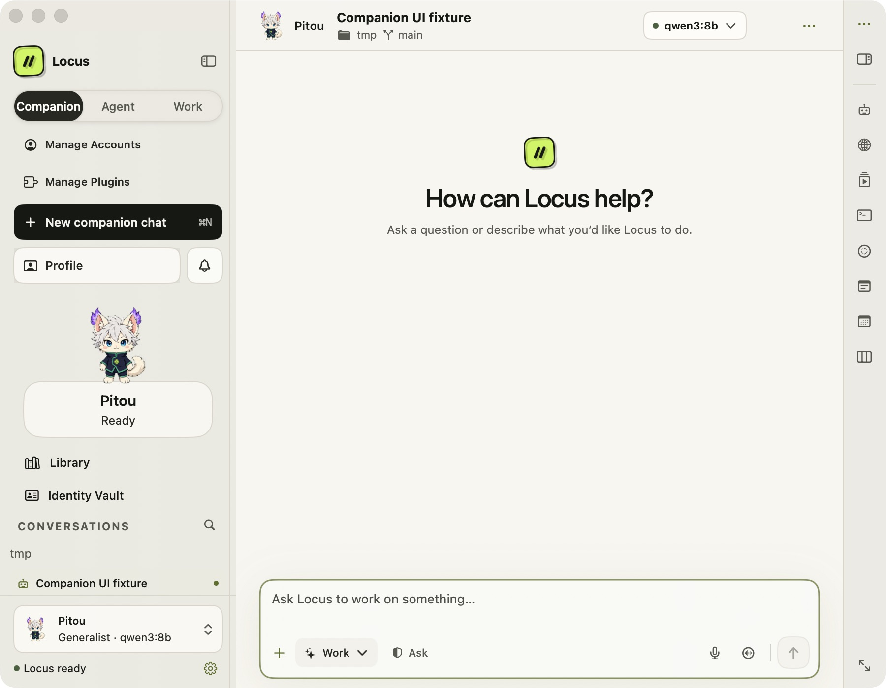
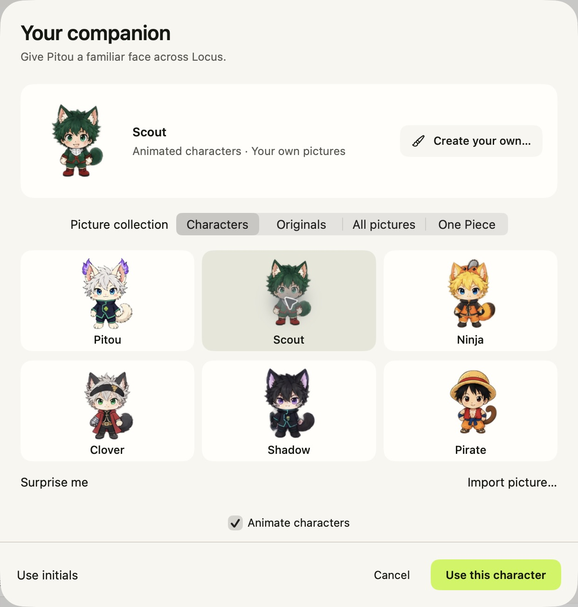

# Companion tab, Scout, and cursor reactions

Verified October 5, 2026 with Xcode 26.6 on macOS. The deployment target remains
macOS 14. This change follows the original [companion verification](YourCompanionVerification.md).

## Implementation and ownership

- `AppModel+CompanionNavigation.swift`, `CompanionDestinationView.swift`,
  `SessionSidebarView.swift`, and `WorkspaceView.swift` add the **Companion** tab
  and its project-scoped chat history. The existing profile, transcript loader,
  composer, task APIs, and presentation store remain canonical.
- `AppModel+SavedAgents.swift`, `AppModel+SessionLifecycle.swift`, and the existing
  onboarding/new-chat hooks preserve destination and selection ownership. Opening
  the tab is read-only; creating an empty conversation is explicit. An active
  row click cannot clear a run or approval, offline rows cannot start a resume,
  and a late new-chat result cannot take over a newer tab/project/chat selection.
  Explicitly returning to a failed transcript retries its load once online;
  already ready or loading transcripts retain their existing ownership.
- `CompanionAppearance.swift` adds `scout-v2` to the six-character gallery and
  keeps `gon-v1` resolvable. Appearance changes do not replace the agent ID,
  rename it, change model/access, or move its conversations.
- `CompanionCharacterView.swift`, `CompanionSpriteView.swift`, and
  `CompanionPointerTracking.swift` render local cursor reactions. Real work and
  connection states retain priority; disabled motion and hidden/closed windows
  release tracking. There is no global input monitor or cursor polling.
- `Resources/Companions/Scout.png` is the new MHA/HxH-inspired character.
  Ninja, Clover, Shadow, and Pirate retain their original animation pixels and
  gain sixteen generated look poses. Pitou is byte-for-byte unchanged. See the
  [artwork record](CompanionArtwork.md), [Scout prompt](CompanionGenerationPrompts.md),
  and [directional-gaze provenance](CompanionDirectionalGaze.md).
- `project.pbxproj` was regenerated with `xcodegen generate`; existing `project.yml`
  source/resource rules include the new files without a new target or dependency.

## Executed checks

`xcodegen generate`, `git diff --check`, and the native `build-for-testing` passed.
The final full native regression run passed **1,916 tests, zero failures and zero
skips**, including all companion suites and neighboring AppModel, saved-agent,
Overview, sidebar, Agent World, and transcript behavior.

```sh
xcodebuild -project Locus.xcodeproj -scheme Locus -configuration Debug \
  -destination 'platform=macOS' -derivedDataPath /tmp/locus-companion-build \
  -disableAutomaticPackageResolution -skipPackageUpdates -jobs 2 \
  CODE_SIGN_IDENTITY=- DEVELOPMENT_TEAM= LOCUS_BUNDLE_MODE=skip test \
  -only-testing:LocusTests \
  -resultBundlePath /tmp/locus-companion-tab-verification/full-native-listener-final.xcresult
```

Local logs and result bundle:
`/tmp/locus-companion-tab-verification/full-native-listener-final.log` and
`full-native-listener-final.xcresult`. All four gaze atlases reproduced byte-for-byte using
`Tools/AppendCompanionGaze.py`; input-overwrite and invalid geometry checks rejected
the inputs. The first nine rows match their original pixel hashes. Scout's 73
frames pass occupancy, transparency-margin, and source-clipping validation.

The hosted-window regression initially exposed a real delivery gap: a SwiftUI
host received queued movement but did not forward it to the character's tracking
area. The corrected app-local listener passed in the full app target, without
skipping: right/up events reach the hosted character, disabling removes the
listener, and normal events remain unconsumed. Earlier focused invocations that
could not activate a test window skipped this case; they were not counted as
delivery verification. See [pointer reactions](CompanionPointerReactions.md).

The full Python suite passed **3,083 tests and 31 subtests** in 379.77 seconds.
The documented command run from `agent/` initially failed collection because the
existing reviewability test imports `Tools` from the repository root. Adding that
root to `PYTHONPATH` ran the unchanged suite successfully:

```sh
cd agent
PYTHONPATH="$(git rev-parse --show-toplevel)" .venv/bin/python -m pytest -q
```

Both artwork preparation scripts passed `py_compile`. The staged Gitleaks scan
found no secrets, and `git diff --check` passed.

## Native UI inspection

An ad-hoc development copy used the separate bundle ID
`io.sparktales.locus.companion-tab-preview` and the opt-in in-memory
`LOCUS_UI_TESTING_COMPANION_CHAT=1` fixture. Its two empty transcripts use a local
URLProtocol transport. No live model message, permission grant, or scheduled task
was submitted, and no real companion profile was edited.

Through native accessibility/UI controls, verified:

- The left **Companion** button opens the regular composer with attachments,
  permission controls, model picker, and relevant inspector entries.
- An unsent companion draft survives a round trip to Work, whose separate draft
  does not replace it.
- The character opens its existing Overview and portrait picker.
- Selecting Scout updates the sidebar, profile/picker, and conversation header
  while the same profile name, model, access, and conversation remain present.
- Light and dark appearance were inspected, including the compact 900 × 700
  point layout captured below. Gallery silhouettes have comparable visible sizes.
  No provider call was made.

Screenshots are fixture evidence, not examples of an AI response:





## Limits

The updated XCUITest cases compile, but the XCUITest runner was not rerun in this
iteration; the native UI flow above was driven through computer-use controls.
No live-provider reply, release archive/notarization, or LocusX build was performed
for this follow-up. Existing tests cover routing and edition-scoped presentation
persistence, which is distinct from testing a production model response.

The UI automation API provides clicks, not free mouse movement. Clicking a new
point alone does not verify a mouse-move event. Direction/frame selection and
tracking teardown are covered by native tests; physical-cursor interaction remains
a separate manual acceptance step. Reduced-motion gates are tested without
changing the user's system accessibility preferences.
