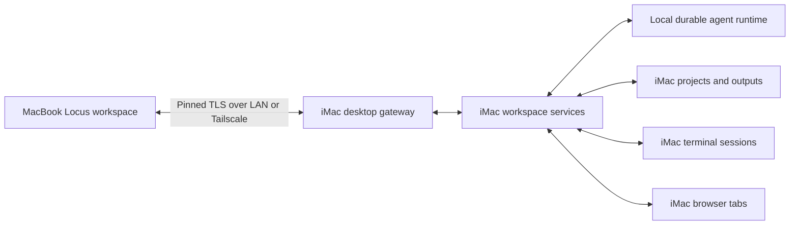

# iMac host and MacBook controller

Status: implementation plan; application changes have not been made.
Repository baseline inspected: `ee6f27b0`.

## Outcome and chosen defaults

Install the normal, wallet-free Locus app on both Apple Silicon Macs. The iMac
owns the projects, accounts, agent execution, terminal processes, and browser
profile. The MacBook presents the iMac workspace and sends user actions to it.
The MacBook does not need Ollama, model weights, project copies, or provider
credentials to use that workspace.

The confirmed scope includes chats, agents, projects, files, terminal, and the
built-in browser, with access at home and away. Related workspace operations
include approvals, schedules, Git, attachments, and saved output previews.

Use LAN discovery at home and a saved Tailscale hostname or address away. Use
the same pinned, encrypted application connection on both paths. No Locus
account or hosted Locus relay is required. Tailscale may itself use its encrypted
relay fallback when a direct network connection is unavailable; do not describe
away access as guaranteed peer-to-peer. See [Tailscale connection types](https://tailscale.com/docs/reference/connection-types).

V1 supports macOS 14 or later and one active machine per Locus window, with a
machine picker for **This Mac** and **iMac**. Keep each machine's navigation,
drafts, resource identifiers, and caches separate. Connecting to the iMac must
never silently fall back to executing on the MacBook.

The iMac must be awake, logged in, and running Locus. Closing its main window
keeps hosting available. Quitting Locus ends remote browser and terminal access;
the independent runtime retains its existing rules for explicitly enabled
background work. Setup offers launch at login and explains the awake
requirement using [Apple's sleep settings](https://support.apple.com/guide/mac-help/set-sleep-and-wake-settings-mchle41a6ccd/mac).
V1 does not promise wake over the internet, pre-login access, or recovery through
FileVault unlock. Operating-system permissions, provider sign-in, protected
identity pages, and biometric unlock remain actions performed on the iMac.

## Existing foundations and required boundaries

The existing architecture has two useful foundations, neither of which provides
the requested complete workspace by itself:

| Area | Repository evidence | Implementation consequence |
| --- | --- | --- |
| Secure pairing | `CompanionGateway`, `CompanionSecurity`, `CompanionWireTypes` | Reuse the TLS, nonce, revocation, and discovery techniques. Preserve the phone protocol and its smaller permission surface. |
| Durable execution | `RuntimeModel`, Python `runtime.py`, `runtime_store.py`, and `api/runtime.py` | Reuse supervisor-owned workers, event cursors, decision fingerprints, and recovery. Enable the existing independent runtime during host setup. |
| Remote deployment | `RemoteRuntimesView` and `runtime_remote.py` | This copies selected projects to a separate runtime over SSH. Keep it separate from connecting to an already installed iMac workspace. |
| Local assumptions | `BackendService`, `AppModel+ChatWorkers`, `AppModel+RuntimeAndLifecycle` | A remote URL alone is insufficient: startup and chat workers currently launch local processes and execute native actions. |
| Native resources | `TerminalSession`, `WorkspaceFileModel`, `WorkspaceBrowserModel`, `BrowserService` | Introduce host-aware services for PTYs, file operations, and browser presentation. Audit Git, attachments, Library, and workspace-link handling as part of the same boundary. |

Follow `Docs/Architecture.md`: new connection state belongs to feature models
and services, with inert initializers and explicit configuration. `AppModel`
remains the composition root. Extract shared domain operations where needed;
do not add a second remote implementation of agent orchestration or put all
network dispatch into another large `AppModel` extension.

### Connection and execution model

Add `WorkspaceTarget` (`local` or a stable host ID), `WorkspaceReference`
(host ID plus workspace ID), and host-qualified references for sessions, files,
terminals, and browser tabs. Remote paths are display metadata or validated
workspace-relative paths; they are never treated as MacBook filesystem URLs.

Add `HostConnectionModel` for discovery, pairing, connection status, endpoint
selection, negotiated capabilities, and reconnect. Add a `WorkspaceServices`
composition boundary with local and remote implementations for chat/agent
commands, workspace files, Git, outputs, terminal, and browser. Feature models
consume these services. Keep the existing loopback `BackendService` behind the
iMac/local implementations instead of turning it into an unrestricted network
proxy.

Host commands identify their workspace and session explicitly. Browsing a
different chat on the MacBook must not switch the iMac user's selected chat or
workspace. The host owns session-scoped executors and resources; each viewer
owns its navigation. Both viewers see changes to shared data.

## Protocol and behavior

### Desktop gateway and pairing

- Add a separate desktop protocol version 1, listener, device registry, and
  Keychain identity namespace. Advertise `_locus-desktop._tcp`; retain
  `_locus-remote._tcp` and the mobile-v1 wire types unchanged. Shared security
  primitives may be extracted with compatibility tests.
- Default the desktop listener to TCP 8794, with a saved editable port and an
  actionable bind-conflict error. Accept LAN and Tailscale peers; restrict
  admission using actual peer/interface addresses, not a hostname's spelling.
  Keep the Python service and its controller token on authenticated loopback.
- Host Settings gains **Remote Access → Allow another Mac to connect**,
  disabled by default. A five-minute, one-use pairing payload includes the
  stable host ID, endpoints, certificate fingerprint, and cryptographic nonce.
  The MacBook pastes pairing details and verifies the pinned certificate
  before sending the nonce. Bonjour provides discovery, not identity trust.
- A successful exchange issues a desktop-only token stored in MacBook
  Keychain. The iMac stores its hash and device metadata. An old mobile token
  cannot acquire desktop authority. Revocation closes that device's control
  and data streams immediately; certificate changes require re-pairing.
- Pairing grants trusted control as the iMac user, including an interactive
  shell. Project path checks are file-API boundaries, not a claim that this
  shell is sandboxed. Provider secrets are used on the host and are never
  included in account listings, diagnostic logs, or general state snapshots.
- Try discovered/saved LAN endpoints first, then the saved Tailscale endpoint,
  always checking the same pin and host ID. Persist the port across relaunch.
  Support both a [MagicDNS hostname](https://tailscale.com/docs/features/magicdns)
  and a saved Tailscale IP. Report reachability, authentication, version, and
  host-runtime failures separately; never downgrade to unencrypted transport.

### Minimum public interfaces

Define Foundation-only desktop DTOs with fixtures shared by the native host and
client. Requests include protocol version, request ID, method, and explicit
resource reference; mutations include the relevant expected revision or
decision fingerprint. Authentication belongs to the connection handshake.

| Interface family | Required capability |
| --- | --- |
| `host.hello`, `state.subscribe`, `command.status` | Negotiate protocol/capabilities; fetch snapshots and resume cursors; reconcile an uncertain mutation. |
| `workspaces.*`, `chats.*`, `agents.*`, `runs.*`, `approvals.*`, `schedules.*` | Browse and change the host workspace, create/continue/stop tasks, choose host models and agents, and resolve current decisions. |
| `files.*`, `git.*`, `outputs.*`, `transfers.*` | Browse/search/read/edit host files, operate Git, preview outputs, and explicitly upload/download content. |
| `terminal.*` | Create/attach a host PTY, send ordered input, resize, read output, and close it explicitly. |
| `browser.*` | Manage host tabs and navigation, subscribe to rendered frames, and send viewport-aware user input. |

The gateway dispatches an explicit method allowlist to host domain services.
It does not expose arbitrary HTTP paths, the Codex internal broker, credential
files, native-action broker claims, or unrestricted backend WebSocket messages.
The MacBook renders state and sends user intentions; only the iMac advertises
and executes native agent capabilities. Host provider setup and existing
permission policies remain authoritative.

Use paginated snapshots and bounded binary data channels for files, PTY data,
and browser frames. Keep control messages at 256 KiB and binary chunks at
64 KiB. Authenticate and bind each data channel to the device and resource;
apply backpressure independently so browser traffic cannot block Stop or an
approval. DTOs deliberately select public fields; the mobile sanitizer's
keyword filtering is not sufficient for the richer desktop protocol.

### Durable state and concurrent actions

- Reuse runtime sequence cursors for agent events. Add revisioned host
  snapshots for native/project state. Reconnect first restores authoritative
  state and current approvals, then resumes live updates without a gap. An
  expired cursor forces a fresh snapshot.
- Persist desktop mutation admissions and results/references in the existing
  runtime database, keyed by device ID and request ID with a payload hash.
  Reject a reused ID with different contents. Retain receipts for seven days;
  missing/expired receipts mean unknown, never permission to replay an action.
  Store metadata and resource references, not terminal input or browser frames.
- Record admission before execution. A crash after an external action was
  attempted produces an uncertain result for reconciliation, not a claim of
  exactly-once delivery. Reuse runtime command IDs for agent work and decision
  fingerprints for approvals. Two clients cannot consume one approval twice.
- Disable new writes while disconnected and retain unsent composer/editor
  drafts. Do not queue terminal keystrokes or browser clicks offline. MacBook
  disconnect leaves the iMac controller attached, so accepted work continues
  and unanswered permissions wait under the existing policy.
- Use one input owner per terminal/browser surface, shared by local UI,
  remote UI, and agent activity. Local interaction can take ownership;
  a remote user can explicitly reclaim it. Lease generations reject stale
  input. Independent surfaces and different chats can run concurrently.

### Files, terminal, and browser

File services browse iMac projects and allow adding an existing host directory
through a host directory chooser in the remote UI. Preserve existing host
filesystem permissions. Workspace operations validate containment after
symlink resolution, including safe parent handling for newly created files.
The chooser cannot bypass macOS folder-access restrictions; missing grants
are explained as an iMac setup action.

Use file revisions/content hashes and atomic saves. Concurrent edits return a
conflict with both versions available for review. Git changes and file watches
run on the iMac and publish invalidations. File links, context attachments,
AGENTS.md operations, and Library previews use host references. Downloads are
explicit MacBook copies; uploads use temporary host storage, hashes, a commit
step, and cleanup after cancellation. Preserve current document/image limits
(100 MB documents, 15 MB images); cap v1 general transfers at 100 MB and explain
larger-file failures. Preserve output metadata and binary previews without
trying to open an iMac path on the MacBook.

Split `TerminalSession` into host PTY ownership and SwiftTerm presentation.
The MacBook uses a terminal renderer without spawning a shell. The host owns
process groups, working directory, resize, exit status, and a bounded emulator
screen/scrollback snapshot (4 MiB scrollback). Attach returns that snapshot and
an output offset; live output follows it in order. Input has a connection
generation and sequence number and is never replayed across reconnect. A
dropped MacBook connection or closed window leaves the PTY alive; explicit
Close Terminal terminates its host process group. An iMac app restart shows
the old terminal as ended and requires explicitly opening a new session.

Keep browser WKWebViews, cookies, downloads, and localhost access on the iMac.
Render its active tab into the MacBook browser panel using the existing
off-screen host/snapshot machinery, with compressed frames up to 10 fps and
one pending latest frame. Start at the existing 1280×800 desktop viewport;
reduce frame rate/resolution under backpressure. Chunk frames on the data
channel and cap each assembled frame at 2 MiB. Send click/drag/scroll/key/text
input using CSS coordinates and the displayed viewport/navigation generation;
reject input for stale navigation. Ordinary dialogs, downloads, and uploads
use host-aware UI; clipboard transfer is explicit. Stream an accessibility
representation alongside frames for keyboard and assistive navigation.

Preserve existing protected identity-page and vault restrictions: show
**Complete on iMac** rather than capturing a protected page. Normal app browser
navigation and project previews are supported; browser audio/video streaming,
camera/microphone forwarding, and whole-desktop screen sharing are outside v1.
Treat this as interactive app browsing, with performance validated below.

## Implementation phases and exit gates

### 1. Establish host-aware workspace services

Introduce target/reference types, service protocols, dependency injection, and
a machine-scoped presentation context. Adapt local behavior first. Separate
session-addressed commands from foreground navigation. Audit all in-scope
filesystem calls, process launches, native capability handling, persistence,
and shutdown paths. Record each operation's local and remote implementation.

**Exit:** existing local workspace tests pass. A fake remote context can render
a workspace with zero local backend/Ollama/PTy launches, workspace reads,
provider-credential access, native tool execution, or host-state writes into
local preferences. Switching targets cannot display stale results.

### 2. Pair the Macs and browse host state

Implement the desktop gateway/client, security namespace, discovery, pairing,
revocation, compatibility negotiation, reconnect, host snapshots, and the
machine picker. Wire setup to the independent runtime's actual readiness.
Keep the feature behind an internal flag while functionality is incomplete.

**Exit:** a signed build on two Macs pairs and lists the iMac's projects/chats
over LAN and Tailscale. Restart retains identity and endpoint settings. Bad
pins, expired/reused nonces, mobile tokens, revoked devices, disallowed peers,
and incompatible protocol versions are rejected. Phone pairing still works.

### 3. Control chats, agents, approvals, and schedules

Add host-routed mutations, the durable command journal, rich transcript
snapshots, output references, streaming events, provider/model selection from
host accounts, saved agent/team configuration, goals, and schedule operations.
Route native tool requests exclusively through the iMac broker. Integrate
runtime cursor replay and decision fingerprints.

**Exit:** the MacBook creates a chat, runs an agent/team using an iMac account,
answers a question/permission request, stops a run, and manages a schedule.
Dropped replies and reconnect produce one admitted task. Simultaneous local
and remote approvals resolve once. Closing the MacBook does not stop an
accepted run or duplicate it when reopened.

### 4. Complete projects, files, Git, and outputs

Implement remote directory selection, listing/search, context attachments,
file previews/edits, file-watch invalidation, Git actions, and bounded transfer
and output-preview services. Audit every file-link and Open/Reveal action:
make the destination Mac clear, and use an explicit download before opening a
remote file in a MacBook application.

**Exit:** edits and Git actions change the iMac project only; simultaneous
edits conflict safely; traversal/symlink escapes and oversized transfers are
rejected. Interrupted transfers clean up correctly. Documents/images and
generated outputs preview on the MacBook without a synced project folder.

### 5. Add remote terminal and browser interaction

Extract PTY ownership from terminal views, add the terminal renderer adapter,
and implement output reattachment. Add the browser frame/input adapter,
accessibility representation, input ownership, and native dialog bridges.
Exercise both resources with the iMac's main window closed.

**Exit:** `hostname` and `pwd` identify the iMac; an interactive terminal app
survives network loss, resize, and reattachment without repeated input. A
localhost website running on the iMac loads and accepts navigation, typing,
scrolling, drag, upload, and download from the MacBook. Browser cookies stay
on the iMac, protected pages cannot be captured, and agent/user input cannot
race. On controlled LAN, target p95 terminal echo below 150 ms and browser
input-to-updated-frame below 300 ms; on a 100 ms RTT/10 Mbps impaired link,
target below 500 ms and 1 second respectively. Record measurements and fix
failures before describing full workspace control as ready.

### 6. Finish host lifecycle and release validation

Add host readiness/setup guidance, launch-at-login integration, visible paired
device status, reconnect/offline states, and machine-labelled diagnostics.
Distinguish display sleep, system sleep, session lock, logout, app quit, and
runtime failure. Preserve identity/vault lock behavior; report native actions
that require an unlocked GUI as waiting. Closing the MacBook app only detaches
remote resources and must not invoke host stop/quit cleanup.

Handle signed app update/relaunch explicitly: checkpoint agent state, mark
terminal/native resources ended or unavailable, reconnect and resnapshot,
and never silently restart an interrupted terminal command. Add setup and
troubleshooting documentation. Enable the feature for release only after all
gates, including the real-device checklist, pass.

**Exit:** a signed/notarized installation passes login-item registration,
relaunch/update, sleep/wake, revocation, and two-Mac validation. Existing
wallet-free local use, mobile access, and independent-runtime behavior remain
compatible. LocusX still builds with desktop hosting excluded in v1.

## Validation and release checklist

- Add protocol fixtures and native unit tests for compatibility, pairing,
  token separation, resource scoping, revision conflicts, bounded streams,
  stale input, revocation, and remote-mode isolation. Keep the current
  companion-v1 fixture and Foundation-only wire-type check unchanged.
- Extend Python runtime tests for admission/result persistence, conflicting
  request reuse, restart uncertainty, replay/resync, stale approvals, and
  continued execution. Use injected failures immediately before and after
  command admission, native action execution, and response delivery.
- Use deterministic fake providers for automated chat/agent tests and a
  real supervisor/worker process for disconnect/restart integration tests.
  Run the relevant existing companion, transport, runtime, workspace file,
  browser, Git, and lifecycle suites; then the repository CI checks before
  release. Tests must use disposable stores and workspaces.
- On two M-series Macs, run one end-to-end scenario: pair → select iMac →
  create chat → edit a host file → review Git diff → start a localhost server
  in its terminal → use its browser → approve an agent action → close the
  MacBook → reconnect and inspect the completed output.
- Repeat with the MacBook on a different network using Tailscale. Test saved
  IP when MagicDNS is unavailable, network switching, a 30-minute disconnect,
  long-running output, expired approvals, certificate reset, and revocation
  while streams are active. Verify no iMac project files or provider secrets
  appear on the MacBook except deliberately transferred user content.
- Test iMac window closure, display sleep, system sleep, screen lock, app
  quit/relaunch, logout/login, and signed update. Document the observed
  boundary for locked-session native actions; never imply unavailable actions
  succeeded. Before-login and powered-off access remain unsupported.
- Keep migration additive: existing mobile devices, chats, account stores,
  project paths, and runtime deployment records retain their meaning. A
  disabled desktop flag restores current behavior. Revoke desktop tokens and
  disable the listener without deleting projects or stopping existing work.

The feature is complete only when the end-to-end scenario succeeds on both
network paths, all six requested workspace surfaces operate on the iMac, and
the failure tests establish that reconnect neither repeats actions nor routes
them onto the MacBook. Automated fixtures alone do not satisfy the signed
installation or physical two-Mac gates.
