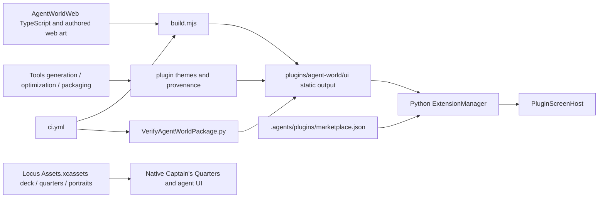

# Agent Worlds packaging, assets, and recovery audit

This is a read-only phase-1 audit supplement to `agent-worlds-extraction-audit.md`. Evidence is from **4cce6ebfaa31f76cd7790967ad8ce7d7e2338deb**, inspected October 5, 2026, in `/Users/nahid/.codex/worktrees/72d5/locus`, initially detached HEAD with a clean working tree. Line numbers refer to that commit, not subsequent extraction edits. No implementation, assets, or private generation ledgers were changed while preparing this audit.

## Observed packaging boundary

`AgentWorldWeb/build.mjs:7–9` writes directly to `../plugins/agent-world/ui` and explicitly preserves old output; lines 10–20 bundle Babylon and application code as a Safari 17 IIFE; lines 21–25 copy HTML/CSS and six WebP backdrops. Consequently rebuilding after deleting the Outpost menu is insufficient: old Outpost models remain in the artifact. Clean staging and an allowlisted package manifest are required.

`plugins/agent-world/.codex-plugin/plugin.json:2–30` establishes plugin identity `agent-world`, version `0.1.1`, screen ID `agent-world`, version `1`, entrypoint `ui/index.html`, and requested `agents.read`, `agents.interact`, `world.preferences`. Its display name and descriptions advertise both themes. `.agents/plugins/marketplace.json:14–23` references a repository-local package, with AVAILABLE/ON_USE policy. Preserve install and screen identity while updating product labels and protocol deliberately; switching to an invented remote URL would create a broken installation source.

The Python extension manager is host infrastructure and stays in Locus: `agent/ollama_code/extensions.py:33` bounds installation to 250 MiB, lines 362–408 validate screen manifests and allowlisted capabilities, and lines 909–958 discover the nearest workspace marketplace. Its version check at line 389 currently recognizes version 1 only. The verifier imports this host parser (`Tools/VerifyAgentWorldPackage.py:388–397`), so it cannot be copied unchanged into an independent repository.

## Ownership matrix and migration decisions

All renderer artifacts below read static files and have no domain-state writes. Native lookups and settings remain subject to the installed screen and its granted capabilities. Build/generation tools are maintenance tools, never permission-bearing runtime APIs.

| Component and evidence | Incoming / outgoing dependencies and state | Classification; destination / action | Protection, risk, rollback |
|---|---|---|---|
| `AgentWorldWeb/package.json:2–19`, `package-lock.json`, `tsconfig.json` | Build/test CLI; TS/Babylon 9.26.0/esbuild 0.28.2/TS 5.9.3. No domain state. | SHARED_WORLD_INFRASTRUCTURE build configuration; independent repository root, preserving pinned toolchain. | Existing npm check. Preserve exact lockfile pins; lockfile root metadata may be renamed without repinning. |
| `AgentWorldWeb/build.mjs:7–27` | Imports main; writes into Locus package and copies artwork. | Mixed composition/packaging; new independent scripts must stage a clean local output, no `../locus` lookup. | CI currently checks generated drift. Build twice and compare; reject archives/symlinks/unreferenced Outpost resources. |
| `plugins/agent-world/.codex-plugin/plugin.json:2–30`, `assets/icon.svg` | Existing marketplace and Locus screen discovery consume identity, entrypoint and capabilities. | LOCUS_HOST_INTEGRATION manifest adapter moves to independent `plugin/`; keep `agent-world` install/screen IDs. Icon is original Locus plugin mark. | Parser tests, installation verification; migration must retain grants and identity. |
| `.agents/plugins/marketplace.json:14–23` | Workspace-discovered local plugin source. No Agent World runtime state. | LOCUS_HOST_INTEGRATION stays in Locus, update only to an actually usable versioned artifact/install path at cutover. | Do not fabricate remote publication. Restore catalog entry with preserved package on rollback. |
| `plugins/agent-world/ui/index.html`, `ui/static/world.js`, `world.css`, six WebPs | Generated from web source; consumed by WebKit. | Generated copies only; rebuild from independent source into `dist/plugin/` or equivalent. | Never use compiled JS as authoritative source. Scan JS, sourcemaps and archives for removed Outpost selectors/assets. |
| `ui/themes/catalog.json:5–10` | TS bootstrap and native theme selection read both worlds. | Mixed discovery; replace active catalog with Local Line-only manifest. Keep legacy `grand-line` identifier migration explicit. | Assert exactly one installed world and no unknown fallback to Outpost. |
| `ui/themes/outpost/theme.json:3–51`, provenance, 11 GLBs | Renderer campus branch, alert beacon branch, animation clips. | OUTPOST_SPECIFIC; verified recovery archive outside active trees, then remove from source/artifact. | Package verifier validates hashes, embedded images/geometry/clips; archive restoration must reproduce them. |
| `ui/themes/grand-line/theme.json:3–51`, provenance, 44 GLBs, references | `grandLineModels`, ships/scenery, ocean renderer. Reads baked model metadata and asset bytes. | Local Line only; independent `packages/local-line/assets/`, maintaining source identifiers/provenance. | Existing package verifier and TS geometry/navigation tests; copy bytes, do not regenerate paid art. |
| `ui/assets/models/den-den-mushi.glb`, reference and provenance; `src/snailAlert.ts:15–16` | Snail viewport uses alert model for ocean; currently uses Outpost beacon otherwise. | Local Line owns snail UI/model despite its current `shared` directory. Remove beacon branch after preservation; not a generic Core requirement. | Shared-asset verifier validates 44-credit ledger; retain model + reference hashes. |
| `AgentWorldWeb/assets/{captain-deck.webp,captain-deck-preview.webp,quarters-*.webp,quarters-artwork.json}` | Build chooses *preview* deck at line 23, five island WebPs at 24–25. | Local Line source artwork and ledger move to Local Line assets. Preserve both deck variants as source inputs until usage decision. | Record source/generated distinction and hashes. Do not quietly use full-size deck as optimized runtime copy. |
| `Locus/Resources/Assets.xcassets/CaptainDeck.imageset`, `Quarters-{elbaf,marineford,water-seven,wano,drum}.imageset`; `AgentWorldView.swift:198–200` | Native quarters uses app-bundled images by asset name; includes native PNG/JPEG plus catalog JSON. `AgentWorldModel.swift:45` derives names. | World-specific presentation art. Source should be owned by Local Line with a bounded installed-plugin asset resolver for the native backdrop; preserve native presentation and fall back safely if unavailable. Do not delete native copies before resolver acceptance. | Native build/UI tests needed; web preview cannot establish native backdrop compatibility. |
| Fifteen `AgentPortrait-*.imageset`, `AgentPicturePicker.swift:7–13`; `Docs/AgentPortraits.json:1–112` | Existing native picture picker, normal sidebar and agent surfaces. Persists profile appearance independently of runtime execution. | LOCUS_HOST_INTEGRATION/shared agent artwork stays in Locus. Do not extract merely because five presets are One Piece characters. | Profile/overview tests; retain native asset names and gallery behavior. |
| `Locus/Resources/ThirdPartyNotices.md:216–218` | App-wide attribution for original plugin marks. | LOCUS_HOST_INTEGRATION notice remains for mark where retained. Add precise independent NOTICE rather than copying all Locus notices. | Preserve Apache licenses and Babylon notice. |
| `.github/workflows/ci.yml:24–41,143–144` | Node renderer/build drift job and Python package verifier rely on in-tree source/package. | Split: independent renderer/build/package CI moves; Locus retains host tests and pinned artifact compatibility tests. | Remove obsolete CI only when replacements pass. CI must not reach another checkout. |
| `project.yml:117–127`; `Locus.xcodeproj/project.pbxproj:305,549,623,641` and corresponding build entries | All native resources copied by folder and native Swift integration compiled into app. No direct `plugins/agent-world` web package resource entry found. | Native Locus files remain until split by responsibility. Asset removal changes source resource contents; regenerate project as needed without removing host UI. | All app variants/native targets compile; release resources must exclude recovery artifacts. |
| `Tools/PackageRelease.sh:239–246,415–448` | Packages already-built app and verifies zip roundtrip/signature; no Agent World-specific packaging discovered. | LOCUS_HOST_INTEGRATION release tooling stays. Add independent artifact digest/version verification at installation/cutover boundary, not an implicit renderer source build. | Audit app resource list and archive contents; no Outpost bundle inside releases. |
| `Tools/GenerateAgentWorldAssets.py:2,27–39` | Paid Outpost generation, recovery helpers `save`, `NoAPIRedirects` reused by Local Line tools. Writes private ledger and authored package assets. | Outpost prompts/campaign are OUTPOST_SPECIFIC; helpers are POTENTIALLY_REUSABLE maintenance code. Archive original; isolate required helper functions if retaining Local Line preparation tooling. Never run generation during migration. | `agent/tests/test_agent_world_assets.py` tests credit/resume/redirect safety. Keep archive and necessary tests together. |
| `Tools/GenerateGrandLineIslands.py:21–22,30,71`, `GenerateGrandLineBudgetIslands.py` | Imports Outpost tool's helpers and optimizer; outputs hardcoded Locus plugin location; campaign prompt JSONs. | Local Line optional maintenance tooling; preserve in independent repository under scripts/tools with explicit input/output roots. No production invocation. | Not required for runtime build; must not require private ledgers or spend credits. |
| `Tools/OptimizeGrandLineAssets.py:143–145` | Uses private original asset source by default; writes prepared assets and provenance; Pillow decoder. | Local Line optional offline tooling; adapt explicit roots, preserve original hashes. | Geometry digest tests and package checks; never overwrite only high-quality source. |
| `Tools/PackageGrandLineIslands.py:283–284,330,398–402` | Repackages **grand-line, outpost, shared** and defaults to private backup, `/tmp` path map. | Mixed maintenance script; preserve whole version in archive, narrow active Local Line packager with explicit roots and no Outpost loop. | New package verifier must not retain all-theme credit assertion after removing Outpost. |
| `Tools/VerifyAgentWorldPackage.py:38–51,388–414` | Validates both themes with host parser and repository paths; lifetime sum fixed at 2053. | Mixed validator; retain archival verifier, extract independent Local Line verifier and host installation checks separately. | New shipped subtotal must be 1844 (1800 Local Line + 44 snail); retain archived 209-credit Outpost history separately. |

## Exhaustive asset categories

The physical plugin contains **123 files / 261,824,234 bytes** (249.70 MiB), excluding no tracked package files. `rg --files` hides the `.codex-plugin` manifest unless asked, so its extension tally is not a complete count. The two theme trees contain 13 Outpost files / 40,256,337 bytes and 91 Local Line files / 210,975,332 bytes. Shared snail assets contain 3 files / 4,342,859 bytes. Authored web backdrop sources contain 8 files / 4,360,344 bytes.

**Outpost model set (all OUTPOST_SPECIFIC):** resident, station, beacon, habitat, crates, resident_explorer, resident_botanist, resident_engineer, planter, lounge, server. Every runtime path is enumerated in `ui/themes/outpost/theme.json:7–17`; each is `assets/<name>.glb.gz`. The source/gzip/texture conversion hashes and embedded animation data are recorded in `provenance.json:294` onward. Preserve the manifest, palette/layout, 30-task 209-credit ledger, all model bytes and active mixed-file references before deletion.

**Local Line model set:** 12 base ships (thousand_sunny, going_merry, baratie, navy_h03, polar_tang, spade_pirates, red_force, moby_dick, perfume_yuda, oro_jackson, queen_mama_chanter, dragons_ship), three additional ships (garp_battleship, marine_patrol, mihawk_coffin), islands/landmarks twin_cape, drum, little_garden, alabasta, water_seven, enies_lobby, marineford, whole_cake, wano, laugh_tale, sabaody, jaya, skypiea, egghead, elbaf, amazon_lily, impel_down, mary_geoise, sabaody_archipelago, dressrosa, hachinosu, long_ring_long_land, punk_hazard, scenery red_line/reverse_mountain, creatures laboon/sea_king/momonosuke/zunesha. All 44 key-to-file mappings, including `_compact` filenames, are authoritative in `ui/themes/grand-line/theme.json:8–51`. All are gzip-wrapped GLBs containing geometry/materials/textures, not standalone loose textures. The ledger has 100 paid tasks and 44 reference records, plus the user-supplied source ship collage. Reference assets are JPEG or PNG; preserve their lineage separately from runtime necessity.

**Procedural artwork and shaders:** `pandas.ts`, `people.ts`, `outpostPalette.ts` are Outpost-only implementations to archive, not generic art to ship unused. `residentMotion.ts` is mixed navigation code and needs symbol-level separation before removal. Local Line ships, articulated island crews, sea signals, News Coo, ocean material and waterfall effects are Local Line rendering, not Core. `oceanWater.ts:3` imports Babylon ShaderMaterial; shader source is in TypeScript and bundled, not separate `.glsl`/`.wgsl` resources. No audio/video files, independent environment-map files, Draco/Basis decoder files, or standalone animation files were discovered in the two renderer/package trees. Main and snail Babylon engines explicitly disable audio (`world.ts:107`, `snailAlert.ts:33`).

**Native gallery (all remains Locus):** atlas, nova, kitsune, moss, orbit, sage, tide, pixel, sol, bloom, luffy, zoro, nami, chopper, law. Each imageset has Contents.json plus portrait.png. World preview ship images are not agent profiles; do not migrate these native portraits into world state or ship DTOs.

**Native backdrop sources:** CaptainDeck has Contents.json + captain-deck.png; each of the five Quarters imagesets has Contents.json + island.jpg. Web copies are different formats/optimized variants. `Docs/AgentWorldDeckAsset.md:3–11` documents the built-in imagegen source and a failed Meshy request (no paid task created); `AgentWorldWeb/assets/quarters-artwork.json:2–35` records prompts and native/web associations for five newly generated backgrounds. These ledgers lack shipped-file hash tables; add hashes to the extraction asset manifest without inventing source rights.

**Icons/notices:** plugin SVG and Apache LICENSE, Babylon-LICENSE.md and Babylon-NOTICE.md move with the independently distributed plugin. `Babylon-NOTICE.md:4–24` lists optional upstream components; package README states optional network decoders/compiler binaries are unused. Preserve upstream notice as supplied; runtime must continue offline.

## Provenance and rights limits

`ui/themes/grand-line/provenance.json:22–27` identifies the user-supplied source collage by name/hash and explicitly calls the world unofficial One Piece fan art. `plugins/agent-world/README.md:128–141` attributes Apache code, Babylon and generated artwork, and separately recognizes original reference designs' rights holders. Neither ledger asserts an actual license from those rights holders or redistribution permission for the reference collage. Generation expenditure and source hashes are provenance evidence, not proof of asset redistribution rights. The same concern is documented by exact prompts in native backdrop and five named portrait presets; changing names alone would not settle it.

For local reversible extraction preserve the existing assets and attribution unchanged. **Public redistribution rights remain unverified.** A release manifest must distinguish Apache code/original marks, generated derivative/reference artwork, and third-party Babylon rather than label all bytes Apache automatically. No rights adjudication or external legal verification was undertaken in this source audit. Do not generate replacements or publish an artifact to bypass this unresolved source-evidence limitation.

## Persistence and reset implications

`AgentWorldModel.swift:219–224,265–266` owns native defaults for appearance, island-click shortcut, conversation bindings and profile history. Canonical chat/profile bindings remain in Locus. Visual per-screen defaults at 376–386 and writes at 800–831 include theme, residentStyle, sailingArea and shipStyles. `main.ts:33–34,285,390,412,609,716–726,758` contains separate demo browser storage keys for island shortcut, demo ship styles, sailing area, resident style. Agent World browser data must never be treated as canonical native settings.

A migration should back up old defaults, map `grand-line` and saved `outpost` selection to Local Line deterministically, preserve per-agent ship styles and supported sailing areas, archive resident-style preference without using it in active world UI, and separate browser-preview migration from native migration. Native bindings and profile history are never cleared by a visual reset. No persisted camera transform was found in this packaging-focused search; reset-view calls change ephemeral renderer camera state.

## Baseline commands and results

- `git rev-parse HEAD`, `git branch --show-current`, `git status --short`: inspected commit above; detached HEAD, clean initial tree.
- `rg --files` and targeted `rg -n` over AgentWorldWeb, plugin assets, Tools, .github, .agents, project.yml, project.pbxproj, native views/resources and Python extension parser established the inventory. Native/project source references below the audited commit are preserved through Git.
- `python3 Tools/VerifyAgentWorldPackage.py`: **environment failure before validation**, `ModuleNotFoundError: requests` importing current checkout's extension parser.
- `/Users/nahid/Documents/locus/agent/.venv/bin/python Tools/VerifyAgentWorldPackage.py`: **PASS**. The absolute Python interpreter supplies dependencies; the tool explicitly imports current checkout `agent` source. Every model's embedded textures/geometry, source references, hashes, all paid task lineage and aggregate totals passed. Output: `Package valid; 2 themes; digest 590da9c7cdd00ec9857dac7015fbdf4a37617dc7d8d0071fdaa4ae8b8c2931dc`; commitments/reported credits both **2053**.
- `/Users/nahid/Documents/locus/agent/.venv/bin/python -m pytest agent/tests/test_agent_world_assets.py -q`: **PASS: 8 passed in 0.94s**. This suite uses mocked network requests; generation was not run.
- No screenshot/native interaction baseline was performed by this audit worker; renderer/native audit workers cover those attempts. A package verifier is not native integration proof.

## Recovery strategy and safe destination discovery

Read-only directory inspection found no existing `agent-worlds` repository in `/Users/nahid/Documents` or the current worktree's parent. `/Users/nahid/Documents/locus-agent-world` is an existing **Locus worktree**, not a destination to overwrite. `git worktree list --porcelain` reports its branch `codex/agent-world`; other existing Agent World worktrees must remain intact.

`/Users/nahid/.codex/agent-world-package-sources-20260913` exists and is referenced by `PackageGrandLineIslands.py:398`; other generation-directory names exist in `.codex`. Their private contents were not inspected or copied. These are not needed for a reproducible shipped-asset build and must not be imported automatically into a public extraction repository. Existing tracking contains all currently shipped Outpost bytes; the original high-resolution preparation sources may be private and should be described as separate optional sources.

Before active removal, create an identifiable archival Git ref at the inspected source commit and a verified Git bundle **outside both active source and distribution input roots**, or a complete targeted archive with a SHA-256 manifest. Because the initial source tree is clean, the inspected commit captures relevant implementation. If relevant implementation becomes dirty, preserve the diff/untracked content explicitly before deletion. Verify restoration in a new disposable directory by resolving the archived commit, comparing each retained relevant file hash, and running the package verifier if its dependencies are available. Record absolute artifact path, SHA-256, source commit and exact restore command in the root extraction audit. Do not rely on another worktree, branch name alone without retained objects, or reflog availability.

The archive scope must include `AgentWorldWeb`, `plugins/agent-world`, all matching native Agent World source/tests, mixed native/back-end call sites at the exact commit, asset generator/optimizer/packager/verifier tools and campaign prompts, applicable licenses/notices, project and CI wiring, and native assets. A verified full-commit bundle is simpler and safer than attempting to guess a minimal mixed-file archive. It must never be included by independent artifact globbing or Locus app release packaging.

Cutover should stop short of removing the working in-tree implementation if native protocol/version support, existing installation resolution, artwork lookup, deterministic visual parity, standalone package validation, or preservation restoration does not pass. Continue additive contract/repository/test work and document concrete missing gates instead of declaring extraction complete.

## Exact asset and packaging file inventory

All hashes below were computed from the audited checkout. Directory roles in the ownership matrix govern every file in each group. This inventory includes the hidden plugin manifest, all retained asset provenance/reference files, native catalog metadata, and generated web output.

| Path | Bytes | SHA-256 |
|---|---:|---|
| `AgentWorldWeb/assets/captain-deck-preview.webp` | 467532 | `81444079370f92ea965b921cfb150a34f683dfe09be2d5617053ae7063adc435` |
| `AgentWorldWeb/assets/captain-deck.webp` | 2133238 | `f4a7fa0e472ccfd52833df493bd506f242bc009ecedb03ad1992d3354395ceb0` |
| `AgentWorldWeb/assets/quarters-artwork.json` | 8398 | `dbf9fd8787b8fc37e2aff4261ba3ef8412744d46f3b0ba0a8eca26014c4ab44e` |
| `AgentWorldWeb/assets/quarters-drum.webp` | 357858 | `bcb4dca94054248da21a190301785db167928cbded57ba753c4d295c0df6abce` |
| `AgentWorldWeb/assets/quarters-elbaf.webp` | 382984 | `cfd27e5d602b943a1431482cfc4db090deb693654cca6fa2a29b9640f6fb7262` |
| `AgentWorldWeb/assets/quarters-marineford.webp` | 285464 | `c0a12a20f3214b86928ab9918bcad563582505ad2582b8969f1c0c5a217cacbe` |
| `AgentWorldWeb/assets/quarters-wano.webp` | 387372 | `6b5dbab89a7c8e42e7270d4dd253eac481d11e2025f1095389c190b1a629be5e` |
| `AgentWorldWeb/assets/quarters-water-seven.webp` | 337498 | `ab265da82cd1edd46d3ac4ed58b7fc3240b1141096ca98086bd1cba0d07d88c8` |
| `plugins/agent-world/.codex-plugin/plugin.json` | 1296 | `5d82b75e70c1d2ca347517becf734300424f4ec6f1a247f0919320f08c6cbbd4` |
| `plugins/agent-world/LICENSE` | 11346 | `56a907a25890fefb1d386af42d9de00e085a1094abb47b221f3c0abbc3afff70` |
| `plugins/agent-world/README.md` | 10375 | `629bfb12824d8d159d3d66162ef305806cf51d80be73a203af86fef66d544694` |
| `plugins/agent-world/assets/icon.svg` | 858 | `2b163f51510f7b80e87ac57c77191ddb3287f58580ce31e57549f6747f183aec` |
| `plugins/agent-world/licenses/Babylon-LICENSE.md` | 9155 | `3a1160f88f3ffdafee129832f8bf5806073f77a43962f15a13ab63f1a5047372` |
| `plugins/agent-world/licenses/Babylon-NOTICE.md` | 793 | `7f85d099ce3c6e1900a45ee8d5b8fa405e760c746af687b3ee2081416e48f183` |
| `plugins/agent-world/ui/assets/models/den-den-mushi.glb` | 4176012 | `7936b36de2bc83919de83a2f6dc62604501ba44462097ee18404eed0cfcaae7a` |
| `plugins/agent-world/ui/assets/provenance.json` | 2797 | `dc4e65bdec28d19e293648f15e0488c22497a4a17f0e49133cd696ecf9e55fc0` |
| `plugins/agent-world/ui/assets/references/den-den-mushi.jpg` | 164050 | `fce6edfdf7c748ec83354a285adc93c41fc4586284810d9dee53b64377621e98` |
| `plugins/agent-world/ui/index.html` | 15900 | `98cdb26d6a44bc4d7e9324c91e0d5d77065acba6a230433d05e839eeaed91aac` |
| `plugins/agent-world/ui/static/captain-deck.webp` | 467532 | `81444079370f92ea965b921cfb150a34f683dfe09be2d5617053ae7063adc435` |
| `plugins/agent-world/ui/static/quarters-drum.webp` | 357858 | `bcb4dca94054248da21a190301785db167928cbded57ba753c4d295c0df6abce` |
| `plugins/agent-world/ui/static/quarters-elbaf.webp` | 382984 | `cfd27e5d602b943a1431482cfc4db090deb693654cca6fa2a29b9640f6fb7262` |
| `plugins/agent-world/ui/static/quarters-marineford.webp` | 285464 | `c0a12a20f3214b86928ab9918bcad563582505ad2582b8969f1c0c5a217cacbe` |
| `plugins/agent-world/ui/static/quarters-wano.webp` | 387372 | `6b5dbab89a7c8e42e7270d4dd253eac481d11e2025f1095389c190b1a629be5e` |
| `plugins/agent-world/ui/static/quarters-water-seven.webp` | 337498 | `ab265da82cd1edd46d3ac4ed58b7fc3240b1141096ca98086bd1cba0d07d88c8` |
| `plugins/agent-world/ui/static/world.css` | 79163 | `e0ec3fb3b9859f9e9a0f8354915386608264e00053f8f2c454d3a06b37d6b60a` |
| `plugins/agent-world/ui/static/world.js` | 3901931 | `75d2b323ba293d08ef49e7f307732e89d5fb6b9b1673202bcf5681cb5c101630` |
| `plugins/agent-world/ui/themes/catalog.json` | 181 | `04325f39eb78350f4796e24c0913322b094afa591249cda07f3e0347b45dc01d` |
| `plugins/agent-world/ui/themes/grand-line/assets/baratie.glb.gz` | 5640511 | `924ac7f83c96cc454d0bb4bd1ab279251844e24f3880b7997c7c6f7c3a10ba79` |
| `plugins/agent-world/ui/themes/grand-line/assets/creature_laboon_compact.glb.gz` | 1743297 | `3b4c6e091dedd61ce82e2f27a291f42cc1e7ee747d0601a0b0eb545c98ebb165` |
| `plugins/agent-world/ui/themes/grand-line/assets/creature_momonosuke_compact.glb.gz` | 2272213 | `bf5d39d2140eade40091f0f1ec288c1363a5c58118e68feb62f2005528b4e1a8` |
| `plugins/agent-world/ui/themes/grand-line/assets/creature_sea_king_compact.glb.gz` | 2138530 | `22b17edcb80c0f600b22e242e8174fde8b2ef08a660b9c24c8e95c59427f77f2` |
| `plugins/agent-world/ui/themes/grand-line/assets/creature_zunesha_compact.glb.gz` | 2810931 | `7fbb352afdf0bd1e58c52922ba0a4b84456333af2b01b90a5821586da7671e2b` |
| `plugins/agent-world/ui/themes/grand-line/assets/dragons_ship.glb.gz` | 5363208 | `da9373e6e5e7fa93deaafd64c80ca61d4653a41889bd3202c125a9fc046233a4` |
| `plugins/agent-world/ui/themes/grand-line/assets/going_merry.glb.gz` | 5433965 | `7275fa62e4e4b77cc5d16875f698c829b3e22f397166ea7a7dad363742bfe31f` |
| `plugins/agent-world/ui/themes/grand-line/assets/island_alabasta.glb.gz` | 5387407 | `c6abf81b9f9d8e22fb776a142b0690ab793efb4fced3ec3eefef94f3c6bfef75` |
| `plugins/agent-world/ui/themes/grand-line/assets/island_amazon_lily_compact.glb.gz` | 3134194 | `9a69769161cf0f2815231db8ec4d83e0b6cbceb913355075de579fe3cf4f84d5` |
| `plugins/agent-world/ui/themes/grand-line/assets/island_dressrosa.glb.gz` | 1570164 | `d5f18d94ee82f453d6d6ea255af565b1b75cb0feab7a844d8a113919fa890e07` |
| `plugins/agent-world/ui/themes/grand-line/assets/island_drum.glb.gz` | 6499790 | `09b1f23f06348c238035efbc34b50204ae4e4a892ba0d677248e789fc2c2dc67` |
| `plugins/agent-world/ui/themes/grand-line/assets/island_egghead.glb.gz` | 6550377 | `a56015bac729513e21f692c5e0477126d9691e97dac6c531dde74faca48d840e` |
| `plugins/agent-world/ui/themes/grand-line/assets/island_elbaf.glb.gz` | 5408349 | `250390d8e6365fcd22b1cad8b49dd2e34249c50d72a2e1ecb533b96d8c6652b4` |
| `plugins/agent-world/ui/themes/grand-line/assets/island_enies_lobby.glb.gz` | 6296936 | `fd7ad24d0e5229ac77bad6f3e9bf1e73b136681187b05cc57e3d551a343ef52f` |
| `plugins/agent-world/ui/themes/grand-line/assets/island_hachinosu.glb.gz` | 1265492 | `225f5c61c6ea21fc2afd5305b3e80d4a94ea23b77ea0c2f9a6c08c9e03f72d19` |
| `plugins/agent-world/ui/themes/grand-line/assets/island_impel_down_compact.glb.gz` | 2690289 | `41c7ff0e89e4e29f042ad8c4af26fb0ea69080771e745f55cfc557ad1ea9cd42` |
| `plugins/agent-world/ui/themes/grand-line/assets/island_jaya_compact.glb.gz` | 2796125 | `04dcf339742f1301a58a27c1bb46e5558dc91426dd32f64333d64b4d44f73b5f` |
| `plugins/agent-world/ui/themes/grand-line/assets/island_laugh_tale_compact.glb.gz` | 2767090 | `28780202826fdc7374c096acd46c1cbc8c2f5226904431cc27682a3381804dec` |
| `plugins/agent-world/ui/themes/grand-line/assets/island_little_garden.glb.gz` | 6034510 | `ad77dfa78b38f06abf7829cfdae5049c78b5ed06756da084484f68e46a2e2cba` |
| `plugins/agent-world/ui/themes/grand-line/assets/island_long_ring_long_land.glb.gz` | 876452 | `cdbc10e13498bf2d67a59a7d7af79a6d07c209a089ca34d371a684cf1356a70e` |
| `plugins/agent-world/ui/themes/grand-line/assets/island_marineford.glb.gz` | 5916649 | `fbe72942581905e9957596c02837c2b70997fc7acc257356586d3f3e3664caf0` |
| `plugins/agent-world/ui/themes/grand-line/assets/island_mary_geoise_compact.glb.gz` | 3007147 | `928a00e712a6d7c6afe1d84b77380d2977c635d88e28a135dc5981d91b2c00ee` |
| `plugins/agent-world/ui/themes/grand-line/assets/island_punk_hazard.glb.gz` | 1540420 | `b21110e4015f3332c4e9b9adace42c0399790331859b34e0d8777f865e224988` |
| `plugins/agent-world/ui/themes/grand-line/assets/island_sabaody_archipelago_compact.glb.gz` | 2938332 | `22bfa8a83032efd7cc41154db02ff6d9b889de6b9fc8da5bad4004976f866ec7` |
| `plugins/agent-world/ui/themes/grand-line/assets/island_sabaody_compact.glb.gz` | 2895469 | `6ecbc05846b0e06beff888823be174144ae933584e5b3ffffd1f92bf5c8d1b6b` |
| `plugins/agent-world/ui/themes/grand-line/assets/island_skypiea.glb.gz` | 5644891 | `39be03a66aed5def328f5a6909a4adf6f1432d0e3bbaa1d49d899d485ee79945` |
| `plugins/agent-world/ui/themes/grand-line/assets/island_twin_cape_compact.glb.gz` | 2776078 | `628e1d5ebb5e21f340412ecdc1b41906a564eb6ce1fb141a43c399150fccd863` |
| `plugins/agent-world/ui/themes/grand-line/assets/island_wano.glb.gz` | 6926643 | `478df35b8f0190dddf24db87372c4ac00d8661dd711a65260d8be940349f9fcf` |
| `plugins/agent-world/ui/themes/grand-line/assets/island_water_seven.glb.gz` | 6371986 | `6020f21001f9d92cf3a65e6f4e0373cf0096a5fdf18c7f506ba2b12ba4ed852b` |
| `plugins/agent-world/ui/themes/grand-line/assets/island_whole_cake.glb.gz` | 5588000 | `c58a7de23629a3253cb8f30c5329bbe50b7c2b18a343b3ce3d730ea16207b2f3` |
| `plugins/agent-world/ui/themes/grand-line/assets/moby_dick.glb.gz` | 5512597 | `0e623423bd8ab15f2df0330126d61c7acbda89ebf0651396a37a0478d652b276` |
| `plugins/agent-world/ui/themes/grand-line/assets/navy_h03.glb.gz` | 5623632 | `78a2eaab5732dc75b39d0f2b6202de7c4f029aa0f04e743555430d38a1a1653d` |
| `plugins/agent-world/ui/themes/grand-line/assets/oro_jackson.glb.gz` | 5274721 | `de7e487b756fa7fd1ec3be97166ac994f3c5d54403da8280549d19bda9ad17a2` |
| `plugins/agent-world/ui/themes/grand-line/assets/perfume_yuda.glb.gz` | 5865832 | `496e35f3dd2a778937d26896e49e2e40e0ff990232e2fbcadc5194b3b8aeacbf` |
| `plugins/agent-world/ui/themes/grand-line/assets/polar_tang.glb.gz` | 4318747 | `f4ab899f31fb1593b278d510c1fbef0fda62b0d3f15f8cd0b097902d93565e1f` |
| `plugins/agent-world/ui/themes/grand-line/assets/queen_mama_chanter.glb.gz` | 5223949 | `0100f597ce9e3acb5411738a3665fc1011992802787dc8cbabe120926cfcf7d8` |
| `plugins/agent-world/ui/themes/grand-line/assets/red_force.glb.gz` | 5985825 | `15366ea65d5241216f591d5cf55df54fc461b0aa7d70df24f38e8a7c47683a44` |
| `plugins/agent-world/ui/themes/grand-line/assets/scenery_red_line.glb.gz` | 5605893 | `f8a2111f6b54a9dac287fa8e7b59ce791e3522bd3dec380b3192da66148cb1fe` |
| `plugins/agent-world/ui/themes/grand-line/assets/scenery_reverse_mountain.glb.gz` | 6169337 | `db9d668f4f2b49497af5c308215db9915902bdb9ecfc4b44bc5393022a8120eb` |
| `plugins/agent-world/ui/themes/grand-line/assets/ship_garp_battleship.glb.gz` | 6262384 | `3669d6c499edc39b96968ca74dab4bdd4fbeb8034cb493e9be73cf85aa9483a2` |
| `plugins/agent-world/ui/themes/grand-line/assets/ship_marine_patrol.glb.gz` | 6176071 | `2b2c3424017aa41a7a6c36e45c774bbfd1f61c8cbe536c172debbe2e7b7116b6` |
| `plugins/agent-world/ui/themes/grand-line/assets/ship_mihawk_coffin.glb.gz` | 5400641 | `11414ecf0aa57f9cbb7250a10ffd54043414cab81a3a9dee5daef53634d67fe0` |
| `plugins/agent-world/ui/themes/grand-line/assets/spade_pirates.glb.gz` | 5282907 | `98bb2857c08d03beaa474b198af664dc542581b2ef853fd67dcb13d68b640127` |
| `plugins/agent-world/ui/themes/grand-line/assets/thousand_sunny.glb.gz` | 5468857 | `b25ae1a705a63810e0d5db543dc7faac76c75435421376e407c802ec0704f486` |
| `plugins/agent-world/ui/themes/grand-line/provenance.json` | 288051 | `349ca6ad8377401f3dc62ce520f5bc54965306528e5201c02782fd59f3832a56` |
| `plugins/agent-world/ui/themes/grand-line/references/baratie.jpg` | 236795 | `b5024b873df027c926bd1bfe80a736bfece9705f194aa7619a3f365c5ce75d5d` |
| `plugins/agent-world/ui/themes/grand-line/references/creature_laboon.jpg` | 154701 | `a306df6ed70d039f997b9396a5814c3dd461db32354a994bee89d2cde15eadf3` |
| `plugins/agent-world/ui/themes/grand-line/references/creature_momonosuke.jpg` | 144734 | `fa07f6417846a98a262f3dedfcc48dec57e0ef43daba49ffa96690488e3aa095` |
| `plugins/agent-world/ui/themes/grand-line/references/creature_sea_king.jpg` | 160421 | `3e2ca1b886bdf8d7aff669068d1c48d5075a4a86caeb73b4dc70b4557ac5ce97` |
| `plugins/agent-world/ui/themes/grand-line/references/creature_zunesha.jpg` | 342664 | `df63553d27810d15d08b973a2c203d30a30ba2bcdd817bc796de86e63df106ae` |
| `plugins/agent-world/ui/themes/grand-line/references/dragons_ship.jpg` | 291045 | `cafd6eb54973b656853dcb40731237b9fe096c26769743635be69eea7c7a1860` |
| `plugins/agent-world/ui/themes/grand-line/references/going_merry.jpg` | 221784 | `a21d155e30073aee50927087271e08f53a4c8c23a24f06c116e39275c1d33b7d` |
| `plugins/agent-world/ui/themes/grand-line/references/grandline_0007_Layer_11.jpg` | 40671 | `6bd9f98a53bcf7054d16c95ecc0dfd38cfefd3e56e5d60466fd7800c68ede259` |
| `plugins/agent-world/ui/themes/grand-line/references/island_alabasta.jpg` | 227290 | `2da3e2fb1dacbe71b6d5aa69c724c1f376825d2d754c6342f81041269d655171` |
| `plugins/agent-world/ui/themes/grand-line/references/island_amazon_lily.jpg` | 401888 | `cdece7fee469a1df4cb7b3606ec5bd68ff70ab73437350b78f6a403a571fb989` |
| `plugins/agent-world/ui/themes/grand-line/references/island_dressrosa.png` | 142144 | `8a6fc975951b8eae9613e688b1345215dc8dfc4b53f806c3c286afec858c1f40` |
| `plugins/agent-world/ui/themes/grand-line/references/island_drum.jpg` | 360529 | `852abf9ba9e3ca50afa260327ace21757d75bd3de2f7799e07244d19670523ac` |
| `plugins/agent-world/ui/themes/grand-line/references/island_egghead.jpg` | 340610 | `ec07ea1176c58c1a88d5d9cb2fd3a7e2e6bd3acae5bf2e82b60f686151f6acd0` |
| `plugins/agent-world/ui/themes/grand-line/references/island_elbaf.jpg` | 280213 | `c86fea0b5e8a0facf97059fc75a4d9690434a1cec9c2627fca34c5ff3acb41d1` |
| `plugins/agent-world/ui/themes/grand-line/references/island_enies_lobby.jpg` | 297808 | `3fe4e8eca77075518e3d7211014b24e283dd8bad6b7290adeee2da71ab7da053` |
| `plugins/agent-world/ui/themes/grand-line/references/island_hachinosu.png` | 167161 | `c2c6b5c2aa5adda3f606a740014ec0b6888fd012228bbfc811c186fa83076100` |
| `plugins/agent-world/ui/themes/grand-line/references/island_impel_down.jpg` | 342653 | `7a91c9cfcce01611e62e548c22d2a1350dcfba25f8f93f68b4b081a190a7b63d` |
| `plugins/agent-world/ui/themes/grand-line/references/island_jaya.jpg` | 298882 | `6a44482dcce6296a08b6f2c0579e34db0e7bb410f7397605eea39f7352ec246c` |
| `plugins/agent-world/ui/themes/grand-line/references/island_laugh_tale.jpg` | 387444 | `b7469bfa1d1baab839b2d289ac435a96527e1d134c62e68d1458eef9e2c82e17` |
| `plugins/agent-world/ui/themes/grand-line/references/island_little_garden.jpg` | 413223 | `6c26ee24cfd667cbd0af4a92aa4d32aa003568f0e8234607b1100a513f5fe8fd` |
| `plugins/agent-world/ui/themes/grand-line/references/island_long_ring_long_land.png` | 57667 | `3901513bdefa74455f9981337c5fd47a7bc51e8275c41ca2c9ac2d47d3b558ea` |
| `plugins/agent-world/ui/themes/grand-line/references/island_marineford.jpg` | 268605 | `42ae03d111ef00979c988a18e73bc3177ef29adf294f1b301f90216aa5ec3997` |
| `plugins/agent-world/ui/themes/grand-line/references/island_mary_geoise.jpg` | 314951 | `b6c218fee2d1656962382e0389125e31b35314fcecdbc396897a9fd4666ea5f2` |
| `plugins/agent-world/ui/themes/grand-line/references/island_punk_hazard.png` | 124474 | `93422cc1d34f9f647b8613a12e7fc406eafbfbf376467cb8a85e5854e4f43193` |
| `plugins/agent-world/ui/themes/grand-line/references/island_sabaody.jpg` | 347888 | `cb5626ee6eb58b86c3b21a4cc593f4879c9b8e5a16348e42ea3e4d14b4955121` |
| `plugins/agent-world/ui/themes/grand-line/references/island_sabaody_archipelago.jpg` | 303709 | `27ccd6067a9ee959ab36772ff318a5871e59a6c1e500545dbff372fd9c50311a` |
| `plugins/agent-world/ui/themes/grand-line/references/island_skypiea.jpg` | 228218 | `506eae8b7e47144a72b212241abe262bfbf8d2034aafba909a14de78636e9999` |
| `plugins/agent-world/ui/themes/grand-line/references/island_twin_cape.jpg` | 343844 | `6301adad62db8e8795f9d017201a2bace597beb1d85339e6bb76afcb5780fa01` |
| `plugins/agent-world/ui/themes/grand-line/references/island_wano.jpg` | 424644 | `df12ccd441705bbe56d4543960ff806616ce23c6b91a961feccfcd722e20f775` |
| `plugins/agent-world/ui/themes/grand-line/references/island_water_seven.jpg` | 449672 | `ca2a2f3b8cdf0cf367bd84c33f616280882ab9421e1a6497f1311202ed2f2488` |
| `plugins/agent-world/ui/themes/grand-line/references/island_whole_cake.jpg` | 316743 | `1439ab0c32a3162d45324901d21673944547ac039c32f6d7637f6e77b0907c7a` |
| `plugins/agent-world/ui/themes/grand-line/references/moby_dick.jpg` | 270776 | `5c7afec044a1b7decf33405724c0a9bfd5e75db2ebde6773eb4e6c1c933ebb90` |
| `plugins/agent-world/ui/themes/grand-line/references/navy_h03.jpg` | 239454 | `46034354ddfee1525266309102673943c73b6648d186789197da9339eaa3a5c0` |
| `plugins/agent-world/ui/themes/grand-line/references/oro_jackson.jpg` | 261708 | `1838fcc58ab2747476d585e96b8ce5e5067447adabf91385d46ea60c5ae62910` |
| `plugins/agent-world/ui/themes/grand-line/references/perfume_yuda.jpg` | 272460 | `68337a40496c82d800d1d5580cfcc64b97e2e14c528c2f0e89315da996f3ab04` |
| `plugins/agent-world/ui/themes/grand-line/references/polar_tang.jpg` | 151488 | `f9b58a2998d94f70fee12b158d523616751bc23d16904077e61f47d4fa2daa0a` |
| `plugins/agent-world/ui/themes/grand-line/references/queen_mama_chanter.jpg` | 220022 | `6724f148859c86a77d250b0dbbc6c8225d28b81ec957971af5488a9bfbe61440` |
| `plugins/agent-world/ui/themes/grand-line/references/red_force.jpg` | 302072 | `28bfdb4f3fe07f0fa864432a529463b211345701ea18a64239eedcb5cffe7cd9` |
| `plugins/agent-world/ui/themes/grand-line/references/scenery_red_line.jpg` | 381706 | `40cc52529d3c38242c62b415e7aa5a8a60ebc0b45218160c727a623700a292ae` |
| `plugins/agent-world/ui/themes/grand-line/references/scenery_reverse_mountain.jpg` | 422798 | `9a22a49f7ae8e5649bc6184719490a5c53384b40da5be4c1ed6bd0b766860672` |
| `plugins/agent-world/ui/themes/grand-line/references/ship_garp_battleship.jpg` | 301883 | `68d0e64e7554793ec98b1283e32c4fdb3377d94b1f5a3f9205c28f8cc637ccb7` |
| `plugins/agent-world/ui/themes/grand-line/references/ship_marine_patrol.jpg` | 282692 | `719929ddeda440a9808b86fe932b6680f1d0753cad7ea302c784ae78ef4dbfed` |
| `plugins/agent-world/ui/themes/grand-line/references/ship_mihawk_coffin.jpg` | 215412 | `0d214dd888fe77a3eb0f0195ea8e601e914d4d77b61abe4ac60205e4eff4e45f` |
| `plugins/agent-world/ui/themes/grand-line/references/spade_pirates.jpg` | 234749 | `8b3ddd344bea4a881d0316f948f250d1b3457ce98fdd919105e96611f3c3d6cf` |
| `plugins/agent-world/ui/themes/grand-line/references/thousand_sunny.jpg` | 226809 | `85bb008307bfa0a7609b45fca1f9028c968b709575621b09e95428a27d627164` |
| `plugins/agent-world/ui/themes/grand-line/theme.json` | 13339 | `22eb7be7597c00f88dc1c15dd9d8558fad05f952079399f290646b3524033d14` |
| `plugins/agent-world/ui/themes/outpost/assets/beacon.glb.gz` | 2772212 | `f26c77612b7a5abd943e4e05466357870f80486a999a58c19ad718cfa652ccf4` |
| `plugins/agent-world/ui/themes/outpost/assets/crates.glb.gz` | 3015554 | `862bdc3653aca7bfb8079dbb7d55d24676cf1cb2e4cbdecb8450d4602f8a7cc1` |
| `plugins/agent-world/ui/themes/outpost/assets/habitat.glb.gz` | 2331122 | `db7cde1585b280e63670e3fc5c695df4b03b3f3254ca8ededde9b944724122f4` |
| `plugins/agent-world/ui/themes/outpost/assets/lounge.glb.gz` | 2148072 | `7b9c36318ac00f27180876d1c1d59d6d0231fb94e8c038bb9c26d7d48f6ffb65` |
| `plugins/agent-world/ui/themes/outpost/assets/planter.glb.gz` | 3522293 | `f3f7bda16e7f945f5188e6c76b29cb60a144bbb59853acb2dc59bfef67f74a04` |
| `plugins/agent-world/ui/themes/outpost/assets/resident.glb.gz` | 5047074 | `4dc10832458cc844bb37a42094abdb2db8a7de8bb0fa327e904602c8ccc1a2db` |
| `plugins/agent-world/ui/themes/outpost/assets/resident_botanist.glb.gz` | 5285292 | `797a52330ba9cc57967a9d07dbb696eca190acea090e1a7a4325dd0465f780a9` |
| `plugins/agent-world/ui/themes/outpost/assets/resident_engineer.glb.gz` | 5435944 | `b05acdf232f773d37fcdfb596a0dc6527ea4e8f68962a490e63984f3c451c6bc` |
| `plugins/agent-world/ui/themes/outpost/assets/resident_explorer.glb.gz` | 5219381 | `a79bbd0874b197698f09750cf4c3cfc768b32b2f605a2085e0aeb7bcc62ebecd` |
| `plugins/agent-world/ui/themes/outpost/assets/server.glb.gz` | 2510483 | `53dbda42227007ff2d476578763353892807389a1a6520145384267c5fc1d801` |
| `plugins/agent-world/ui/themes/outpost/assets/station.glb.gz` | 2940520 | `dc3db2eb41a442ebb5ea1d33182a9a7392e518649118821b5dd9bd9f6ef8124f` |
| `plugins/agent-world/ui/themes/outpost/provenance.json` | 27060 | `4a9172e66fd031354b86d29deb6b1bcbb1749d5c23875a21acf03748509e16ac` |
| `plugins/agent-world/ui/themes/outpost/theme.json` | 1330 | `70a1b9abc725fd18932a4167429f447f910f2182fc12bb6fd40d7f15363e5837` |
| `Locus/Resources/Assets.xcassets/AgentPortrait-atlas.imageset/Contents.json` | 152 | `4c5b70f05e4fe65d5929b2d23f0e462efdfd84cb3dd23745b6d2e8859729ee3f` |
| `Locus/Resources/Assets.xcassets/AgentPortrait-atlas.imageset/portrait.png` | 2590614 | `d2fafcbad0c3abf07ec9297524f53c610c16ce9dc52954e159267bf0f323c983` |
| `Locus/Resources/Assets.xcassets/AgentPortrait-bloom.imageset/Contents.json` | 152 | `4c5b70f05e4fe65d5929b2d23f0e462efdfd84cb3dd23745b6d2e8859729ee3f` |
| `Locus/Resources/Assets.xcassets/AgentPortrait-bloom.imageset/portrait.png` | 2101190 | `763aa123a98169d32650327dd20dacf13bb67fe1556726541ffe5fbec874d7b7` |
| `Locus/Resources/Assets.xcassets/AgentPortrait-chopper.imageset/Contents.json` | 152 | `4c5b70f05e4fe65d5929b2d23f0e462efdfd84cb3dd23745b6d2e8859729ee3f` |
| `Locus/Resources/Assets.xcassets/AgentPortrait-chopper.imageset/portrait.png` | 2284890 | `e46aa72f69588f67541a1079f1e415d4e413b9606a578200220ba1e5612685c1` |
| `Locus/Resources/Assets.xcassets/AgentPortrait-kitsune.imageset/Contents.json` | 152 | `4c5b70f05e4fe65d5929b2d23f0e462efdfd84cb3dd23745b6d2e8859729ee3f` |
| `Locus/Resources/Assets.xcassets/AgentPortrait-kitsune.imageset/portrait.png` | 2359141 | `0b99e7cb48fca113c4639a9c0e44651a3240598298640e4f3f54059072bf769b` |
| `Locus/Resources/Assets.xcassets/AgentPortrait-law.imageset/Contents.json` | 152 | `4c5b70f05e4fe65d5929b2d23f0e462efdfd84cb3dd23745b6d2e8859729ee3f` |
| `Locus/Resources/Assets.xcassets/AgentPortrait-law.imageset/portrait.png` | 2262493 | `fd854b6c2ebb5c6fc0d35dfbc2dee3af4f35ad777198a4c5c54491e56d529596` |
| `Locus/Resources/Assets.xcassets/AgentPortrait-luffy.imageset/Contents.json` | 152 | `4c5b70f05e4fe65d5929b2d23f0e462efdfd84cb3dd23745b6d2e8859729ee3f` |
| `Locus/Resources/Assets.xcassets/AgentPortrait-luffy.imageset/portrait.png` | 2240731 | `d1d027017230af327dbcf4de7228c859a760d7ac67f4125f5aaf915d8ee0863e` |
| `Locus/Resources/Assets.xcassets/AgentPortrait-moss.imageset/Contents.json` | 152 | `4c5b70f05e4fe65d5929b2d23f0e462efdfd84cb3dd23745b6d2e8859729ee3f` |
| `Locus/Resources/Assets.xcassets/AgentPortrait-moss.imageset/portrait.png` | 2582037 | `0ac908b40e6fd61efc0c0fb1a1632880bb30302397bef8ca62e22aa9afd03a99` |
| `Locus/Resources/Assets.xcassets/AgentPortrait-nami.imageset/Contents.json` | 152 | `4c5b70f05e4fe65d5929b2d23f0e462efdfd84cb3dd23745b6d2e8859729ee3f` |
| `Locus/Resources/Assets.xcassets/AgentPortrait-nami.imageset/portrait.png` | 2303623 | `47bfad3f9793c08ecdc6218eef6b23f014ad66c675863b1181c4b66f8ec2060a` |
| `Locus/Resources/Assets.xcassets/AgentPortrait-nova.imageset/Contents.json` | 152 | `4c5b70f05e4fe65d5929b2d23f0e462efdfd84cb3dd23745b6d2e8859729ee3f` |
| `Locus/Resources/Assets.xcassets/AgentPortrait-nova.imageset/portrait.png` | 2242953 | `08a731d5e51559f83e1a0de3531c5586b339e167dc4b501dc43506c4ac35f4c2` |
| `Locus/Resources/Assets.xcassets/AgentPortrait-orbit.imageset/Contents.json` | 152 | `4c5b70f05e4fe65d5929b2d23f0e462efdfd84cb3dd23745b6d2e8859729ee3f` |
| `Locus/Resources/Assets.xcassets/AgentPortrait-orbit.imageset/portrait.png` | 2198304 | `fca122be0ec3e5d3f802462ccdd643f7706b40817bb1bfe735f8b53e12fc4405` |
| `Locus/Resources/Assets.xcassets/AgentPortrait-pixel.imageset/Contents.json` | 152 | `4c5b70f05e4fe65d5929b2d23f0e462efdfd84cb3dd23745b6d2e8859729ee3f` |
| `Locus/Resources/Assets.xcassets/AgentPortrait-pixel.imageset/portrait.png` | 2600880 | `df434bff1d1ccd52c0c469ad8cc0841048c62e2403ce852094b5c415388a014d` |
| `Locus/Resources/Assets.xcassets/AgentPortrait-sage.imageset/Contents.json` | 152 | `4c5b70f05e4fe65d5929b2d23f0e462efdfd84cb3dd23745b6d2e8859729ee3f` |
| `Locus/Resources/Assets.xcassets/AgentPortrait-sage.imageset/portrait.png` | 2327954 | `53db0d167ca05da89f7464b4bde5e63aca108a448e9f261c0eb827089d83bf1c` |
| `Locus/Resources/Assets.xcassets/AgentPortrait-sol.imageset/Contents.json` | 152 | `4c5b70f05e4fe65d5929b2d23f0e462efdfd84cb3dd23745b6d2e8859729ee3f` |
| `Locus/Resources/Assets.xcassets/AgentPortrait-sol.imageset/portrait.png` | 2414791 | `3033816045769789ab0932c6b8477ac15fd61c5f5e41f5917f84ff6072b7e4c3` |
| `Locus/Resources/Assets.xcassets/AgentPortrait-tide.imageset/Contents.json` | 152 | `4c5b70f05e4fe65d5929b2d23f0e462efdfd84cb3dd23745b6d2e8859729ee3f` |
| `Locus/Resources/Assets.xcassets/AgentPortrait-tide.imageset/portrait.png` | 2276118 | `307974ecb4ba055331a25c5ec564380d8d2ad1bfdf4716fee8cd46a237bb33a7` |
| `Locus/Resources/Assets.xcassets/AgentPortrait-zoro.imageset/Contents.json` | 152 | `4c5b70f05e4fe65d5929b2d23f0e462efdfd84cb3dd23745b6d2e8859729ee3f` |
| `Locus/Resources/Assets.xcassets/AgentPortrait-zoro.imageset/portrait.png` | 2067679 | `48f32042cf1a5e8e855b1cf698746134e052355f4547c45e30f6eba166c8aed5` |
| `Locus/Resources/Assets.xcassets/CaptainDeck.imageset/Contents.json` | 156 | `23a79e5c1d06ac81aa9656d5799f5968d6e590f0701baa6d061bf697b4fbb964` |
| `Locus/Resources/Assets.xcassets/CaptainDeck.imageset/captain-deck.png` | 2835173 | `64b9d40bc94712de6684e01488fdffd73b52958a09e34dea6e9863088d647fc3` |
| `Locus/Resources/Assets.xcassets/Quarters-drum.imageset/Contents.json` | 150 | `af34e342be4413d80b358e60778c1a759bce7c4d44631898184f236e7016254d` |
| `Locus/Resources/Assets.xcassets/Quarters-drum.imageset/island.jpg` | 874312 | `6bb5fe2c28f3e5be83e56f87d563c5c399c7bf64cd951a879f8148269ef40802` |
| `Locus/Resources/Assets.xcassets/Quarters-elbaf.imageset/Contents.json` | 150 | `af34e342be4413d80b358e60778c1a759bce7c4d44631898184f236e7016254d` |
| `Locus/Resources/Assets.xcassets/Quarters-elbaf.imageset/island.jpg` | 899024 | `30570ac79554b9b8b53440c6e4641f41ad62c5294bc1a2ca87f38a11964c4cd0` |
| `Locus/Resources/Assets.xcassets/Quarters-marineford.imageset/Contents.json` | 150 | `af34e342be4413d80b358e60778c1a759bce7c4d44631898184f236e7016254d` |
| `Locus/Resources/Assets.xcassets/Quarters-marineford.imageset/island.jpg` | 730895 | `bd2a9b001636aae5537b9fc14606d217d9a7db6bae3aa2bbd1f901e550c2b5bd` |
| `Locus/Resources/Assets.xcassets/Quarters-wano.imageset/Contents.json` | 150 | `af34e342be4413d80b358e60778c1a759bce7c4d44631898184f236e7016254d` |
| `Locus/Resources/Assets.xcassets/Quarters-wano.imageset/island.jpg` | 912228 | `a7250cce5ca7f0a23115b1b4f79ad0baaddaa20f815e6eb4ddf7cc13602868e2` |
| `Locus/Resources/Assets.xcassets/Quarters-water-seven.imageset/Contents.json` | 150 | `af34e342be4413d80b358e60778c1a759bce7c4d44631898184f236e7016254d` |
| `Locus/Resources/Assets.xcassets/Quarters-water-seven.imageset/island.jpg` | 852246 | `204bcadf37cb7abf225bfa3e9ede9c87a7ae2f91bcd6c8cd8a26a2590b6633b9` |
