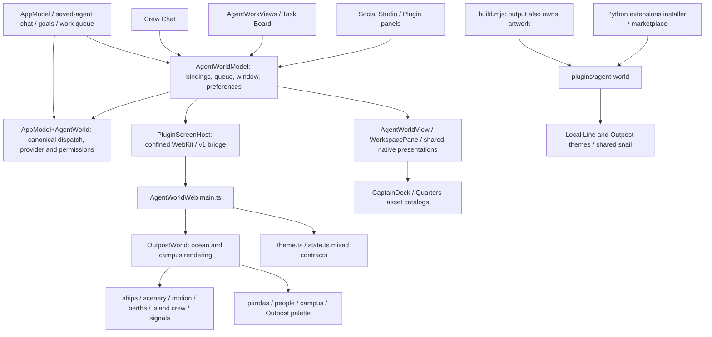

# Agent Worlds extraction audit

## Inspected source and gates

Inspected 2026-10-05: `4cce6ebfaa31f76cd7790967ad8ce7d7e2338deb`, detached HEAD in `/Users/nahid/.codex/worktrees/72d5/locus`. The initial working tree was clean. This is newer than the preliminary `4319810` inspection. Root `AGENTS.md` disables default project skills/Task Observer; the only tracked nested instructions are in an unrelated backend bundled skill. No user implementation changes need incorporating. Audit documents and disposable dependency/build outputs are the only changes during this phase.

This document and its renderer, native and assets appendices form the audit. Evidence refers to the inspected commit, not line numbers after edits. **Destructive cutover is gated** on native integration, lifecycle, artifact and parity checks. A failing or unexecuted required check must leave the original working source available. Publication rights for third-party-inspired assets are not established by generation receipts.

## Dependency map

The problematic reverse edges are canonical saved-agent chat and queue ownership into `AgentWorldModel`, and unrelated plugin windows into the same model. Extraction must separate their ownership before deleting world implementation. `AppModel+AgentWorld.swift` is native domain orchestration, not a renderer. It remains in Locus after naming/responsibility cleanup.

## Ownership matrix and destination decisions

| Component (evidence) | Reads / writes / dependencies | Owner and destination | Verification / risk |
| --- | --- | --- | --- |
| `AgentWorldWeb/src/main.ts:1–763` | DOM, mixed theme selection, v1 bridge, browser preferences, auto-demo; imports world, signals, fleet helpers | Local Line UI plus composition adapter; split WebKit/mock transport into `plugin/` / `dev/` | Existing browser controls need parity; production absence of bridge must fail closed |
| `AgentWorldWeb/src/world.ts:59–1309` | Babylon, scene, rendering loop, asset containers, motion; agents are display projection | `packages/local-line/src/`; campus symbols archived and removed from candidate | 144 existing renderer tests cover pure logic; native GPU/UI tests still required |
| `AgentWorldWeb/src/state.ts:1–115`, `theme.ts` | Wire DTO mixed with world IDs, ship catalog, campus defaults | Renderer-neutral v2 DTO/validation in `packages/sdk`; nautical projection types stay Local Line | v1 semantics preserved; shared Swift/TS fixture gate before moving renderer |
| `AgentWorldWeb/src/pandas.ts`, `people.ts`, `crewAssignments.ts`, `outpostPalette.ts` | Campus residents, palette, procedural geometry | OUTPOST_SPECIFIC; recovery archive only | Must not enter candidate bundle/metafile or release |
| Local Line geography, ships, islands, berths, motion, encounters, signals, camera helpers | Visual reservations/state; reads host statuses, never dispatches work | `packages/local-line/src/`, existing tests beside it | World mechanics are not Core, even when previously shared |
| `Locus/PluginScreenHost.swift:9–300` | Root-confined files, WebKit, exact-key v1 validation, native callbacks | Locus host transport; extend with v2 scoped handshake and strict payload bounds | Preserve CSP, no-network, main-frame and symlink guards; process death revokes session |
| `Locus/AgentWorldModel.swift:90–949` | Profiles/read-only status; canonical chat bindings/history/queue; window; theme, islands, ships; unrelated plugin controllers | Split canonical services and presentation from cosmetic settings; native host remains | Closing renderer must not cancel canonical runners; tests must prove absence/uninstall |
| `Locus/AppModel+AgentWorld.swift`, `+AgentCrewChat.swift`, `+SavedAgents.swift` | Existing providers, session IDs, permissions, queue admission, native chat activation | LOCUS_HOST_INTEGRATION; keep canonical execution in Locus | Saved-agent, Crew Chat, permission, queue regression suite |
| `Locus/AgentWorldSignals.swift` | Canonical runs, attention request UUIDs, transfers, bounded safe displays | Locus display projection adapter | Do not expose raw errors, paths, instructions, transcript/provider contents |
| `AgentWorldView.swift`, `AgentWorldWorkspacePane.swift`, `LocusSharedPresentations.swift` | Shared native forms/chat/settings/tools and world palette/artwork | Hosted Locus UI stays native; decorative labels/tokens/confined images from plugin | No new declarative UI or dynamic native library |
| `Locus/Models/ExtensionModels.swift:90`, `agent/ollama_code/extensions.py:362` | Screen identity/version/capabilities and installer trust review | Existing Locus optional plugin system; explicit v2 support | Current parser only supports v1; Social Studio v1 stays valid |
| `agent/ollama_code/extensions.py:1284–1372` | Trust digest, staging, scope-preserving previous versions | Retain and strengthen existing atomic install/rollback | No parallel installer; validate actual artifact through this seam |
| `.agents/plugins/marketplace.json`, `plugins/agent-world/.codex-plugin/plugin.json` | Installation identity `locus/agent-world`; local package source | Preserve identity; versioned independent artifact after cutover gate | Never point production at mutable main or a developer sibling checkout |
| `AgentWorldWeb/build.mjs`, theme asset trees, native world backdrops | Output tree currently doubles as source artwork; license/provenance ledgers | Immutable Local Line source assets in new repo; clean allowlisted staging | Explicit exclusion of Outpost, archives, dev fixtures, stale files |
| `project.yml`, CI, verifier and UI tests | Native build, asset catalog and in-tree renderer references | Update only when real package integration gate passes | Ordinary app must build without renderer sources/assets/network |

See `agent-worlds-renderer-audit.md`, `agent-worlds-native-audit.md`, and `agent-worlds-assets-audit.md` for detailed symbol, file and asset inventories, tests and classifications.

## Persistence ownership

| Existing namespace | Owner / migration |
| --- | --- |
| `Locus.AgentWorld.conversations.v1` | Canonical Locus workspace/profile/chat bindings. Retain native; world reset must never touch it. |
| `Locus.AgentWorld.profileHistory.v1` | Canonical historical profile-to-chat identity. Retain native with compatibility reads; never regenerate IDs. |
| `Locus.AgentWorld.theme.v1.<screen>` | World cosmetic. Preserve backup; map `grand-line` and prior Outpost selection to Local Line in v2 namespace. |
| `Locus.AgentWorld.shipStyles.v1.<screen>` | World cosmetic mapping keyed by canonical UUID; migrate without changing profile data. |
| `Locus.AgentWorld.residentStyle.v1.<screen>` | Outpost-only cosmetic. Preserve backup, do not apply to Local Line. |
| `Locus.AgentWorld.sailingArea.v1.<screen>` | Local Line cosmetic; validate and migrate. |
| `Locus.AgentWorld.quartersAppearance.v1`, `.islandQuartersEnabled.v1` | Local Line decoration; global legacy scope must not silently broaden. |
| `locus.agentWorld.*` in browser localStorage | Old standalone preview-only preferences; production uses a nonpersistent WKWebsiteDataStore (`PluginScreenHost.swift:199`). |
| Profiles, portraits, provider settings, chats, tasks, board/calendar, credentials, Identity Vault | Canonical Locus stores. No movement or reset through the world contract. |
| Agent positions / work berths / selection effects / seen transfers | Disposable visual projection; reconcile from host state, never infer task execution from motion. |

## Captain's Quarters feature disposition

WORLD UI: map/camera, sailing-area choice, fleet paging, ship styles, island visits, decorative frame/backdrops, wood/ocean cosmetics. HOSTED LOCUS UI: agent overview/editor, chats, Crew Chat, task assignment drafts, permissions, providers, automations, accounts, plugins, connections, Library, Identity Vault, Calendar, Task Board, Activity Center and results. WORLD → LOCUS COMMAND: open/select UUID, open native create form, open exact approval/transfer, allowed navigation. LOCUS → WORLD STATE: authorized names/roles/statuses, selected UUID, safe scoped attention/transfer tokens and cosmetic preferences. Portrait pickers remain canonical; already persisted user pictures must survive uninstall. Shared anime portrait gallery is not exclusive world artwork and remains in Locus.

## Behavior baseline and verification

Existing renderer: `cd AgentWorldWeb && npm ci && npm run typecheck && npm test && npm run build`, Node 25.5.0: **144 tests passed, 0 skipped; typecheck/build passed**, no tracked generated changes. Tests use Node's existing strip-types runner. No new build engine is required.

Package: `python3 Tools/VerifyAgentWorldPackage.py` initially failed because `requests` was missing. Re-run with `/Users/nahid/Documents/locus/agent/.venv/bin/python Tools/VerifyAgentWorldPackage.py` passed: two themes, digest `590da9c7cdd00ec9857dac7015fbdf4a37617dc7d8d0071fdaa4ae8b8c2931dc`. The external interpreter only supplies dependencies; checked-out source was verified. Package size 261,824,234 bytes, including Outpost 40,256,337 bytes and Local Line 210,975,332 bytes. These are byte inventory measurements, not frame/memory performance claims.

Native baseline: Xcode 26.6, native regression build/test underway in isolated `/tmp/locus-agent-worlds-native-baseline`; exact invocation/outcome recorded in native appendix. Native fixtures exist, but deterministic baseline image capture and real transport checks are not yet completed. Browser rendering alone cannot discharge these gates.

Controls inspected: roster search, 12-agent paging (area berth count can lower it), selection and focus, previous/next agent, camera drag/pan/orbit/reset/keyboard/zoom, New Agent, Crew Chat, Captain's Quarters and five island visits, island-visit preference, native tools/settings, Activity Center/attention/transfer targets, ship style selection, reduced motion and hidden-page rendering suspension. Empty host roster remains empty in native mode; existing absent-bridge automatic samples must be removed from production. Busy/queued/attention statuses reserve nearest free reachable harbors; completion and removal release. Full details and test limitations are in renderer appendix. A public marketplace/world-authoring installer, transport exactly-once delivery, and production event stream are **not currently implemented**.

## Preservation and migration plan

1. Commit this audit and appendices before implementation. No original history rewrite. Create a `codex/agent-worlds-extraction` branch from the inspected detached HEAD.
2. Before deletion, archive the exact relevant tracked source/assets/config/docs from the inspected commit to a durable sibling recovery directory outside both active build roots. Record SHA-256 and per-file hashes. Extract to a fresh disposable directory and compare every byte; retain original archive. No relevant uncommitted implementation existed at audit start.
3. Define SDK/world lifecycle and new wire v2 (v1 is not silently redefined). Handshake negotiates release, SDK, capabilities and fresh workspace-scoped session before data. Correlated bounded commands delegate to native surfaces; cosmetic storage is separately namespaced and quota-bounded. Publish authoritative snapshots and ordered projection changes; gaps trigger fresh snapshots, never mutation replay. Test shared vectors in Swift/TypeScript before renderer transfer.
4. Separate rendering in an independent local `agent-worlds` Git repository, preserving source path/commit provenance rather than importing unrelated Locus history. Local Line owns all nautical semantics and Babylon; Core only lifecycle, contract, projection. A test-only non-nautical world exercises the same interface. Explicit development host only; production bridge failures cannot become demos.
5. Clean staging allowlists Local Line runtime/artwork. Preserve notices/asset provenance and unresolved rights. Run clean isolated clone/build/package validation; record manifest/hash. Stage v2 native integration while v1 remains usable.
6. Only after native packaged-asset, install/revoke/reconnect/rollback, parity and ordinary-Locus-without-plugin gates pass: remove embedded renderer, Outpost registration, world catalogs/backdrops and in-tree package. If any required gate fails, retain that working implementation and mark cutover blocked; continue independent contract/package work.
7. Record every check and T01–T40 outcome in the migration status/evidence reports. Remote creation/push/release is not implied by a local artifact; record exact publication steps if not performed.

## Rollback and unknowns

A migration cannot rely on a reflog. Keep the verified archive plus previous installed plugin digest/version until acceptance, and retain afterward until explicitly removed. New preferences preserve old values; downgrade reads the untouched legacy namespace. Canonical stores are unaffected. Old host rejects v2; new host deliberately supports v1 during transition and v2 only after handshake. No automatic v2 → v1 protocol downgrade.

Remaining audit uncertainties block deletion/publication, not additive work: native baseline/visual results, verified full hosted-native parity, plugin failure containment/hang recovery, and third-party asset redistribution rights. There is no claimed remote `agent-worlds` repository or release yet.
