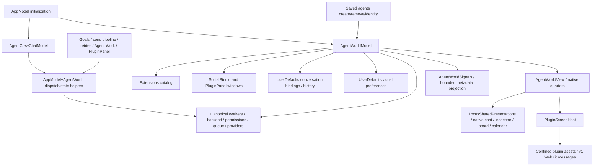

# Agent Worlds extraction: native integration audit

Audit date: 2026-10-05. Inspected checkout: detached HEAD `4cce6ebfaa31f76cd7790967ad8ce7d7e2338deb`; initial `git status --short` was empty. All references below describe that commit, not proposed implementation. This audit is read-only except this document and disposable build outputs. The project/root AGENTS instructions disable automatic companion skills and Task Observer; neither was activated.

## Method and baseline

Commands: `git rev-parse HEAD`, `git branch --show-current`, `git status --short`, `rg --files`, `rg -n 'agentWorld|AgentWorld' Locus --glob '*.swift'`, targeted `nl -ba ...`, `xcodebuild -list -project Locus.xcodeproj`, and the focused native baseline below. `README.md:157` documents Xcode 26/XcodeGen; `project.yml` is project source of truth (`README.md:176`). Existing generated project includes AgentWorldModel, AgentWorldView, AgentWorldWorkspacePane, AgentWorldSignals and AppModel+AgentWorld in all native app source lists (`Locus.xcodeproj/project.pbxproj:3231`, `3701`, `4172`). No project generation or implementation change was necessary for the baseline.

```sh
xcodebuild test -project Locus.xcodeproj -scheme Locus -configuration Debug \
  -destination 'platform=macOS' \
  -derivedDataPath /tmp/locus-agent-worlds-native-baseline \
  -only-testing:LocusTests/AgentWorldTests \
  -only-testing:LocusTests/AgentWorldSignalsTests \
  -only-testing:LocusTests/AgentCrewChatTests \
  -only-testing:LocusTests/SavedAgentTests \
  -only-testing:LocusTests/PluginPanelTests \
  CODE_SIGN_IDENTITY=- DEVELOPMENT_TEAM= \
  LOCUS_DIRECT_ENTITLEMENTS=Config/LocusDirectAdHoc.entitlements \
  LOCUS_BUNDLE_MODE=skip LOCUS_BUNDLE_CODEX=skip LOCUS_BUNDLE_CLAUDE=skip
```

Log: `/tmp/locus-agent-worlds-native-baseline.log`. Result pending at document creation; appended when complete. `Tools/BundleBackend.sh:46` explicitly supports skip mode. This tests native compile/unit behavior, not a complete app bundle with the Python runtime. No native visual parity or interactive WebKit observation is claimed. Static control inventory below is a source baseline, not screenshot evidence.

## Dependency map



Crucial reverse dependency: ordinary saved-agent identity currently falls back to `agentWorld.boundProfileID` (`AppModel+SavedAgents.swift:295`), creation writes `agentWorld.bindConversation` (`:401`), and safe removal checks `agentWorld.hasPendingWork` (`:172`). This is canonical native state, not disposable renderer state. Deleting or treating the entire AgentWorldModel as optional would risk history identity and running work.

## Native ownership and migration matrix

| Component / evidence | Incoming → outgoing dependencies | State / persistence / capability | Classification and intended destination | Tests, risk, rollback |
|---|---|---|---|---|
| `AgentWorldModel.swift:6` error and `:78` conversation state | Crew Chat, saved agents, AgentWorkLedger, task capsules, send pipeline → native ChatBlock/state | Native transcript/dispatch error, never wire | LOCUS_HOST_INTEGRATION; generalize to saved-agent native types in Locus | AgentWorldTests / AgentCrewChatTests / SavedAgentTests; do not remove by filename |
| `AgentWorldModel.swift:181`, `:222`, `:243`, `:254`, `:262`, `:498` binding/history/create coalescing | Ordinary saved agents and world panel → canonical sessions | `Locus.AgentWorld.conversations.v1`, `Locus.AgentWorld.profileHistory.v1`; profile history persisted before current selection | LOCUS_HOST_INTEGRATION; dedicated Locus saved-agent conversation service; migrate keys conservatively, retain read compatibility | `AgentWorldTests.swift:636`, `:739`, `:791`, `:814`; corrupt/missing/history bindings must remain protected |
| `AgentWorldModel.swift:195`, `:247`, `:642` queues/runners | Native composer and saved-agent removal → app dispatch | In-memory queue max 20; runners intentionally outlive window (`:414`) | LOCUS_HOST_INTEGRATION; native conversation service, never SDK/runtime | Preserve pending-work guard and queued work during window close; uninstall must not kill canonical accepted runs |
| `AppModel+AgentWorld.swift:72`, `:107`, `:120`, `:147` | Goals (`AppModel+Goals.swift:60`), SendPipeline (`:40`, `:424`), AgentWork (`:52`, `:88`), Crew Chat (`:49`), PluginPanel (`:453`), queue retry (`AppModel+RunQueueAndActivity.swift:582`) → exact provider route/native backend/global queue/permissions | Provider IDs, instructions, credentials routing, native transcript; authoritative mutable state | LOCUS_HOST_INTEGRATION; remain Locus, rename independently from mechanical extraction | Existing dispatch/profile tests; any extraction to JS is forbidden. Host commands must only open existing native forms |
| `AppModel+AgentWorld.swift:5`; `AppModel.swift:1323` | App init → CrewChat configure at `:7`, World configure | Always constructed and configured even no plugin installed | LOCUS_HOST_INTEGRATION; move Crew Chat init outside optional world config | No-plugin operation tests needed; distinguish world availability from service existence |
| `AgentWorldModel.swift:273`, `:279`, `:348`, `:356`; `AgentWorldView.swift:4` | Work menu, SocialStudio and PluginPanel (`SocialStudioWindowController.swift:42`, `PluginPanel.swift:353`) → extension catalog/window controllers | Installed plugin ID, digest, root, screen; global/project enabled/disabled scopes | SHARED_WORLD_INFRASTRUCTURE only for optional screen display; generic plugin discovery stays Locus | PluginPanelTests / SocialStudioTests / workspace-disable test; removing AgentWorld must not remove unrelated windows |
| `AgentWorldModel.swift:155`, `:301`, `:367` active screen identity | Native host → plugin catalog | Captures plugin/root/digest/screen equality and pinned `windowWorkspace`; refresh revokes sync on disable/digest change | LOCUS_HOST_INTEGRATION; narrow host adapter with per-WebView session epoch and checked identity | Current equality/revocation preserved; absent explicit per-request workspace session token is a migration gap |
| `AgentWorldModel.swift:399`, `:407`; `PluginScreenHost.swift:210`, `:229`, `:243` | NSWindow visibility/close → snapshot poll/WebKit event | 500 ms refresh task; visibility callback; teardown removes handler and delegates | LOCUS_HOST_INTEGRATION for lifecycle signal; renderer runtime handles activate/deactivate/dispose | Hidden world should stop full rendering; test repeated close/reopen, stale messages, async init, disposal |
| `PluginScreenHost.swift:10`, `:129`, `:195` | AgentWorldView → WebKit and local plugin tree | Exact safe relative path, symlink containment, GET-only, bounded resources, ephemeral WK storage, CSP/network block, no navigation/popups/media | LOCUS_HOST_INTEGRATION; retain Locus generic resource host | `AgentWorldTests.swift:604`, `:685`; maintain security independently of bridge evolution |
| `PluginScreenHost.swift:30`, `:48`, `:249` message decoder/dispatch | Plugin JS → native world actions | v1 only, exact key sets, UUID IDs, capabilities; no arbitrary send/tool calls; no request correlation/errors/session/payload byte bound | LOCUS_HOST_INTEGRATION; replace/add strict v2 adapter, reuse existing plugin system | `AgentWorldTests.swift:60`, `:76`, `:98`, `:351`, `:377`, `:911`; negative contract tests required |
| `AgentWorldSignals.swift:6`, `:18`, `:45`, `:191` | Backend events/native workers/runs/CrewChat → bounded metadata | Native session IDs/details held out of `snapshot`; opaque UUID tokens; 256 attention/128 transfers max (`:253`); no external persistence | LOCUS_HOST_INTEGRATION projection adapter; minimal DTO wire only | AgentWorldSignalsTests owner/session/workspace/transport tests; never export private transcript/details |
| `AgentWorldSignals.swift:260` refresh | Visible native world → backend run details | Four-second throttle, max eight reads, 64 cached runs; no work creation | LOCUS_HOST_INTEGRATION; replace snapshot polling with native subscriptions where feasible | Must not become world-owned execution runtime; keep backend calls behind Locus |
| `AgentWorldModel.swift:22`, `:139`, `:843` world catalog | Native toolbar and snapshot → plugin `themes/catalog.json` | Built-ins include Outpost and Local Line; max 32 KiB/50 catalog rows | OUTPOST_SPECIFIC only Outpost option; Local Line selection owned by composition/manifest; native generic world picker if needed | `AgentWorldTests.swift:332`, `:368`; archive Outpost before removing active option; migrate old theme value explicitly |
| `AgentWorldModel.swift:32`, `:39`, `:48`, `:99`, `:114`, `:796`, `:823` nautical prefs/catalogs | World chrome, bridge, native view theme → UserDefaults | `quartersAppearance.v1`, `islandQuartersEnabled.v1`; per-screen `theme.v1`, `shipStyles.v1`, `residentStyle.v1`, `sailingArea.v1`; no project scope for visual prefs | LOCAL_LINE ownership (not generic Core); ship/island labels/catalogs move to world metadata; bounded generic visual storage in Locus adapter | `AgentWorldTests.swift:13`, `:488`, `:513`, `:935`; repeatable visual-only migration, preserve canonical keys separately |
| `AgentWorldModel.swift:860` snapshot | Native model → JS | Names, role, status; selected ID; ship styles; attention/transfer DTO; project basename; no full path/messages/provider details | LOCUS_HOST_INTEGRATION selected/authorized DTO; ship preference semantics belong Local Line | AgentWorldSignalsTests.swift:50; add byte/string/roster caps and epoch/revision |
| `AgentWorldView.swift:20`, `:69`, `:146`; `AgentWorldWorkspacePane.swift` | Native model → SwiftUI chat/composer/inspector/profile/board/calendar/Crew Chat | Full native forms, approval controls and real domain models remain native | LOCUS_HOST_INTEGRATION; preserve native panes, generalize narrow presentation chrome from data if possible | AgentWorldTests control/presentation tests; removing quarters would violate current visible behavior |
| `AgentWorldView.swift:200`, `:780`, `:815`; `Theme.swift`, `Sheets.swift`, `BoardWindowController.swift:15` | Native quarters/world avatars → CaptainDeck, Quarters-* app assets, plugin grand-line ship reference JPEGs | Static art + NSCache bounded 45/8 MiB; hardcoded native ship path/IDs | LOCAL_LINE artwork/presentation; generic bounded plugin asset references at host edge; canonical agent photos stay Locus | `AgentWorldTests.swift:243`, `:260`, `:275`; asset ownership not solved by copying only web assets |
| `LocusSharedPresentations.swift:6`, `:34`; `AppModel.swift:117`; `WorkspaceView.swift:70` | Main window/native world → Library, Identity Vault, schedules, settings, files, tasks, permissions | Shared native presentation ownership Boolean controlled by key window | LOCUS_HOST_INTEGRATION; generic presentation owner instead of product dependency | Preserve dismissal guards and keyboard focus; native controls required for authorization |
| `AgentWorkViews.swift:14`, `:56`, `:69` | Ordinary board/calendar assignment UI → world workspace/activity routing | Canonical work ledger and schedule actions; world-specific presentation selection only | LOCUS_HOST_INTEGRATION; generic active native workspace/presentation service | AgentWorkTests; no-world Activity Center must remain available |
| `Models/ExtensionModels.swift:90`, `:112`; `agent/ollama_code/extensions.py:362` | Native and backend discovery → screen validation | Only version 1; known caps; confined HTML; special native social-studio unchanged | LOCUS_HOST_INTEGRATION; version acceptance and negotiated wire contract evolve together | Swift ExtensionsTests + Python extension tests; reject future incompatible majors safely |
| `ExtensionsModel.swift:232`, `:265`, `:282`, `:297`; `extensions.py:2168`, `:2195` | Existing install/update/disable/rollback/uninstall → digest-checked backend | Existing trust screen; changed screen capabilities/version/entrypoint require renewed trust; identity based on catalog/plugin | LOCUS_HOST_INTEGRATION; reuse unchanged installation system; retain `agent-world` plugin identity explicitly | Existing extension trust/update tests; no new marketplace or fabricated remote needed |

## Static behavior baseline

- Work menu enumerates installed, enabled screens and other plugin panels (`AgentWorldView.swift:4`). Missing world produces no launch item; services remain initialized.
- Roster search matches names, roles, ships, home ports (`AgentWorldView.swift:160`); working/attention counts (`:168`); empty state includes native agent creation (`:464`). No launch/snapshot automatically creates agents.
- Ship selection calls native choose/open-map-chat (`AgentWorldModel.swift:430`, `:451`), and existing tests specifically assert no new conversation or quarters switch (`AgentWorldTests.swift:157`). Focus and selection have distinct behavior.
- Native toolbar has world picker, Local Line quarters appearance/settings, New Agent, Crew Chat, Captain's Quarters, agent-list toggle, and map/full native workspace toggle (`AgentWorldView.swift:273`, `:309`). Outpost resident style menu is a different branch (`:344`) and should be archived/removed.
- Captain's Quarters embeds the existing native composer and inspector (`AgentWorldWorkspacePane.swift:403`), existing board/calendar (`AgentWorldView.swift:690`), profile editor, automation management, accounts, extensions, connections, Library, and Identity Vault through shared native presentation ownership. Those are not JS APIs.
- Ship style menu and native fallback ship portrait rely on Local Line's fixed catalog/JPEG naming (`AgentWorldView.swift:815`, `:881`). Real profile photo data in AgentTeamsModel remains authoritative and overrides world fallback (`:770`).
- Attention and transfer interactions use opaque, known native tokens and native conversation navigation (`AgentWorldModel.swift:754`, `:760`, `:766`), not direct permission acceptance.
- Board handoff validates card membership, selected agent and project, creates a native chat only after explicit native action, and prepares a draft (`AgentWorldModel.swift:550`). Actual send remains user action.
- Existing wire supports no arbitrary navigation, tasks.assign, transcript reading, execution, tools, provider access, file paths, or portrait data. These must not be invented simply to fill conceptual API categories.

## Security/lifecycle boundary and implementation order

Preserve `PluginScreenFiles` canonical path/symlink rules, pre-markup CSP plus WebKit network blocker, nonpersistent WebKit store, top-frame/scheme/host checks, plugin/digest equality, deny external navigation/popups/media, and native known-entity lookup. Capability advertisement currently comes from the trusted installed manifest; each mutation additionally needs current installed identity/session/scope authorization, not only a client enum.

Current v1 is one-way fire-and-forget and snapshot driven. It has no handshake negotiation, session epoch, request ID/result, timeout/cancellation protocol, bounded total message bytes, or generic visual storage. No event revision/gap recovery or 2D test world is currently implemented. These are extraction requirements, not baseline claims. Snapshot metadata is relatively narrow already and should not expand into full Locus internals.

Safe staged plan:

1. Preserve Outpost and relevant app/web assets outside active inputs; verify restored archive. Keep this pre-cutover implementation available until native and renderer parity gates pass.
2. Separate saved-agent identity/history/conversation state/dispatch and pending-work accounting into native services. Keep read-through of old canonical keys; write identity before selection; test no-plugin behavior.
3. Generalize plugin-screen lifecycle/discovery/presentation ownership enough to keep Social Studio, PluginPanel and ordinary agent functionality independent. Avoid moving unrelated domain code.
4. Formalize v2 SDK/DTO shapes, strict Swift + TS decoders, session identity, capability enforcement, monotonic revision, correlated responses/errors, bytes/count limits. Reuse existing resource host and trust installer; support v1 during explicit bounded migration or fail compatibly.
5. Move Local Line-specific catalogs/assets/world settings/UI into the extracted world or manifest data. Native Captain's Quarters content stays Locus. Replace native hardcoded image/catalog lookups with validated plugin-owned presentation metadata only after demonstrated parity.
6. Wire event subscriptions at native service observation boundaries with coalescing; emit lifecycle on visibility/switch/revoke; invalidate stale asynchronous callbacks. Close renderer lifecycle only, not native accepted work.
7. Run focused native + contract + no-world regression tests and interactive native parity before deleting active legacy implementation. Missing graphical/native parity or compile gate means retain working code and document blocker.

Rollback is restoration of the captured commit/artifact plus legacy plugin identity and visual preferences. Canonical bindings, profiles, transcripts, accepted runs and permissions are never rolled back or overwritten by a visual-preference migrator. Plugin uninstall removes visual package access, not canonical saved agents or their chats.

### Recorded native baseline result

The focused command completed with exit **65** before running any test method. Swift/app/test compilation and signing completed, but Xcode could not launch `LocusTests`: `IDELaunchErrorDomain Code 20`, `IDELaunchServicesLauncher`, "The LaunchServices launcher has returned an error." This is a baseline environment/launch failure, not a green test suite or evidence of a test assertion failure. `xcresulttool get test-results summary` records zero passed tests and one runner-launch failure. Result bundle: `/tmp/locus-agent-worlds-native-baseline/Logs/Test/Test-Locus-2026.10.05_16-27-56--0400.xcresult`. Compile logs contain no Swift `error:`. Native UI parity remains unverified and blocks destructive cutover.

### Recovered native test baseline (same compiled bundle)

The repository's earlier native audits documented the same LaunchServices collision alongside an already running Locus app (`Docs/AgentExperienceAudit-2026-09-14.md:169`). That app was left running. Direct Xcode `xctest` successfully executed the exact compiled XCTest bundle. The first direct run had six resource assertions in two tests because `Bundle.main` was Xcode's executable and had no app Assets.car. A disposable runner app containing the **unchanged** Xcode xctest binary and a copy of the built Locus Resources corrected that resource-host mismatch; no application sources, test bundle, dylib, or assertions were changed.

Final baseline: **116 tests, zero failures**, exit **0**. Includes the real WKWebView local asset fetch/XHR test and native in-memory controls. It remains distinct from interactive native UI visual parity. Log: `/tmp/locus-agent-worlds-native-baseline-direct-resources.log`.

Wrapper: `/tmp/locus-agent-worlds-xctest-runner.app`, containing `Contents/MacOS/xctest` copied from `/Applications/Xcode.app/Contents/Developer/usr/bin/xctest`, `Contents/Resources` copied from the compiled `Locus.app/Contents/Resources`, and Info.plist with CFBundleExecutable=xctest, CFBundlePackageType=APPL, CFBundleIdentifier=io.sparktales.agent-worlds-xctest-baseline. Reproduce after native compilation:

```sh
env -i PATH=/usr/bin:/bin:/usr/sbin:/sbin \
  DYLD_LIBRARY_PATH=/tmp/locus-agent-worlds-native-baseline/Build/Products/Debug/Locus.app/Contents/MacOS:/Applications/Xcode.app/Contents/Developer/usr/lib:/Applications/Xcode.app/Contents/Developer/Platforms/MacOSX.platform/Developer/usr/lib \
  DYLD_FRAMEWORK_PATH=/tmp/locus-agent-worlds-native-baseline/Build/Products/Debug/Locus.app/Contents/Frameworks:/Applications/Xcode.app/Contents/Developer/Platforms/MacOSX.platform/Developer/Library/Frameworks \
  /tmp/locus-agent-worlds-xctest-runner.app/Contents/MacOS/xctest \
  -XCTest 'LocusTests.AgentWorldTests,LocusTests.AgentWorldSignalsTests,LocusTests.AgentCrewChatTests,LocusTests.SavedAgentTests,LocusTests.PluginPanelTests' \
  /tmp/locus-agent-worlds-native-baseline/Build/Products/Debug/Locus.app/Contents/PlugIns/LocusTests.xctest \
  > /tmp/locus-agent-worlds-native-baseline-direct-resources.log 2>&1
```

The sanitized environment also avoids xctest dumping unrelated process configuration if a runner argument is malformed.
