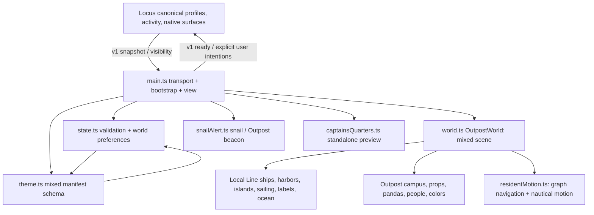

# Agent Worlds renderer audit supplement

Inspected commit: `4cce6ebfaa31f76cd7790967ad8ce7d7e2338deb`, detached HEAD, originally clean tracked tree. This supplement is part of the phase-one audit; paths and line references below refer to that exact commit. No implementation files were edited to prepare this report. `npm ci` installed ignored dependencies; the existing build reproduced tracked packaged outputs without a diff.

## Actual baseline

Executed in `AgentWorldWeb`: `npm ci`, `npm run typecheck`, `npm test`, `npm run build`. Node `v25.5.0`; dependency installation added six packages with zero reported vulnerabilities. Typecheck passed. All **144 tests passed**, zero failed, skipped, or cancelled (5.267 seconds reported by runner). Build passed and `git status --short` reported no tracked output changes. This is source/unit/NullEngine verification, not a native SwiftUI/WebKit or visual browser acceptance result. Deterministic screenshot/interaction fixtures are absent from this renderer test suite. Native quarters/chat/security behavior must be verified in Locus separately.

Read-only commands included `git rev-parse HEAD`, `git branch --show-current`, `git status --short`, `rg --files`, `rg -n` over imports/exports/call sites/Outpost symbols/storage/listeners/render loops, and numbered source reads using `nl -ba`. Build evidence: `AgentWorldWeb/package.json:5` retains TypeScript 5.9.3, Babylon.js 9.26.0, esbuild 0.28.2; `AgentWorldWeb/build.mjs:7` writes directly to the adjacent plugin and deliberately preserves themes at line 8. The new repository needs an owned asset tree and clean staging build, not this output-preservation rule.

## Dependency and responsibility boundary

There is no independent World interface, generic lifecycle runtime, or wire-only SDK today. `main.ts:17` declares browser bridge globals; line 25 directly discovers WebKit; line 26 silently creates demo mode from bridge absence. The mixed renderer owns its own Babylon loop (`world.ts:177`, `878`); a future runtime must control this loop through lifecycle methods or take over scheduling, never add a second loop. Existing disposal is valuable and must survive extraction (`world.ts:1289`, `snailAlert.ts:209`).

SDK destination: bounded, renderer-neutral agent/status/attention/transfer display DTOs, versioned envelopes and validation, World metadata/context/interface, capability and request/result types. Core destination: world registration/lifecycle, host snapshot/event projection and bounded storage/session bookkeeping; no imports of Babylon, Local Line, island IDs, ship models or nautical rules. Plugin destination: WebKit transport, installed-world composition and connection UI. Local Line destination: all geometry, nautical navigation/camera/labels, HUD/quarters artwork and presentation. Locus retains command authorization and canonical profile/chat/task/native state.

## Mixed symbols and Outpost classification

| Evidence | Classification | Decision |
|---|---|---|
| `world.ts:223` buildMap campus branch (229–299), buildCommons (301), createGardenTree (341), buildBackground (357), createPropFallback (394), createStation (500) | OUTPOST_SPECIFIC | Preserve in external recovery archive; exclude source and generated artifact from new active Local Line package. |
| `world.ts:445` createActor humanoid/panda/person/robot branches; `1187` setResidentStyle; `1207` residentKind; crewAssignments, non-ocean roster assignments at `649` | OUTPOST_SPECIFIC | Preserve then remove these branches and imports. Merely renaming the class is insufficient. |
| `world.ts:106` engine creation, input cleanup `808`, hidden handling `1281`, disposal `1289` | SHARED_WORLD_INFRASTRUCTURE concept; concrete class still Local Line | Extract lifecycle contract into Core, keep Babylon canvas implementation within Local Line. Generalize only the small lifetime controls. |
| `world.ts:525` attachModel and `575` loading cancellation | POTENTIALLY_REUSABLE | Keep required Local Line loading code with world; do not make an engine-wide Babylon abstraction without another consumer. |
| `theme.ts:4` humanoid keys, `27` props, `52` campus stations, `58` wander points, `62` prop radii, `64` campusLayout, `86` Outpost defaults | OUTPOST_SPECIFIC | Remove from shipped schema/defaults after archiving. Retain Local Line's ship/scenery size and orientation defaults in its package. |
| `theme.ts:99` safeAssetPath, `108` parseTheme, `156` parseCatalog | Mixed SHARED_WORLD_INFRASTRUCTURE / Local Line presentation | Generic manifest validation may enter SDK, but ship/scenery keys and ocean layout remain Local Line. Reject unsupported worlds explicitly instead of defaulting to Outpost. |
| `state.ts:7` AgentStatus, `9` Agent, `13` AttentionRequest, `14` AgentTransfer, `55` parser | SHARED_WORLD_INFRASTRUCTURE with LOCUS_HOST_INTEGRATION wire details | Split DTO validation to SDK and v1 translation into adapter; remove visual fields from generic core types. |
| `state.ts:10` resident appearance; `15` ship style; `16–19` theme/island/sailing commands and visual snapshot fields | Mixed OUTPOST_SPECIFIC / Local Line / LOCUS_HOST_INTEGRATION | Archive resident appearances; keep world preferences in bounded Local Line schema; host command schema only allowed native intentions. |
| `residentMotion.ts:33` stationObstacle, `40` stationObstacles, `142` themeNavigation campus-specific branch | OUTPOST_SPECIFIC | Remove campus collision/default assumptions without disturbing full-hull ocean clearance and approach logic. |
| `residentMotion.ts:159` pathfinding, `295` motion and `425` spacing | Local Line, POTENTIALLY_REUSABLE only in abstract | Keep all in Local Line. It imports shipBerthHeading at line 1; cannot move unchanged into generic Core. |
| `main.ts:17–58` browser globals/direct transport, `562` receive, `591` exported receive hook, `761` ready | LOCUS_HOST_INTEGRATION | Adapter owns v1 compatibility and session-aware protocol. World receives context callbacks/DTOs only. |
| `main.ts:493` loadTheme, `707` start, `689` menu | Mixed composition / OUTPOST_SPECIFIC defaults | Compose one installed Local Line manifest; archive Outpost fallback `535–547` and theme selector branches. |
| `main.ts:735` sample agents and transfers; bridge absence at `26` | POTENTIALLY_REUSABLE developer harness | Move fixtures to explicitly selected mock host; production bridge absence must show disconnected state with no invented activity. |
| `main.ts:396` resident appearance controls and `418` campus labels | OUTPOST_SPECIFIC | Remove after preservation; preserve ocean control behavior. |
| `snailAlert.ts:16`, `67`, `157`, `188–195` beacon asset and campus UI | OUTPOST_SPECIFIC | Remove beacon and its branch; retain snail viewport in Local Line. |
| `newsCoo.ts:12`, `newsCooFlight.ts:5` ocean=false route | OUTPOST_SPECIFIC branch inside Local Line implementation | Preserve old route; ship only ocean route. |
| `style.css:111–233`, `339–342` campus styling; `index.html:14,17,19,29,59,64,73,85` defaults/selector/beacon | OUTPOST_SPECIFIC inside mixed presentation | Remove campus selectors/placeholders; retain shared and ocean styles and accessible controls. |
| `pandas.ts`, `people.ts`, `crewAssignments.ts`, `outpostPalette.ts` | OUTPOST_SPECIFIC | Archive source and tests; exclude new product. Island crew is independent (`islandCrew.ts`) and must remain. |
| `snailAlertState.ts:33` selectAttentionRequest | POTENTIALLY_REUSABLE (test-only exported helper presently) | Do not assert dead solely from no UI import; retain/archive with tests and decide during extraction. |

No unreferenced file has been declared dead solely from its name. The class name OutpostWorld and `TransformNode('outpost')` (`world.ts:122`) are misleading mixed ownership; archive campus implementation before renaming the actual ocean renderer.

## State, permissions and lifetime evidence

`state.ts:55–90` validates v1 snapshots: max 4,096 agents with UUIDs/unique identities; name <=256 chars, role <=4,096, detail <=16,384; max 256 attention entries, 128 transfers; timestamp finite/range-limited; selection/transfer actors must be roster members. It does **not** define session IDs, revisions, epochs, sequence-gap recovery, correlated responses, cancellation, timeout, permissions, payload byte limits or unknown-key rejection. The returned object can retain unknown extra fields (`90`). Project switching is inferred by display name (`main.ts:566`), which is insufficient as a secure workspace identity. These are concrete extraction requirements, not claims of current support.

The renderer reads host display state and produces no profile/task execution locally. `selectAgent` optimistically adjusts visual selection and sends v1 intent (`main.ts:216`). Create-agent checks an advertised boolean (`597`), but authority must remain in host. Browser link paths, provider services, execution tools, messages and credentials are not needed in the World context. Native roster placement messages carry visual ship/home labels (`main.ts:198–213`) and need bounded world-owned metadata semantics, not canonical agent properties.

Memory-only projection: snapshot, active sector, selected/hovered actor, asset containers, appearance/harbor/work-harbor assignments, transfer dedup IDs, camera, motion state, clocks and DOM maps. Browser persistence is limited to preview keys: `locus.agentWorld.islandQuartersEnabled.v1` (`main.ts:33,609,758`), `locus.agentWorld.demoShipStyles.v1` (`34,285`), `locus.agentWorld.sailingArea.v1` (`390,721`), `locus.agentWorld.residentStyle.v1` (`412,716`). These are visual, not canonical. `history.replaceState` carries preview theme/style/area (`60–67`). Native preferences are host-owned in Swift and require migration independently. No browser camera persistence is implemented.

World disposal aborts its fetch controller (`world.ts:1290`), removes registered canvas/window/matchMedia listeners, stops engine loop, removes DOM labels, disposes scene/templates/GPU resources (`1293–1307`). Asset completion checks `disposed` (`587–609`). Visibility stops/restarts loop (`1281–1286`); frame body also checks visibility and throttles to 30 FPS (`878–881`). Alert viewport has an independent 20 FPS loop (`snailAlert.ts:103–127`), matches reduced motion, disposes resize observer. Main document listeners (`main.ts:664–687`) are only page-lifetime listeners and have no reusable teardown, so hot replacement cannot reuse current bootstrap safely. Main closes on pagehide (`687`), but pending manifest fetch has a generation guard rather than an abort (`493–552`); standalone quarters `createCaptainsQuarters` has no disposal API. These need explicit lifetime ownership in the extracted composition.

## Local Line controls and baseline behavior

This is a code-and-unit-test baseline, not a claim that native UI interactions were exercised.

| Control / condition | Current effect and evidence | Preservation test |
|---|---|---|
| Ship, name, island crew click; previous/next; clear | Selects actual roster UUID, changes sector, focuses ship, sends host select intention. Clear resets overview (`main.ts:216–244`, `world.ts:847–858`). | state, shipCameraFollow, islandCrew |
| Empty roster / more than 12 | Empty welcome display; sectors bounded; search scans whole roster; restricted sailing areas lower visible capacity (`main.ts:44,289–352`). | state, sailingArea |
| Create agent / Crew Chat / agent controls | Opens existing native action via bridge; preview shows note or preview deck, no message dispatch (`main.ts:597–627`). | DTO validation exists; full host interaction is native gate |
| Fleet / search / boat style | Standalone roster and searching; 15 ship choices, host receives explicit preference in live mode (`main.ts:271–287,638–645`). | shipStyles, state |
| Rotate / Move map / arrows/WASD / wheel / Reset view | Orbit/pan, zoom, reset with responsive region framing (`main.ts:355–393,649–684`, `world.ts:1226–1279`). | shipCameraFollow, sailingArea, state |
| Whole / left / right sailing area | Clears visual home reservations/routes, selects region harbors and nav bounds, adjusts camera (`world.ts:1249`). | sailingArea |
| Five island visits / click preference | Elbaf, Marineford, Water 7, Wano, Drum native or preview quarters; preference disables island targeting (`main.ts:247–261,605–620`). | islandQuarters, grandLineModels |
| Activity Center / request / courier | Native Activity Center with nativeChrome, otherwise preview activity list; exact request/transfer tokens (`main.ts:79–115`). | fleetActivity, snailAlertState, seaSignals |
| Work / queued / attention / failure | Nearest navigable free harbor reservations; real states govern motion; working glow transitions to shoreline after docking; crew boards only when settled. | harborAssignments, islandBerths, islandWorkSignals, shipWorkGlow |
| Idle/reduced motion/hidden | Idle voyages and encounters are decorative; required work returns remain; ambient animation freezes; rendering stops when hidden. | residentMotion, shipEncounters, oceanWater, waterfalls, newsCoo |
| Llamoon interaction | Picking and key handling drive decorative reaction; not model work (`world.ts:806,853`). | laboon, laboonGeometry |
| Assets/graphics unavailable | Procedural ship fallback and notice; roster remains accessible (`main.ts:483–490`, `world.ts:577`). | ships/assetBytes tests; full context-loss UI not currently covered |
| Standalone Captain's Quarters | World-owned deck/island artwork preview, crew search/locate; native chat/tools remain host (captainsQuarters.ts:7). | No DOM integration test currently implemented |

The README describes older hide/collapse behavior and disposal when requests clear, but current SnailAlert explicitly keeps a persistent communicator (`snailAlert.ts:131,185`). Preserve actual current behavior; do not reintroduce documentation-only behavior during extraction. No persistent event subscription, safe reconnect, capability revocation, generic test world, or injectable bootstrap clock currently exists.

## Per-source ownership and import graph

All paths in this table start at `AgentWorldWeb/src`. `LL` means `packages/local-line/src/<same filename>` in the new repository; `archive` means external recovery artifact only; `split` means the symbol decisions above, not a wholesale move. Dependencies are direct local imports; Babylon imports remain world rendering dependencies. Incoming lists are direct source callers. Tests are under `AgentWorldWeb/tests`, named without `.ts`. State is visual memory unless identified in the state section; these files have no independent host authorization, so all user intentions go through the adapter.

| File and first symbol evidence | Owner / destination | Direct incoming | Direct outgoing | Direct tests |
|---|---|---|---|---|
| `assetBytes.ts:4` decompressModel | world-neutral loading utility → Core | snailAlert, world | none | assetBytes.test |
| `captainsQuarters.ts:7` createCaptainsQuarters | Local Line → LL | main | islandQuarters, state | none (coverage gap) |
| `crewAssignments.ts:4` ResidentKind | OUTPOST_SPECIFIC → archive | world | residentMotion | crewAssignments.test |
| `fleetActivity.ts:3` unseenRecentTransfers | Local Line → LL | main, shipEncounters, world | state | fleetActivity.test |
| `grandLineCompanions.ts:12` zuneshaPose | Local Line → LL | grandLineModels, grandLineScenery | grandLineGeography | grandLineCompanions.test |
| `grandLineGeography.ts:5` RED_LINE_X | Local Line → LL | grandLineCompanions, grandLineScenery, main, oceanWater, sailingArea | state, theme | grandLineCompanions.test, grandLineGeography.test, islandQuarters.test, laboonGeometry.test, oceanWater.test, sailingArea.test |
| `grandLineModels.ts:14` SceneryPlacement | Local Line → LL | grandLineScenery | grandLineCompanions, islandQuarters, theme, waterfallFlow | grandLineModels.test, laboonGeometry.test |
| `grandLineScenery.ts:32` buildGrandLineScenery | Local Line → LL | world | grandLineCompanions, grandLineGeography, grandLineModels, islandQuarters, laboonInteraction, oceanWater, state, theme, waterfallMist | none (coverage gap) |
| `harborAssignments.ts:4` HarborShip | Local Line → LL | world | state, theme | harborAssignments.test |
| `islandBerths.ts:6` shipBerthHeading | Local Line → LL | islandWorkSignals, residentMotion, shipEncounters, world | residentMotion, state, theme | grandLine.test, islandBerths.test, islandWorkSignals.test, shipAlignment.test, shipEncounters.test |
| `islandCrew.ts:11` ISLAND_CREW_VARIANTS | Local Line → LL | world | none | islandCrew.test |
| `islandQuarters.ts:2` ISLAND_QUARTERS | Local Line → LL | captainsQuarters, grandLineModels, grandLineScenery, main, state, world | none | islandQuarters.test |
| `islandWorkSignals.ts:11` MAX_WORK_ISLANDS | Local Line → LL | world | islandBerths, residentMotion, state, theme | harborAssignments.test, islandWorkSignals.test |
| `laboonInteraction.ts:5` LABOON_REACTION_SECONDS | Local Line → LL | grandLineScenery | none | laboon.test, laboonGeometry.test |
| `main.ts:1` entrypoint | split (see above) | none | captainsQuarters, fleetActivity, grandLineGeography, islandQuarters, sailingArea, snailAlert, snailAlertState, state, theme, world | none (coverage gap) |
| `newsCoo.ts:12` createNewsCoo | Local Line → LL | world | newsCooFlight | newsCoo.test |
| `newsCooFlight.ts:1` NewsCooPose | Local Line → LL | newsCoo | none | newsCoo.test |
| `oceanWater.ts:11` MAX_OCEAN_COASTS | Local Line → LL | grandLineScenery | grandLineGeography | oceanWater.test |
| `outpostPalette.ts:8` LOCUS_OUTPOST_PALETTE | OUTPOST_SPECIFIC → archive | world | none | none (coverage gap) |
| `pandas.ts:12` PANDA_VARIANTS | OUTPOST_SPECIFIC → archive | world | none | pandas.test |
| `people.ts:11` PERSON_VARIANTS | OUTPOST_SPECIFIC → archive | world | none | people.test |
| `residentMotion.ts:6` RESIDENT_RADIUS | Local Line → LL | crewAssignments, islandBerths, islandWorkSignals, sailingArea, shipEncounterVisuals, shipEncounters, world | islandBerths, state, theme | fleetActivity.test, grandLine.test, grandLineGeography.test, harborAssignments.test, islandBerths.test, islandWorkSignals.test, residentMotion.test, sailingArea.test, shipAlignment.test, shipEncounters.test, shipStyles.test |
| `sailingArea.ts:5` SAILING_AREAS | Local Line → LL | main, state, world | grandLineGeography, residentMotion, theme | sailingArea.test |
| `seaSignals.ts:57` createDenDenMushi | Local Line → LL | world | none | seaSignals.test |
| `shipCameraFollow.ts:5` stepShipCameraFollow | Local Line → LL | world | none | shipCameraFollow.test |
| `shipEncounterVisuals.ts:15` createShipEncounterVisuals | Local Line → LL | world | residentMotion, shipEncounters | shipEncounters.test |
| `shipEncounters.ts:8` EncounterShip | Local Line → LL | shipEncounterVisuals, world | fleetActivity, islandBerths, residentMotion, state, theme | shipEncounters.test |
| `shipLabelDetail.ts:1` ShipLabelDetail | Local Line → LL | world | none | shipLabelDetail.test |
| `shipLabelLayout.ts:7` placeShipLabel | Local Line → LL | world | state | shipLabelLayout.test |
| `shipWorkGlow.ts:9` createShipWorkGlow | Local Line → LL | world | state | shipWorkGlow.test |
| `ships.ts:15` fitShipModel | Local Line → LL | world | theme | shipAlignment.test, shipStyles.test |
| `snailAlert.ts:15` SNAIL_ALERT_ASSET | split (see above) | main | assetBytes | none (coverage gap) |
| `snailAlertState.ts:3` ActivityTab | Local Line → LL | main | state | snailAlertState.test |
| `state.ts:7` AGENT_STATUSES | split (see above) | captainsQuarters, fleetActivity, grandLineGeography, grandLineScenery, harborAssignments, islandBerths, islandWorkSignals, main, residentMotion, shipEncounters, shipLabelLayout, shipWorkGlow, snailAlertState, theme, world | islandQuarters, sailingArea, theme | fleetActivity.test, grandLine.test, islandQuarters.test, islandWorkSignals.test, residentMotion.test, sailingArea.test, shipEncounters.test, shipWorkGlow.test, snailAlertState.test, state.test |
| `theme.ts:4` HUMANOID_ASSET_TYPES | split (see above) | grandLineGeography, grandLineModels, grandLineScenery, harborAssignments, islandBerths, islandWorkSignals, main, residentMotion, sailingArea, shipEncounters, ships, state, world | state | assetBytes.test, fleetActivity.test, grandLine.test, grandLineGeography.test, grandLineModels.test, laboonGeometry.test, residentMotion.test, sailingArea.test, shipAlignment.test, shipStyles.test, state.test |
| `waterfallFlow.ts:6` WaterfallFlow extends MaterialPluginBase { | Local Line → LL | grandLineModels | none | waterfalls.test |
| `waterfallMist.ts:8` createWaterfallMist | Local Line → LL | grandLineScenery | none | waterfalls.test |
| `world.ts:60` OutpostWorld { | split (see above) | main | assetBytes, crewAssignments, fleetActivity, grandLineScenery, harborAssignments, islandBerths, islandCrew, islandQuarters, islandWorkSignals, newsCoo, outpostPalette, pandas, people, residentMotion, sailingArea, seaSignals, shipCameraFollow, shipEncounterVisuals, shipEncounters, shipLabelDetail, shipLabelLayout, shipWorkGlow, ships, state, theme | none (coverage gap) |

`style.css` and `index.html` are mixed visual presentation, split as above and moved to Local Line presentation/plugin shell as appropriate. `package.json`, `package-lock.json`, `tsconfig.json`, `build.mjs` are build ownership moving to agent-worlds with clean output destinations and no checkout-relative dependency. `assets/*.webp` and `quarters-artwork.json` are Local Line artwork; shipped plugin theme and shared model asset details are recorded in the main packaging audit. Unit tests move with owning code; Outpost-specific tests are preserved in the recovery artifact, while mixed tests must retain their Local Line assertions. Tests must not be simply deleted to conceal regressions.

## Reversible extraction sequence and gates

1. Complete combined audit and baseline; preserve exact source plus Outpost assets in verified external recovery artifact, including any dirty relevant files. Record source commit/hash and restore test. No deletion before this.
2. Copy renderer/assets into separate independently buildable repository; retain Babylon and existing lock/toolchain. Initially keep the source Locus implementation running. Mechanical copies should remain distinguishable from behavior changes.
3. Define SDK wire validation, metadata and World interface; implement Core lifecycle/projection and test-only non-nautical world. Add session/epoch/revision/request/capability semantics at both host and adapter. Canonical state and dispatch stay native.
4. Split mixed renderer surgically: remove campus methods/assets/defaults, keep ocean mathematics/geometry unchanged, move preview fixtures to explicit dev host, move WebKit globals to plugin adapter, replace page-global listeners with disposable binding. Add lifetime/reconnect tests.
5. Clean-stage a Local Line-only artifact owned by the new repo. Scan source, CSS, manifests, sourcemaps and bundled code for Outpost imports/assets/strings; test asset fallback and all retained unit behavior. Every referenced model must exist in package; archive must be outside release inputs.
6. Only switch Locus to a pinned, integrity-verified tested artifact after Swift/security/absence/install/upgrade/native UI and behavioral acceptance gates pass. Retain old implementation and recovery bundle if a gate is blocked. Native/browser performance and screenshots are additional evidence, not inferred from 144 unit passes.

Risks: removing default campus geometry can alter fallback motion; renamed `grand-line` may invalidate saved area/styles/quarters, so migration must be deliberate; model source provenance/redistribution may constrain publication; stale async callbacks, duplicate loops and global DOM listeners can survive hot replacement; the old `build.mjs` cannot demonstrate a clean Outpost-free artifact because it never empties themes. Rollback is original Locus tree plus preserved plugin artifact and separately versioned extracted repo. No remote publication, release or native acceptance is claimed here.
