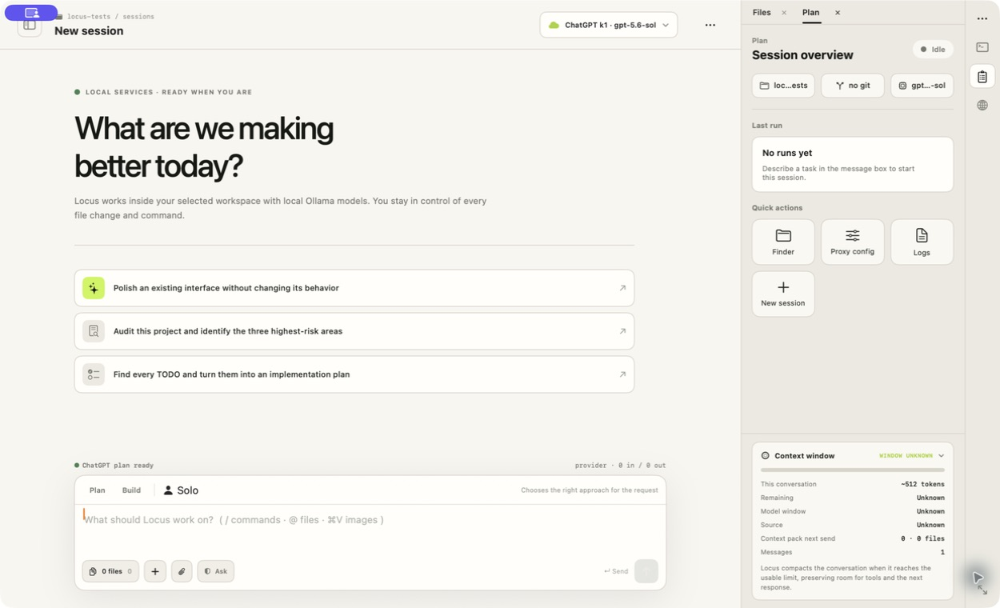

# Locus for macOS

Locus is a native AI workspace for building software with local or hosted models. It brings chat, planning, file context, change review, a terminal, agent teams, and an agent-drivable browser into one SwiftUI app.

Local Ollama is the default. ChatGPT plans and API-backed providers are used only after you add and select an account.

[Website](https://locushost.co) · [Download the latest release](https://github.com/nahid-sparktales/locus/releases/latest) · [Changelog](CHANGELOG.md)


## What Locus does

- **Works in your project.** Add files and folders to context, search the workspace, review diffs, use a retained terminal, and preview sites without leaving the conversation.
- **Plans before it changes things.** Use Chat, Plan, or Build mode and choose how often file, command, browser, Computer Control, and MCP actions require approval.
- **Runs solo or as a team.** Adaptive Work can route tasks to specialists, or you can define explicit agent teams with model, tool, memory, and runtime limits.
- **Keeps runs inspectable.** Timelines, evidence, costs, checkpoints, pause/resume state, and recovery actions stay available in the Runs inspector.
- **Supports local and hosted models.** Use Ollama, a ChatGPT plan, OpenAI, Anthropic Claude, Moonshot Kimi, or an OpenAI-compatible endpoint.
- **Stores work locally by default.** Sessions, run records, and encrypted memory live on your Mac. Hosted providers receive prompts only when you select them.


## Inspector

The right-hand inspector keeps project tools beside the conversation:

- Changes and files
- Terminal and checkpoints
- Runs and `AGENTS.md`
- Plans and browser tabs

Panels open when they are useful and can be collapsed when you want more room.



## Models and accounts

Locus starts with local Ollama and never silently switches to a paid route.

| Account | Authentication | Notes |
| --- | --- | --- |
| Ollama | Local service | Default; model weights stay on your machine |
| ChatGPT plan | OpenAI-managed browser sign-in | Uses eligible plan access, not an API key |
| OpenAI API | API key | Separate from ChatGPT plan usage and billing |
| Claude | Anthropic API key | Native Anthropic messages route |
| Kimi / Kimi Code | Moonshot API key | Standard and coding endpoints |
| Custom endpoint | Provider API key | Any compatible OpenAI-style base URL |

The model picker can also browse and install compatible GGUF models from Hugging Face. Ollama and model weights are not bundled.

## Permissions and privacy

Locus has three permission modes:

- **Ask every time** approves file changes, commands, and fetches individually.
- **Accept file edits** applies edits inside the workspace while still asking for commands and outside access.
- **Bypass all** runs tools without asking and is intended only for disposable workspaces.

Credentials are stored in macOS Keychain or user-readable local credential stores and are sent only to the provider you configure. The bundled agent communicates with the app over authenticated loopback connections. Memory is encrypted with AES-256-GCM, with its key stored in Keychain.

The direct-download build can optionally provide guarded Computer Control. It is off by default and is not available in the sandboxed Mac App Store build. The built-in browser remains available in both distributions.

## Requirements

- Apple Silicon Mac
- macOS 14 or newer
- One model source: Ollama with a tool-capable model, an eligible ChatGPT plan, or a supported API account

The release bundle includes its Python agent runtime and managed ChatGPT helpers. End users do not need Python, Homebrew, Rust, Codex CLI, the Codex app, or the ChatGPT app.

## Install

1. Download `Locus-macOS.zip` from [locushost.co](https://locushost.co) or [GitHub Releases](https://github.com/nahid-sparktales/locus/releases/latest).
2. Move Locus to Applications and open it.
3. Choose a workspace and model, then start in Chat, Plan, or Build mode.

Direct-download builds from 1.14.0 onward check the stable release channel and can install signed updates when Locus quits. Mac App Store installations use the App Store update service.

## Build from source

The checked-in Xcode project can be opened directly. Install [XcodeGen](https://github.com/yonaskolb/XcodeGen) only when changing `project.yml` or adding source files.

Source builds require Xcode 26 and Rust 1.95 through [rustup](https://rustup.rs/):

```bash
brew install xcodegen
rustup toolchain install 1.95.0 --profile minimal --component rust-src
rustup target add aarch64-apple-darwin x86_64-apple-darwin --toolchain 1.95.0
xcodegen generate
open Locus.xcodeproj
```

Select the **Locus** scheme and run **My Mac**. The first build downloads the relocatable Python runtime and pinned Codex dependencies, then compiles the required helpers; later builds reuse those artifacts.

### Tests

Run the Swift tests:

```bash
xcodebuild test \
  -project Locus.xcodeproj \
  -scheme Locus \
  -destination 'platform=macOS' \
  -only-testing:LocusTests
```

Run the agent tests:

```bash
cd agent
python3 -m venv .venv
.venv/bin/pip install -e ".[dev]"
.venv/bin/python -m pytest -q
```

## Architecture

The SwiftUI app owns the interface, workspace access, native terminal, Keychain integration, and permission surfaces. A bundled Python service owns agent orchestration, model streaming, tools, sessions, and run persistence. They communicate over authenticated REST and WebSocket endpoints bound to `127.0.0.1`.

ChatGPT-plan requests use a pinned Codex App Server child process over local JSONL/stdio while keeping Locus's permission manager and tool set in control.

```text
Locus/          SwiftUI application
LocusTests/     Swift unit tests
LocusUITests/   macOS UI tests
agent/          Bundled Python agent service
Tools/          Build, packaging, and audit scripts
Docs/           Guides and screenshots
```

For protocol and orchestration details, see the [agent README](agent/README.md), [wire protocol](agent/PROTOCOL.md), and [Agent Teams guide](Docs/AGENT_TEAMS_FEATURE_GUIDE.md).

## Contributing

Read [CONTRIBUTING.md](CONTRIBUTING.md) before opening a change. Please include focused tests and update documentation when behavior changes.

## License

Licensed under the [Apache License 2.0](LICENSE), © 2026 SparkTales Inc. Third-party components retain their own licenses; the shipped inventory is documented in [ThirdPartyNotices.md](Locus/Resources/ThirdPartyNotices.md).
