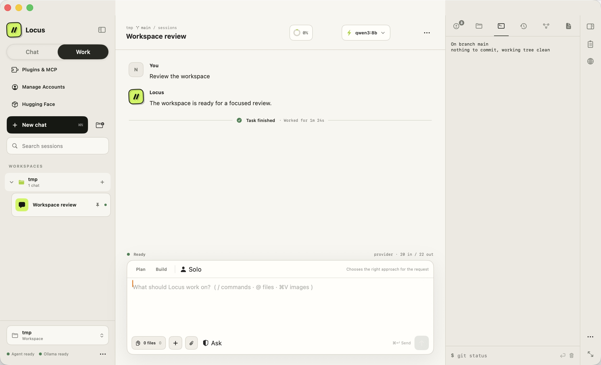

# Locus for macOS

Locus 1.6 is a native workspace for building with local Ollama models. It combines
conversation, planning, file context, change review, a console, and live preview
in one calm SwiftUI interface—without sending your code to a hosted model provider.


## Designed for real project work

- **One calm sidebar** holds the conversation list: New chat, search, recents,
  and a footer with the workspace selector, connection status, and the rest of
  the app's actions. It starts open, collapses with `⌘0` or the header button
  when you want the room, and remembers its state across launches.
- **Workspaces** open from a folder picker that can create folders, or with
  **New Workspace…**, which names a folder, creates it, and opens it.
- **Local or rented GPU.** Point Locus at local Ollama, or at any
  OpenAI-compatible endpoint — a Hugging Face Inference Endpoint, vLLM, or TGI
  on a rented box — with an API key kept in your keychain.
- **Ask, Plan, and Build modes** adapt the agent to the job at hand.
- **Slash commands** (`/clear`, `/model`, `/plan`, `/checkpoint`, `/export`,
  `/help`, …) with an autocomplete popup; unknown commands pass through to the
  local agent.
- **`@` file mentions** fuzzy-search the workspace and attach the chosen file
  to the context pack as they complete.
- **Thinking blocks** render reasoning-model `<think>` output as collapsible
  cards; finished responses get full markdown with copyable code blocks, and
  tool output that looks like a diff is colored line by line. A transcript-wide
  view mode — `/thinking hidden|collapsed|expanded`, also in the workspace
  `…` menu — hides reasoning entirely, keeps the collapsed cards, or pins
  every card open.
- **Context packs** attach selected files and folders with inclusion controls
  and model-aware token budgets. Files are refreshed just before sending.
- **Context-window meter** in the workspace header shows how much of the
  model's window the session is using, measured against the same limit the
  agent budgets compaction with, and estimates growth while a reply streams.
  When no window is known — remote endpoints do not advertise one — it shows
  the token count plainly instead of a percentage of an invented window. The
  popover breaks down the window, the session, and what the context pack adds
  to the next send.
- **Find in conversation** (`⌘F`) searches the current transcript with a live
  match count, `↵`/`⇧↵` navigation, and scroll-to-match highlighting.
- **Message queueing** keeps you typing while a run is active — queued
  messages send automatically when the turn finishes, and Esc stops a run.
- **Rewind** any earlier user message: the conversation returns to that point
  with the message back in the composer for editing.
- **Session organizer** adds names, pins, soft archives, filtering, and Markdown
  export with workspace, model, timestamps, messages, and tool summaries.
- **Workspace profiles** restore the last model, mode, preview URL, draft, and
  context-file references for eight recent workspaces.
- **Message tools** copy, reuse as an editable draft, and regenerate the latest
  response on a non-destructive session branch.
- **Clear Chat** (`⌘⇧K`) starts a genuinely fresh saved session only after the
  local agent acknowledges it; the previous conversation remains available.
- **Clear Saved Sessions** moves inactive history into recoverable local
  storage while preserving the active chat, connection, and any running job.
- **Draft and prompt history** preserve unfinished work per workspace and make
  recent submitted prompts available with the Up and Down arrow keys.
- **Session checkpoints** restore the conversation, plan, workspace, model, and
  context together.
- **Native command palette and shortcuts** keep frequent actions close at
  hand — ⌘K palette with arrow-key navigation, ⌘/ shortcut reference.
- **Background notifications** announce finished runs and pending permission
  requests when Locus is not the active app.
- **Local sessions and model switching** work directly with the Ollama Code
  service, which also compacts a conversation automatically before it outgrows
  the model's context window. Automatic compaction needs a known window size,
  so it applies to local Ollama models; against an OpenAI-compatible endpoint,
  which does not advertise one, compact with `/compact`.
- **Local Model Library** searches GGUF repositories on Hugging Face, scans
  available quantizations and sizes, then downloads the selected build through
  Ollama with native progress, cancellation, refresh, and selection.

## The inspector

The right-hand panel keeps execution visible beside the conversation: **Plan,
Changes, Files, Console, and Preview**, selected with `⌘1`–`⌘5`. It starts
hidden — the conversation gets the room until you need it, and `⌘1`–`⌘5` or
`⌘⌥I` bring it back; a restore control also sits in the workspace header. It
drags to any width between 280 and 520 points, and the width, the collapsed
state, and the last open tab are remembered across launches. Tab labels appear once the
panel is wide enough to fit them; below that the strip is icons only. A run
never switches your tab: new work raises a badge and leaves you where you were.

**Changes reads git**, not the chat log. It shows the real working tree with
per-file diffs and staged, modified, and untracked counts — including edits made
outside Locus, by another tool, or by a console command. The tab badge counts
changed files (capped at `99+`) and stays coral until you have looked. Rendered
diffs are capped at 2,000 lines. Each row stages, unstages, or discards its
file (discarding always confirms; an untracked file moves to the Trash rather
than being deleted), and a commit area at the bottom commits the staged set —
**Draft with AI** writes the message from the staged diff with the local
model, falling back to a plain summary when no local model is available.


**Files** searches the workspace index, peeks inline at any indexed text file up
to 256 KB, and from the context menu adds a file to the context pack, mentions
it in the composer, reveals it in Finder, or copies its relative path. The index
covers common source and text extensions, skipping hidden files and directories
like `node_modules`, `.git`, and `.build`.


**Console** runs shell commands in the workspace with live streaming output, a
cancel button, and a line of input for `y/n` prompts. Commands run outside the
conversation's turn, so a long build keeps streaming while the model works, and
a run survives a brief disconnect. It is a command runner, not a full terminal:
there is no PTY, each command starts fresh in the workspace (so `cd` does not
carry over), and interactive programs like `vim` and `top` will not work. The
deny list below applies to what you type, too.



## Permissions

When a tool needs approval, the **permission prompt replaces the composer** —
the way Claude Code and Codex ask — with the tool, a preview of exactly what
will run or change, and a keyboard-first option list: **1** allows once, **2**
stops asking for that tool this session, **3** (or `Esc`) denies and returns
focus to the input so you can tell Locus what to do differently. `↑`/`↓` move
the selection and `↵` confirms; the transcript's tool card keeps the status.
Three modes set how much the agent may do unasked, from the composer or the
Plan tab:

| Mode | Behavior |
| --- | --- |
| **Ask every time** (default) | Every file change, command, and fetch is approved individually. |
| **Accept file edits** | Edits inside the open workspace apply without asking; commands and anything outside it still ask. |
| **Bypass all** | Nothing asks. The deny list still applies. |

Reading, searching, and listing are automatic inside the open workspace and ask
every time outside it. Answering **don't ask again** grants that tool for the
rest of the session everywhere on disk, not only inside the workspace — "Reset
session allowances" takes it back.

A **deny list** that no permission answer and no mode can override blocks a few
catastrophic command prefixes outright — `rm -rf /`, `mkfs`, `dd if=`, and fork
bombs — checked against every chained segment of a command, so a harmless prefix
cannot smuggle one in. It is a guard rail against an obvious accident, not a
sandbox: the agent runs with your privileges by design.

## Requirements

- Apple Silicon Mac
- macOS 14 or newer
- [Ollama](https://ollama.com) running locally
- At least one installed, tool-capable model

That is the whole list — the app bundles its own agent runtime, so there is
nothing else to install. No Python, no Homebrew.

New models can also be installed without leaving Locus: open the model picker,
choose **Browse Hugging Face Models…**, search or paste a repository URL,
select a quantization, and choose **Download & Use**. `Q4_K_M` is highlighted
as the balanced default when a repository provides it.

Ollama and model weights are not bundled.

## Using a model on a rented GPU

A model too large for this Mac can run somewhere else. In **Settings ▸ Model
provider**, switch to **Remote endpoint** and fill in:

| Field | Example |
| --- | --- |
| Endpoint URL | `https://xxxx.us-east-1.aws.endpoints.huggingface.cloud` |
| Model name | `meta-llama/Llama-3.1-8B-Instruct` |
| API key | your `hf_…` token, or the key your host issued |

**Test Connection** confirms the endpoint answers before you send a message,
and reports the actual reason when it does not — a rejected key, a wrong URL,
or a scaled-to-zero GPU that is still waking up.

Anything speaking the OpenAI chat-completions API works: Hugging Face
Inference Endpoints, the Hugging Face Inference Providers router
(`https://router.huggingface.co/v1`), or vLLM/TGI on RunPod, Vast.ai, Lambda,
and friends. The URL is accepted with or without `/v1`. If the endpoint does
not support tool calling, Locus retries once without tools and says so — the
agent can still answer, but it cannot edit files that way.

**About the key.** It is stored in your login keychain and passed to the local
agent process in memory. It is never written to a config file, never returned
by any API, and only ever sent to the endpoint you configured. If no key is
passed that way, the agent falls back to the first of `LOCUS_REMOTE_API_KEY`,
`OLLAMA_CODE_API_KEY`, `HF_TOKEN`, `HUGGING_FACE_HUB_TOKEN`, or
`OPENAI_API_KEY` in its own environment — that is how you supply one when
running the agent from a terminal.

## The local agent runtime

The agent itself is **ollama-code**, a Python service that owns the model
loop, tools, permissions, and session storage. It lives in this repository
under [`agent/`](agent/) — see its [README](agent/README.md) and
[PROTOCOL.md](agent/PROTOCOL.md). Locus starts and stops it for you, and it
listens only on `127.0.0.1`.

It rejects any request carrying a browser `Origin` header, which keeps a web
page you are visiting from opening the agent's WebSocket or driving its
state-changing endpoints. Treat that as a speed bump rather than a wall:
browsers omit `Origin` on same-origin and simple `no-cors` GETs, and the
service does not validate `Host`, so a DNS-rebinding page could still reach
some read endpoints. The real boundary is that the service is local-only and
the permission system gates anything that touches your files.

The build embeds that service together with a **relocatable CPython** from
[python-build-standalone](https://github.com/astral-sh/python-build-standalone)
and the service's dependencies. The interpreter resolves its dylib and
standard library relative to its own location inside `Locus.app`, so the
packaged app runs on a Mac with no Python installed at all — the same
single-download experience as Claude Code or Codex. (Releases up to 1.5.1
instead copied the build machine's Homebrew Python, which kept resolving its
standard library from `/opt/homebrew` — that is why those builds required
Homebrew's `python@3.14`.)

If no runtime shipped with your build, point Locus at an agent checkout —
this repository's `agent/` folder — under **Settings ▸ Fallback backend
folder**. The bundled copy wins whenever its files are present.

## Install the app

Download `Locus-macOS.zip` from this repository's Releases page, move Locus
to Applications, and open it. The agent runtime and its Python are inside the
app, so there is nothing else to install — you only need
[Ollama](https://ollama.com) (or a remote endpoint) for the models. Releases
up to 1.5.1 were published from the old `locus-macos` repository and required
Homebrew's `python@3.14`; builds from this repository do not.

The downloadable build is signed with an Apple Development certificate and is
not notarized, so macOS blocks the first open of a downloaded copy. Try to
open Locus once, then go to **System Settings ▸ Privacy & Security** and click
**Open Anyway** — or clear the quarantine flag from Terminal instead:

```bash
xattr -dr com.apple.quarantine /Applications/Locus.app
```

A Developer ID certificate plus notarization would remove this step; that is
planned once the certificate exists.

On first launch:

1. Confirm that the sidebar footer says **Agent ready** and **Ollama ready**.
2. Choose a workspace from the workspace row at the bottom of the sidebar.
3. Select an installed model.
4. Start in Ask, Plan, or Build mode.

## Build from source

Everything the app needs lives in this repository:

```text
locus/
├── project.yml     # xcodegen spec — regenerate after adding/removing files
├── Locus/          # the SwiftUI app
├── LocusTests/     # unit tests
├── LocusUITests/   # UI tests
├── Tools/          # bundling scripts and icon generator
├── Docs/           # screenshots and audits
└── agent/          # the ollama-code Python service Locus embeds
```

The Xcode project is generated by
[xcodegen](https://github.com/yonaskolb/XcodeGen) (`brew install xcodegen`);
`Locus.xcodeproj` is checked in, so you only need xcodegen after editing
`project.yml` or adding files:

```bash
cd ~/Documents/locus && xcodegen generate
```

Open `Locus.xcodeproj`, select the Locus scheme, and run **My Mac**. The
project was built and verified with Xcode 26. The first build downloads a
relocatable CPython (~26 MB, from python-build-standalone) into
`.agent-runtime/`, installs the agent's dependencies into it, and embeds the
result; later builds — including offline ones — reuse that cache. No Python
needs to be installed for this.

The bundling step takes environment overrides:

```bash
# Embed the developer venv's Python instead (the pre-1.6 behavior; the built
# app then runs only on Macs with that Python installed):
LOCUS_BUNDLE_MODE=venv xcodebuild -project Locus.xcodeproj -scheme Locus

# Bundle nothing and rely on the fallback backend folder from Settings:
LOCUS_BUNDLE_MODE=skip xcodebuild -project Locus.xcodeproj -scheme Locus

# Bundle an agent checkout from another location:
LOCUS_BACKEND_ROOT=/path/to/agent xcodebuild -project Locus.xcodeproj -scheme Locus
```

Working on the agent itself needs a venv (any Python 3.10 or newer):

```bash
cd agent
python3 -m venv .venv
.venv/bin/pip install -e ".[dev]"
.venv/bin/python -m pytest -q
```

## Tests

```bash
xcodebuild \
  -project Locus.xcodeproj \
  -scheme Locus \
  -configuration Debug \
  -derivedDataPath .build \
  test \
  -only-testing:LocusTests \
  CODE_SIGNING_ALLOWED=NO

# Requires macOS UI automation permission for Xcode:
xcodebuild \
  -project Locus.xcodeproj \
  -scheme Locus \
  -configuration Debug \
  -derivedDataPath .build \
  test \
  -only-testing:LocusUITests

# The agent service has its own suite:
cd agent && .venv/bin/python -m pytest -q
```

104 unit tests, 18 UI tests, and 153 backend tests currently pass.

The unit suite covers work modes, lightweight context migration, session
acknowledgements and retry branches, recoverable session clearing, Hugging Face
repository normalization and GGUF quantization detection, prompt history
(including draft stashing and cursor resets), streaming finalization on error
and turn completion, message queueing and drain, slash-command parsing and
local execution, thinking-block and markdown-fragment parsing, diff detection,
`@`-mention matching, reconnect backoff, a 2,000-token streaming regression,
inspector width clamping and settings round-trips, console output assembly and
its bounded buffer, and the rule that a run badges a tab instead of switching
to it. The UI suite checks Clear Chat, Clear Saved Sessions, the Local Model
Library, message actions and rewind, session organization, archived filtering,
recent workspaces, context controls, prompt history, the slash command popup,
the shortcuts sheet, command-palette keyboard navigation, and the inspector —
collapse and restore, `⌘1`–`⌘5`, the Changes and Files tabs, and the console —
through accessibility identifiers. The backend suite covers the tools,
permission modes and the deny list, streaming, session metadata and trash
recovery, most HTTP endpoints, the git status and diff endpoints, the console
protocol, the WebSocket handshake, and the agent loop end to end against a
scripted model.

UI tests drive a real window, so run them from a terminal with UI automation
permission — not from a sandboxed shell, where the app launches without a
window and every test fails at the window wait.

## Architecture

Locus is written in SwiftUI. A bundled Python service owns the local agent loop,
Ollama streaming, tools, permissions, and session persistence. The native app
communicates with that service through REST and WebSocket endpoints on
`127.0.0.1`: REST for session management, metadata, and git status and diffs;
one WebSocket for the turn — streamed tokens, proposed tool calls, permission
requests, and plan updates — and for the console, which shares that socket but
runs outside the turn, so a command keeps streaming while the model works.

Conversations are append-only JSONL under `~/.ollama-code/sessions`. Titles,
pins, and archive flags live in a sidecar manifest, so renaming a conversation
never rewrites its transcript. Console runs are recorded as their own record
type that existing readers skip; what you type into a running command is never
written to disk. Clearing saved sessions **moves** sessions to
`~/.ollama-code/session-trash/<timestamp>/` with a manifest of their metadata,
and they can be moved back.

Everything runs locally by default: prompts, workspace files, model traffic,
and saved sessions stay on the Mac. Workspace preferences persist file
references only; source-file contents are re-read from disk when needed.

## The product site

The Locus site is its own git repository and is not part of this one —
nothing in it ships with the app. It repeats claims made in this README (the
version badge, the macOS floor, the inspector tab names, the mode shortcuts),
so re-read it against this file whenever Locus ships a release.
