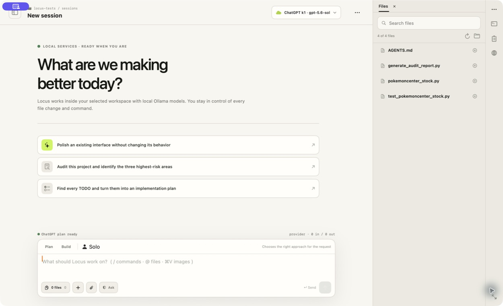
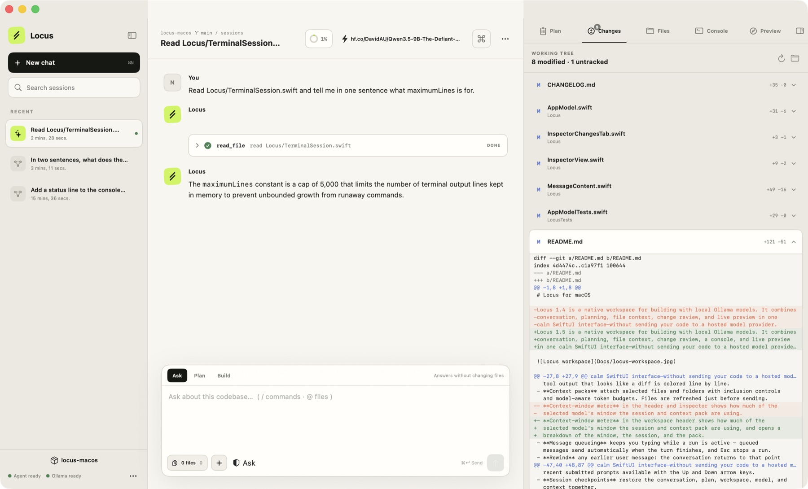
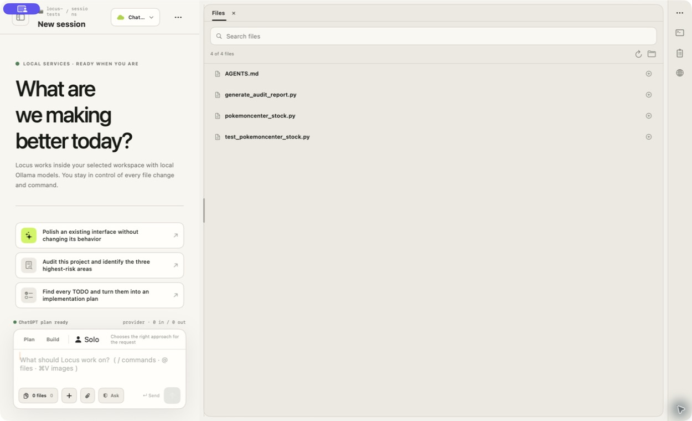

# Locus for macOS

Locus is a native workspace for building with local and hosted models. It
combines conversation, planning, file context, change review, a terminal, and a
built-in browser the agent can drive in one calm SwiftUI interface. Local
Ollama is the default; a ChatGPT plan or an API-backed provider is used only
after you explicitly add and select that account.

**[locushost.co](https://locushost.co)**



Locus opens in a 1250×760 workspace by default, keeping the sidebar, conversation,
and inspector visible without clipping the right edge. Resize it whenever you
like; macOS remembers the size you choose for later launches.

## Highlights

- **Use your ChatGPT plan without an API key.** Add the single **ChatGPT plan**
  account, choose **Sign in with ChatGPT**, and finish OpenAI's managed sign-in
  in your browser. Locus then discovers the models available to that account,
  routes normal chats, teams, and evaluations through included plan usage, and
  shows rate-limit windows plus token activity separately from API/local cost
  estimates. The ChatGPT and Codex apps do not need to be installed or open,
  and this route never silently falls back to billable API usage.
- **Locus stays in charge of tools and permissions.** ChatGPT-plan turns use a
  pinned, bundled OpenAI Codex App Server over local JSONL/stdio, but expose
  only Locus's current tools through App Server dynamic tools. File, shell,
  browser, Computer Control, MCP, and extension calls still pass through the
  same Locus permission manager, budgets, and user-visible activity. OpenAI's
  readable reasoning summaries can stream into the existing Thinking cards;
  raw private reasoning is neither requested for display nor persisted.
- **Account and model-library interactions behave like native controls.** Every
  account input row is a full-width click target, and its caret, typing, and
  pasted text start at the left and advance left-to-right. Choosing **Browse
  Hugging Face Models…** from Settings dismisses Settings first and opens the
  model library immediately. In the Browser inspector, the compact controls
  sit above the tab strip so each tab stays next to the address bar it drives.
- **The inspector follows the request without taking over.** The general right
  panel button always returns to its workspace tabs; Plan and Browser open only
  when selected or needed by active work. Solo Context & Plan and team Team Runs
  each explain themselves the first time that kind of request is sent, keep
  independent automatic-opening choices, and point back to **Settings ▸
  General**. On first launch Locus also asks whether Enter or Command–Enter
  should send; General settings can change that choice later while Shift–Enter
  always inserts a newline. Session rows distinguish solo and team chats, and
  an elapsed timer appears only while work is actually running.

- **Adaptive Work and explicit agent teams** can route a request across local or
  hosted specialists and multiple coding models. Coding jobs share one isolated
  checkout and run in dependency order, so a backend model can finish before a
  UI model continues without concurrent edits.
- **Durable, inspectable runs** record timelines, evidence, routing decisions,
  costs, checkpoints, steering, pause/resume state, and recovery options in a
  local run store. Stop is routed to the worker that owns the run, waits for a
  terminal event, and leaves a cancelled run non-recoverable instead of
  replaying its last approval after reconnecting. Run updates are coalesced and
  loaded incrementally so large histories stay responsive at completion. After
  an unexpected quit, completed runs restore silently, while a genuinely
  interrupted run offers Resume or Discard on its conversation board. A completed run no longer triggers the active-work
  warning when you quit just because an older in-memory status is still present.
- **Live Team Run boards in the conversation** stay attached to the request
  that started them. One board follows dispatch, whole-plan approval, read-only
  work, ordered coding jobs, review, and completion without taking over the
  composer. The header status button scrolls to the active board, and each
  completed board collapses to a permanent result summary. The plan asks for
  one approval for the complete run; individual models, jobs, and steps do not
  ask again. Common
  Qwen/vLLM plan wrappers are normalized before validation; when correction is
  needed, both the live board and Team Runs show the repair stage and exact bounded
  validation reason. If repair still fails, Locus explains why it is continuing
  safely with the Lead Writer instead of silently skipping specialists.
- **Team-aware model controls** label the workspace with the selected team and
  distinct model count, list the exact team models in a bounded, scrollable
  header picker, and use provider-backed model dropdowns when editing agent
  profiles. Long vLLM repository identifiers wrap inside the picker instead of
  resizing or stalling the app. Temporary team routes are never saved as a solo
  account preference, and fallback catalogs discard models that belong to a
  different provider.
- **Evaluation suites and transparent scorecard routing** compare Solo and team
  configurations against immutable fixtures, then explain why an eligible agent
  was selected.
- **Editable agents and encrypted scoped memory.** Settings can change the
  primary agent and every team profile: display identity, self-description,
  response style, custom and per-mode guidance, capability ceilings, memory
  policy, and runtime limits. Provider/model identity and safety rules remain
  factual locked layers. The local AES-256-GCM memory vault separates personal,
  workspace, and agent notes; its key stays in macOS Keychain. Agents may place
  conservative suggestions in a 30-day Memory Inbox, but only approved memory
  is recalled. Just Chat can receive personal or agent memory, never workspace
  memory. Memory & Knowledge also supports explicit search, pin/stale controls,
  delete-all, and readable JSON export/import.
- **Modern MCP support** adds allowlisted resources and prompts, long-running
  tasks, progress, safe input requests, and per-agent access policies.
- **Native Computer Control** gives the active foreground coding agent guarded Mac
  UI access in signed direct-download builds; it remains disabled by default and
  unavailable in the sandboxed App Store build.
- **An agent-drivable browser** lets the model open pages, read them as
  addressable elements, click and type, capture screenshots, and inspect the
  console and network — in the same Browser tab the user sees. It is on by
  default, works in every build including the App Store one, and keeps reading
  permission-free while page JavaScript always asks.

See the [Agent Teams feature and usage guide](Docs/AGENT_TEAMS_FEATURE_GUIDE.md)
for setup, examples, permission boundaries, recovery, and troubleshooting.

## Designed for real project work

- **One calm sidebar** holds the conversation list: rows for Plugins & MCP,
  Manage Accounts, and Hugging Face, then
  New chat, search, recents, and a footer with the workspace selector,
  connection status, and the rest of the app's actions. It starts open,
  collapses with `⌘0` or the header button when you want the room, and remembers
  its state across launches.
- **Workspaces** open from a folder picker that can create folders, or with
  **New Workspace…**, which names a folder, creates it, and opens it.
- **Local, subscription, or API-backed models.** Use local Ollama, sign in to
  use included ChatGPT plan access, or point Locus at an API provider or an
  OpenAI-compatible endpoint such as a Hugging Face Inference Endpoint, vLLM,
  or TGI on a rented GPU.
- **Proxy support** for networks that require one. **Settings ▸ Network**
  follows the macOS proxy configuration or takes an explicit HTTP/HTTPS or
  SOCKS5 proxy, with optional sign-in and a bypass list, and covers both the
  app's own requests and everything the bundled agent reaches — providers, the
  model's web fetches, MCP servers, and git. Loopback and the Ollama host
  always connect directly, and a proxy that stops answering is an error rather
  than a quiet direct connection. See [Working behind a
  proxy](#working-behind-a-proxy).
- **Chat and Work stay visibly separate.** Chat answers from the conversation
  and files explicitly attached to the current message, while keeping tools,
  skills, integrations, workspace browsing, and edits disabled. Work restores
  the Plan and Build controls and the prior inspector layout.
- **Attachments in every mode.** Text and source files, PDFs, and common
  image formats attach to any message — drag them onto the composer or the
  conversation, paste an image with ⌘V, or pick files with the paperclip.
  "Here's a screenshot of the bug, fix it" works in Work mode with a
  vision-capable model; local models report vision support straight from
  Ollama, and the composer warns before sending images to one known to refuse
  them. Attachments ride the one message and are never persisted; in a team
  run the images reach the dispatcher and the first coding job, announced by
  a note in the transcript.
- **Search across all conversations.** The sidebar search looks inside every
  transcript, ranks matching messages with highlighted snippets, and opens
  the session scrolled to the exact message. `⇧⌘F` focuses it from anywhere.
- **Usage & Costs** (sidebar ▸ ••• menu) rolls up estimated spend and tokens
  by agent, model, and workspace with the most expensive runs one click from
  their timelines. Estimates come from the per-agent rates you entered;
  local Ollama is free, and the sheet says plainly that it is not a bill.
  **ChatGPT plan usage** has its own section for OpenAI-reported rate-limit
  windows, reset times, and token activity, never mixed into cost estimates.
- **Slash commands** (`/clear`, `/model`, `/plan`, `/checkpoint`, `/export`,
  `/help`, …) with an autocomplete popup; unknown commands pass through to the
  local agent.
- **`@` file mentions** fuzzy-search the workspace and attach the chosen file
  to the context pack as they complete.
- **Thinking blocks** render local reasoning-model `<think>` output and
  OpenAI-provided ChatGPT reasoning summaries as collapsible cards; raw private
  reasoning from the managed runtime is ignored. Finished responses get full
  markdown with copyable code blocks, and tool output that looks like a diff is
  colored line by line. A transcript-wide
  view mode — `/thinking hidden|collapsed|expanded`, also in the workspace
  `…` menu — hides reasoning entirely, keeps the collapsed cards, or pins
  every card open.
- **Context packs** attach selected files and folders with inclusion controls
  and model-aware token budgets. Files are refreshed just before sending.
- **Context-window meter** in the workspace header shows how much of the
  model's window the session is using, measured against the same limit the
  agent budgets compaction with, and estimates growth while a reply streams.
  The window is the one Ollama is really running the model in, not the one it
  was trained for — metering against the trained window reads reassuringly low
  right up to the point where replies start getting truncated. That figure is
  measured once the model is resident and then **remembered per host and
  model**, so the meter keeps working after Ollama evicts the model (it does so
  after about five idle minutes) and on the next launch — and a model served at
  32K on a GPU box on the LAN does not report 32K when the same model is served
  at 4K here. Hosted accounts use the provider's published window for the
  selected model, or a value you set on the account. The percentage is measured
  against what a conversation may actually occupy — the window less the tool
  schemas and the room kept for a reply — so it reaches 100% exactly when
  compaction acts, rather than reading about 55%. Only a local model that has
  never been resident, with no window set, shows a plain token count instead.
  The popover breaks down the window, the session, and what the context pack
  adds to the next send.
- **Find in conversation** (`⌘F`) searches the current transcript with a live
  match count, `↵`/`⇧↵` navigation, and scroll-to-match highlighting.
- **Message queueing** keeps you typing while a run is active — queued
  messages send automatically when the turn finishes, and Esc stops a run.
  Anything submitted while the UI says **Stopping…** is queued for the next
  turn rather than steered into the run being cancelled.
- **Rewind** any earlier user message: the conversation returns to that point
  with the message back in the composer for editing.
- **Session organizer** adds names, pins, soft archives, filtering, and Markdown
  export with workspace, model, timestamps, messages, and tool summaries.
- **Workspace profiles** restore the last model, mode, browser home URL, draft,
  and context-file references for eight recent workspaces.
- **Message tools** copy, reuse as an editable draft, and regenerate the latest
  response on a non-destructive session branch.
- **Clear Chat** (`⌘⇧K`) starts a genuinely fresh saved session only after the
  local agent acknowledges it; the previous conversation remains available.
- **Clear Saved Sessions** moves inactive history into recoverable local
  storage while preserving the active chat, connection, and any running job.
- **Draft and prompt history** preserve unfinished work per workspace and make
  recent submitted prompts available with the Up and Down arrow keys.
- **Session checkpoints** restore the conversation, plan, workspace, model, and
  context together.
- **Native command palette and shortcuts** keep frequent actions close at
  hand — ⌘K opens the palette with arrow-key navigation, ⌘/ opens the shortcut
  reference, and the same reference has a permanent Settings tab below
  Extensions.
- **Background notifications** announce finished runs and pending permission
  requests when Locus is not the active app.
- **Local sessions and model switching** work directly with the Ollama Code
  service, which also compacts a conversation automatically before it outgrows
  the model's context window. Compaction needs a known window: locally that is
  measured from a resident model or remembered from the last time it was, and
  for a hosted account it is the provider's published figure for the model, or
  whatever you set on the account.
- **Local Model Library** searches GGUF repositories on Hugging Face, scans
  available quantizations and sizes, then downloads the selected build through
  Ollama with native progress, cancellation, refresh, and selection. Opening it
  from Settings cleanly hands off from the Settings sheet or native Settings
  window instead of leaving the library hidden behind it.

## The inspector

The right-hand panel keeps execution visible beside the conversation: **Plan,
Changes, Files, Terminal, Browser, Checkpoints, Runs, and AGENTS.md**, selected
with `⌘1`–`⌘8`. It starts hidden — the conversation gets the room until you
need it, and `⌘1`–`⌘8` or `⌘⌥I` bring it back; a restore control also sits in
the workspace header. It
drags to any width between 280 and 520 points, and the width, the collapsed
state, and the last open tab are remembered across launches. Tab labels appear once the
panel is wide enough to fit them; below that the strip is icons only. A run
never switches your tab: new work raises a badge and leaves you where you were.

The **Plan** tab puts context-window usage first, the active implementation plan
below it, and keeps permission controls pinned to the bottom edge. **Checkpoints**
has its own tab for naming, creating, restoring, and deleting session snapshots.
**Runs** shows durable Solo and team history, active progress, recovery controls,
and detailed timelines. **AGENTS.md** explains workspace instructions and
provides a safe root-file editor with create, refresh, revert, save, and Finder
actions.

**Changes reads git**, not the chat log. It shows the real working tree with
per-file diffs and staged, modified, and untracked counts — including edits made
outside Locus, by another tool, or by a terminal command. The tab badge counts
changed files (capped at `99+`) and stays coral until you have looked. Rendered
diffs are capped at 2,000 lines. Each row stages, unstages, or discards its
file (discarding always confirms; an untracked file moves to the Trash rather
than being deleted), and each hunk inside a diff stages, unstages, or discards
independently — a hunk that changed since the diff was read is re-located by
content or refused, never guessed. A commit area at the bottom commits the
staged set — **Draft with AI** writes the message from the staged diff with
the local model, falling back to a plain summary when no local model is
available. The header names the current branch and switches or creates
branches; fetch, fast-forward-only pull, and push (publishing the branch on
first push) appear in the direct-download build — the App Store sandbox
cannot reach your keychain or SSH keys, so there a footnote says why they are
absent. **Open Pull Request** lands on GitHub's compare page with the branch
prefilled; the Create button stays yours. Locus never stores or prompts for
git credentials in any build.



**Files** searches the workspace index, peeks inline at any indexed text file up
to 256 KB, and from the context menu adds a file to the context pack, mentions
it in the composer, reveals it in Finder, or copies its relative path. The index
covers common source and text extensions, skipping hidden files and directories
like `node_modules`, `.git`, and `.build`.



**Terminal** is one persistent, app-owned login shell for the active workspace,
rendered with SwiftTerm. It has a real PTY, ANSI/true color, Unicode, mouse
reporting, resize support, password prompts, bracketed paste, and full-screen
programs such as `vim`, `less`, and `top`. It remains alive when the panel is
hidden, chat sessions change, or the local agent reconnects; changing
workspaces restarts it after warning about a foreground job. Use ⌃` to focus it
or ⌘4 through the inspector. Terminal input is a direct user action and does
not weaken the separate permission rules applied to model-initiated commands.
Neither terminal input nor output is written into task history. In the App
Store build the shell inherits the Locus sandbox and can access only locations
the user approved.

**Browser** shows the same live pages the agent drives, with compact viewport,
capture, drawer, external-browser, and expand controls at the top. Directly
below is an always-visible tab strip with favicons, loading spinners, URL
tooltips, and a right-click menu (close, close others, copy URL, open in the
default browser), followed by the address bar each tab controls; ⌘T, ⌘W, and
⇧⌘]/⇧⌘[ work while the panel is showing. Ordinary
navigation browses through the HTTP cache — only loopback dev servers hard
reload, where a stale asset would hide the edit you just made — and the
camera button captures the visible page into an annotation sheet (crop, pen,
box, arrow, text) whose result attaches straight to the composer for a
vision model. While a solo run is active and the composer is empty, the send
button becomes a **stop** button; ⌘↵ or Esc stops the run, and typing
switches it back to steering.

## Built-in skills and recommended MCP servers

Locus ships five complete, pinned coding skills: Frontend Design, Vercel React
Best Practices, Systematic Debugging, Test-Driven Development, and Verification
Before Completion. They are ready on first launch, can be disabled everywhere
or for one workspace, and cannot be deleted. An imported, plugin, or workspace
skill with the same name takes precedence over the bundled copy.

**Plugins & MCP** also shows five offline recommendations: Context7, GitHub,
Sentry, project-scoped read-only Supabase, and OpenAI Docs. They are inert
templates—startup does not contact those hosts. **Review & connect** shows the
host, scopes, policy, resource/prompt posture, and data warning; it then creates
an editable disabled server, authenticates if needed, runs a tool probe, and
asks again before enabling it. OAuth uses standards discovery, S256 PKCE,
issuer-bound registrations and rotating refresh tokens. OAuth material and
manual credentials live in Locus's user-only `auth.json`; only the current
access token or header is handed to the local agent in memory. Existing MCP
entries from older releases are migrated out of Keychain once on upgrade.

## Permissions

When a tool needs approval, the **permission prompt replaces the composer** —
the way Claude Code and Codex ask — with the tool, a preview of exactly what
will run or change, and a keyboard-first option list: **1** allows once, **2**
stops asking for that tool this session, **3** (or `Esc`) denies and returns
focus to the input so you can tell Locus what to do differently. `↑`/`↓` move
the selection and `↵` confirms; the transcript's tool card keeps the status.
Three modes set how much the agent may do unasked, from the composer or the
Plan tab:

| Mode | Behavior |
| --- | --- |
| **Ask every time** (default) | Every file change, command, and fetch is approved individually. |
| **Accept file edits** | Edits inside the open workspace apply without asking; commands and anything outside it still ask. |
| **Bypass all** | Nothing asks. The deny list still applies. |

Reading, searching, and listing are automatic inside the open workspace and ask
every time outside it. Answering **don't ask again** grants that tool for the
rest of the session everywhere on disk, not only inside the workspace — "Reset
session allowances" takes it back.

A **deny list** that no permission answer and no mode can override blocks a few
catastrophic command prefixes outright — `rm -rf /`, `mkfs`, `dd if=`, and fork
bombs — checked against every chained segment of a command, so a harmless prefix
cannot smuggle one in. It is a guard rail against an obvious accident, not a
sandbox: the agent runs with your privileges by design.

## Requirements

- Apple Silicon Mac
- macOS 14 or newer
- One model source:
  - [Ollama](https://ollama.com) and an installed, tool-capable local model;
  - an eligible ChatGPT plan; or
  - an API key for a supported hosted provider or custom endpoint.

That is the whole end-user list. The app bundles its Python agent runtime,
OpenAI Codex App Server, and the companion code-mode host, so there is no
Python, Homebrew, Rust, Codex CLI, Codex app, or ChatGPT app dependency. Locus
starts the local services it needs. When you use a ChatGPT plan, sign-in opens
your default browser once; neither OpenAI desktop app needs to open or remain
running afterward.

New models can also be installed without leaving Locus: open the model picker,
choose **Browse Hugging Face Models…**, search or paste a repository URL,
select a quantization, and choose **Download & Use**. `Q4_K_M` is highlighted
as the balanced default when a repository provides it.

Ollama and model weights are not bundled.

## Model accounts: ChatGPT plan, OpenAI API, Claude, and Kimi

**Local Ollama is the default and stays the default.** A fresh install talks to
your own machine and nothing else; hosted providers only ever come into play
once you add an account, and removing the last one drops you straight back to
local. The model picker always opens with the local section first.

In **Settings ▸ Accounts** — or **Manage Accounts** in the sidebar — choose
**Add Account…** and pick one of these distinct routes:

| Account | Authentication | Service |
| --- | --- | --- |
| ChatGPT plan | OpenAI-managed browser sign-in; no API key | Included usage and limits from the signed-in ChatGPT workspace |
| OpenAI API | API key from [platform.openai.com](https://platform.openai.com/api-keys) | `https://api.openai.com/v1` |
| Claude (Anthropic) | API key from [console.anthropic.com](https://console.anthropic.com/settings/keys) | `https://api.anthropic.com/v1` |
| Kimi (Moonshot AI) | API key from [platform.moonshot.ai](https://platform.moonshot.ai/console/api-keys) | `https://api.moonshot.ai/v1` |
| Kimi Code (Moonshot AI) | Key from the Kimi Code Console | `https://api.kimi.com/coding/v1` |
| Custom endpoint | API key from your host | Whatever OpenAI-compatible URL you paste |

**ChatGPT plan** and **OpenAI API** are deliberately separate. ChatGPT sign-in
uses subscription access; API-key use is billed by the OpenAI Platform. Locus
never converts one into the other and never falls back from ChatGPT-plan usage
to an API key. Existing accounts stored under the historical `codex` value
continue to work unchanged and now appear as **OpenAI API**.

Choose **Sign in with ChatGPT** and complete OpenAI's browser flow. The bundled
helper refreshes that session, lists the account's available models, and reports
plan status and usage. Locus supports one signed-in ChatGPT identity in this
release; it can be selected for ordinary chats, agent-team roles, and
evaluations. Sign-out visibly returns active ChatGPT routes to local Ollama and
does not delete Locus transcripts.

The integration uses OpenAI's official [Codex App
Server](https://learn.chatgpt.com/docs/app-server) over local JSONL/stdio and
the official [ChatGPT authentication
flow](https://learn.chatgpt.com/docs/auth#openai-authentication). Some of the
tool-bridging interface is experimental, so Locus pins OpenAI Codex
`rust-v0.147.0` and treats version or protocol mismatches as visible errors
instead of trying another paid route.

**Kimi Code** is the one whose key bills against a subscription rather than
per token: its keys come from the Kimi Code Console and draw on a Kimi
membership. It is still a key you paste, just a differently billed one. It is a
separate account type from **Kimi** — different host, different key, different
models — and the two keys are not interchangeable.

There is no managed Claude.ai sign-in here. Claude accounts use Anthropic
console API keys; the account editor says so and links to their terms.

Give an API account a name — "Work", "Personal" — paste its key, and it joins
the model picker as its own section. **You can add as many API accounts as you
like, including several for the same provider**: two Claude keys appear as
"Claude — Work" and "Claude — Personal", each with its own models, and the
picker's checkmark tracks the account as well as the model, so identically
named models never blur together. The ChatGPT-plan identity remains the one
single-account exception.

Choosing a model routes the session through that account. Choosing one during a
turn is held until the turn finishes rather than refused, because the agent
cannot swap providers mid-run. Local Ollama is always the first section, and
deleting the account a session was using falls back to it.

A model name is remembered per account rather than globally, so switching to a
different provider never arrives carrying the last one's model — that is how a
Kimi model name ends up pointed at Anthropic and fails with an error that names
neither problem.

Team jobs also cannot rewrite that solo preference. Locus scopes cached and
fallback model lists to the account that owns them, so a temporary Claude team
route cannot appear under Kimi and a Kimi model cannot appear under a Qwen vLLM
endpoint after relaunch.

When a team is selected, the header menu shows the team name and distinct model
count rather than the solo session's provider. Open it to see each exact model,
switch back to Solo, or manage the team. Agent profiles use a model dropdown
filled from their selected provider; the refresh and **Test Connection** actions
can wake a scaled-to-zero vLLM endpoint before its model catalog is available.

The Team Progress button appears immediately left of the context meter and
scrolls to the active live board. The board is attached directly below the
request that started the team run. It shows the dispatcher route, elapsed time,
observable stage, validation status, the completed plan, ordered jobs, current
model, permission waits, usage, and terminal result. **Run Plan** is a single
approval for the entire dependency graph; it is not repeated for each agent or
step. The composer remains available, and messages entered while approval is
pending are queued for the next turn. Security-sensitive tool permissions
still follow the permission mode selected separately.

Team call budgets are **Automatic** by default. Locus allocates the 100-call
pool in bounded slices, protects capacity for later writers, review, and final
synthesis, and continues an unfinished coding job when its fair share allows.
A model-call budget or 100-step writer guard never counts as success: the run
pauses at a checkpoint and offers recovery instead of starting later jobs or
synthesizing a false completion. Choose a Fixed limit only when a smaller hard
ceiling is intentional; Solo keeps its 40-step safety limit.

A team may include several write-capable coding profiles. The dispatcher must
order every coding job through dependencies; Locus then runs them one at a time
in the same checkout. The **Lead Writer** remains responsible for safe fallback
and any combined fix requested after review. Each coding profile keeps its own
provider, model, MCP policy, and access ceiling, while the global Ask / Accept
Edits / Bypass permission choice remains in force.

**Test Connection** confirms an API account answers before you send a message,
and reports the actual reason when it does not — a rejected key, a wrong URL,
or a scaled-to-zero GPU that is still waking up. For providers that publish no
model listing, it sends a one-token completion instead, which is the only thing
that really proves a key works. The ChatGPT-plan editor instead shows managed
sign-in status with Refresh, Cancel Login, and Sign Out controls.

Claude uses Anthropic's native Messages protocol; the API-key-backed OpenAI,
Kimi, and custom providers use their documented OpenAI-compatible routes.
Authenticated non-loopback endpoints must use HTTPS, and provider redirects are
refused so credentials can never follow a response to a different URL. The
ChatGPT-plan route uses App Server rather than either raw inference protocol.

Locus identifies itself as `Locus/<version>` on every request it makes,
including the pages the model browses. That is a fixed value rather than a
setting: Moonshot's Kimi Code terms require third-party tools to identify
themselves honestly, and a header configuration could rewrite would defeat it.

### Any OpenAI-compatible endpoint

**Custom endpoint** covers a model too large for this Mac running somewhere
else: Hugging Face Inference Endpoints, the Hugging Face Inference Providers
router (`https://router.huggingface.co/v1`), or vLLM/TGI on RunPod, Vast.ai,
Lambda, and friends. The URL is accepted with or without `/v1`. If the endpoint
does not support tool calling, Locus retries once without tools and says so —
the agent can still answer, but it cannot edit files that way.

### Ollama on another machine

Locus talks to whatever Ollama the agent is pointed at, which does not have to
be this Mac. To use a GPU box on the LAN, set the host in the agent's config —
there is no setting for this in the app, because it belongs to the agent rather
than to a provider account:

```jsonc
// ~/.ollama-code/config.json  (sandboxed App Store build:
// ~/Library/Application Support/Locus/Agent/config.json)
{ "host": "http://192.168.1.50:11434" }
```

The models on that machine then appear in the **Local** section of the picker
exactly as if they were here, and the app reads its model list, pulls, and
commit-message drafts from that host too. The remote machine needs Ollama bound
to something other than loopback (`OLLAMA_HOST=0.0.0.0` on that box); Ollama
listens on localhost only by default.

Windows measured on one host are remembered for that host alone, so a model
served at 32K on the LAN box does not report 32K when the same model is served
at 4K here.

### Credential storage

Each API account and MCP server keeps its credential in `~/.locus/auth.json`,
in its own section and entry, and passes only the runtime value to the local
agent process in memory. The file is atomically replaced at mode `0600` inside
a `0700` directory, so no other user account on the Mac can read it; in the
sandboxed App Store build it lives in the app container instead. A key is never
written to the agent's config, never returned by any API, and only ever sent to
its own provider or MCP endpoint. Removing an account or server deletes its
credential with it.

ChatGPT-plan OAuth credentials are different. OpenAI's bundled helper owns and
refreshes them in a separate file-backed `CODEX_HOME` under
`~/Library/Application Support/Locus/Codex` (or the app container). Swift
models, Locus's API-key store, team manifests, transcripts, logs, and provider
routes never receive those token values. Locus writes only the helper's local
policy file; it does not read or rewrite `auth.json`. Signing out asks the
helper to clear its managed session.

Be clear about what that does and does not buy you. File permissions keep the
credentials away from *other users* of the machine. They do not keep them away
from anything running as **you** — any program you launch can read those files
in the direct-download build. Earlier
releases used the login keychain, which added per-application access control and
an authorization prompt; these file-backed stores do not. That is a real
reduction in protection, not a wash. If no API key is passed from Locus, the
agent falls back to the first of `LOCUS_REMOTE_API_KEY`,
`OLLAMA_CODE_API_KEY`, `HF_TOKEN`, `HUGGING_FACE_HUB_TOKEN`, or
`OPENAI_API_KEY` in its own environment — that is how you supply an API key
when running the agent from a terminal. Those variables are deliberately
removed from the managed ChatGPT helper's environment.

The local REST/WebSocket service is loopback-only, rejects browser origins, and
the app protects each launch with a fresh capability header shared only with
the child process. That keeps an unrelated page from driving file or shell
tools through localhost.

## Working behind a proxy

**Settings ▸ Network** routes Locus's outbound traffic through a proxy. Three
modes:

- **Direct connection** — the default, and exactly what Locus always did.
- **Use system proxy** — the app's own requests already follow the proxy in
  System Settings; this mode additionally launches the agent with the matching
  `HTTP_PROXY`/`HTTPS_PROXY`/`ALL_PROXY`/`NO_PROXY` environment, which is what
  its libraries (`requests`, `httpx`, git) actually read. The environment is a
  snapshot taken when the agent starts — change the system proxy and the agent
  keeps the old values until its next restart. A **PAC file cannot be expressed
  in environment variables at all**: with a PAC-based system proxy the agent's
  traffic stays direct, the Network tab says so, and Manual mode is the fix.
- **Manual proxy** — an explicit HTTP/HTTPS (CONNECT) or SOCKS5 proxy, applied
  to everything: the app's requests, the agent's provider and Ollama traffic,
  the model's `web_fetch`, MCP servers (HTTP and stdio), extension marketplace
  clones, and the browser pane. SOCKS5 uses `socks5h`, so DNS for proxied hosts
  resolves at the proxy rather than locally.

What never goes through the proxy: loopback, the app ↔ agent link, and the
configured Ollama host. Those are Locus's own plumbing — and NDJSON token
streaming rarely survives a corporate proxy anyway. One more exception worth
knowing: the **MCP OAuth sign-in window** is the system browser stack
(`ASWebAuthenticationSession`), which follows the proxy in System Settings
rather than Locus's own. On a network where only the proxy has egress, set
the system proxy as well to complete a sign-in; the token exchange and refresh
requests that follow do go through Locus's proxy.

The bypass field takes comma-separated hostnames, IP addresses, or `.suffix`
domains for anything else (CIDR ranges are not understood). A proxy that stops
answering is a visible error, never a silent fall back to direct connections —
leaking the very traffic a proxy is configured to carry is the one failure this
feature must not have.

Sign-in, when the proxy requires it, is basic auth. The password is stored in
`~/.locus/auth.json` (same trade-offs as API keys, above) and used by the app
and its agent. It is deliberately **not** given to anything the model can run:
shell commands, git, and stdio MCP servers inherit the proxy
*address* with the credential stripped, so behind an authenticated proxy those
child processes get `407` answers rather than the password. The same applies
to `ollama serve` when Locus starts it — model pulls through an authenticated
proxy will fail rather than leak. The agent receives the password over an
inherited pipe rather than an environment variable, precisely so it never
enters the exec-time environment block that `ps -E` can read for the life of
the process. NTLM or Kerberos proxy auth is not supported.

Two smaller caveats. Many corporate proxies allow `CONNECT` only to port 443,
so a plain-HTTP endpoint on an unusual port may be refused by policy rather
than by Locus. And `Ollama.app` started by macOS rather than by Locus gets no
environment from anyone — it only ever serves loopback, so this does not
matter in practice.

## The local agent runtime

The agent itself is **ollama-code**, a Python service that owns the model
loop, tools, permissions, and session storage. It lives in this repository
under [`agent/`](agent/) — see its [README](agent/README.md) and
[PROTOCOL.md](agent/PROTOCOL.md). Locus starts and stops it for you, and it
listens only on `127.0.0.1`.

It rejects any request carrying a browser `Origin` header, which keeps a web
page you are visiting from opening the agent's WebSocket or driving its
state-changing endpoints. Treat that as a speed bump rather than a wall:
browsers omit `Origin` on same-origin and simple `no-cors` GETs, and the
service does not validate `Host`, so a DNS-rebinding page could still reach
some read endpoints. The real boundary is that the service is local-only and
the permission system gates anything that touches your files.

For a ChatGPT-plan route, that Python service lazily starts one bundled
`codex app-server` process and communicates with it over JSONL/stdio. The
primary service is the only helper owner; authenticated local worker brokers
multiplex team and evaluation threads back through it. Locus disables the
helper's native shell, file, web, apps, plugins, skills, multi-agent, analytics,
and update surfaces, supplies Locus's system instructions, and publishes only
the active Locus tool registry through dynamic tools. Unexpected built-in tool
or approval requests fail the route as a protocol mismatch.

The build embeds that service together with a **relocatable CPython** from
[python-build-standalone](https://github.com/astral-sh/python-build-standalone)
and the service's dependencies. The interpreter resolves its dylib and
standard library relative to its own location inside `Locus.app`, so the
packaged app runs on a Mac with no Python installed at all — the same
single-download experience as Claude Code or Codex. (Releases up to 1.5.1
instead copied the build machine's Homebrew Python, which kept resolving its
standard library from `/opt/homebrew` — that is why those builds required
Homebrew's `python@3.14`.)

If no runtime shipped with your build, point Locus at an agent checkout —
this repository's `agent/` folder — under **Settings ▸ Fallback backend
folder**. The bundled copy wins whenever its files are present.

## Install the app

Download `Locus-macOS.zip` from [locushost.co](https://locushost.co) or this
repository's Releases page, move Locus to Applications, and open it. The agent
runtime, Python, and managed ChatGPT helpers are inside the app, so there is
nothing else to install — choose Ollama, a ChatGPT plan, or an API-backed
endpoint for models. Releases up to 1.5.1 were published from the old `locus-macos`
repository and required Homebrew's `python@3.14`; builds from this repository
do not.

The release pipeline can produce a SparkTales **Developer ID** build that is
notarized by Apple and stapled, so it opens normally on a Mac that has never
seen it. Only an archive produced with `LOCUS_NOTARIZE=1` and passing the
Gatekeeper/ticket checks below may be described as a public release. The
historical 1.10.0 archive is not evidence that current source has passed that
gate; private verification archives are labeled and must not be published.

This build is deliberately **not sandboxed**. A container would buy nothing
outside the App Store and would limit which workspaces the agent can reach; the
App Store build (`ReleaseMAS`) keeps the sandbox and its entitlements.

On first launch:

1. Confirm that the sidebar footer says **Agent ready** and **Ollama ready**.
   Both pills track a supervised runtime and also report *starting*,
   *recovering*, and *offline*, so a runtime that is not actually up says which
   state it is in rather than failing at your first message. The second pill
   names the active provider once you select an account — **Claude ready**,
   **Endpoint ready**, and so on.
2. Choose a workspace from the workspace row at the bottom of the sidebar.
3. Select an installed model.
4. Start in Ask, Plan, or Build mode.

## Build from source

Everything the app needs lives in this repository:

```text
locus/
├── project.yml     # xcodegen spec — regenerate after adding/removing files
├── Config/         # app and helper signing entitlements
├── Locus/          # the SwiftUI app
├── LocusTests/     # unit tests
├── LocusUITests/   # UI tests
├── Tools/          # bundling scripts and icon generator
├── Docs/           # screenshots and audits
└── agent/          # the ollama-code Python service Locus embeds
```

The Xcode project is generated by
[xcodegen](https://github.com/yonaskolb/XcodeGen) (`brew install xcodegen`);
`Locus.xcodeproj` is checked in, so you only need xcodegen after editing
`project.yml` or adding files:

```bash
cd ~/Documents/locus && xcodegen generate
```

Open `Locus.xcodeproj`, select the Locus scheme, and run **My Mac**. The
project was built and verified with Xcode 26. Source builds require
[Rust through rustup](https://rustup.rs/) because Locus builds its pinned Codex
App Server instead of trusting an installed Codex or ChatGPT app:

```bash
rustup toolchain install 1.95.0 --profile minimal --component rust-src
rustup target add aarch64-apple-darwin x86_64-apple-darwin --toolchain 1.95.0
```

The OpenAI source includes `rust-toolchain.toml`, so the build automatically
uses Rust/Cargo 1.95 even if a newer stable toolchain is your default. The first
build downloads a relocatable CPython (~26 MB), the checksum-pinned OpenAI
Codex `rust-v0.147.0` source, and OpenAI's pinned V8 artifacts, then compiles
`codex` and `codex-code-mode-host` for the requested architectures. That first
Rust compile can take tens of minutes per architecture. Later builds reuse
`.agent-runtime/` and `.codex-app-server/`; when inputs and architectures have
not changed, helper preparation is effectively immediate and works offline.
No system Python needs to be installed.

Build both helper architectures up front when preparing a universal artifact:

```bash
LOCUS_CODEX_ARCHS="arm64 x86_64" Tools/PrepareCodexAppServer.sh
```

The bundling step takes environment overrides:

```bash
# Embed the developer venv's Python instead (the pre-1.6 behavior; the built
# app then runs only on Macs with that Python installed):
LOCUS_BUNDLE_MODE=venv xcodebuild -project Locus.xcodeproj -scheme Locus

# Bundle nothing and rely on the fallback backend folder from Settings:
LOCUS_BUNDLE_MODE=skip xcodebuild -project Locus.xcodeproj -scheme Locus

# Bundle an agent checkout from another location:
LOCUS_BACKEND_ROOT=/path/to/agent xcodebuild -project Locus.xcodeproj -scheme Locus

# Skip only the managed ChatGPT helper for a quick UI-only development build:
LOCUS_BUNDLE_CODEX=skip xcodebuild -project Locus.xcodeproj -scheme Locus
```

Debug builds use Xcode's portable ad-hoc “Sign to Run Locally” identity and do
not require an Apple Developer certificate. Before Xcode seals the app, its
build phases remove an unsigned `LocusTests.xctest` left in the host app by an
earlier test build and strip quarantine, Finder, and resource-fork metadata
from copied runtime files. Release and App Store builds retain their
distribution signing rules.

Working on the agent itself needs a venv (any Python 3.10 or newer):

```bash
cd agent
python3 -m venv .venv
.venv/bin/pip install -e ".[dev]"
.venv/bin/python -m pytest -q
```

The suite runs against a throwaway `OLLAMA_CODE_HOME`, so it never reads or
writes your real `~/.ollama-code`; an audit hook fails the suite if anything
tries.

## Tests

```bash
xcodebuild \
  -project Locus.xcodeproj \
  -scheme Locus \
  -configuration Debug \
  -derivedDataPath .build \
  test \
  -only-testing:LocusTests \
  CODE_SIGNING_ALLOWED=NO

# Requires macOS UI automation permission for Xcode:
xcodebuild \
  -project Locus.xcodeproj \
  -scheme Locus \
  -configuration Debug \
  -derivedDataPath .build \
  test \
  -only-testing:LocusUITests

# The agent service has its own suite:
cd agent && .venv/bin/python -m pytest -q
```

The repository contains broad Swift unit/UI coverage and a comprehensive
backend test suite.

The unit suite covers work modes, lightweight context migration, session
acknowledgements and retry branches, recoverable session clearing, Hugging Face
repository normalization and GGUF quantization detection, prompt history
(including draft stashing and cursor resets), streaming finalization on error
and turn completion, message queueing and drain, slash-command parsing and
local execution, thinking-block and markdown-fragment parsing, diff detection,
`@`-mention matching, reconnect backoff, a 2,000-token streaming regression,
inspector width clamping and settings round-trips, agent/team validation,
orchestration-budget compatibility, managed-run state, MCP callback validation,
native PTY behavior and persistence, telemetry defaults, and the rule
that a run badges a tab instead of switching to it. It also covers legacy
OpenAI-account decoding, managed ChatGPT provider payloads, the one-account
rule, and usage/status formatting. The UI suite checks Clear
Chat, Clear Saved Sessions, the Local Model Library, message actions and rewind,
session organization, archived filtering,
recent workspaces, context controls, prompt history, the slash command popup,
the shortcuts sheet, command-palette keyboard navigation, and the inspector —
collapse and restore, `⌘1`–`⌘8`, the Changes, Files, Terminal, Checkpoints, Runs,
and AGENTS.md tabs through accessibility identifiers. It also
clicks the left and center of every account row, types and pastes exact values,
and verifies both Settings-to-Hugging-Face presentation paths. The backend suite
covers the tools,
permission modes and the deny list, streaming, session metadata and trash
recovery, most HTTP endpoints, the git status and diff endpoints, extension
state migration, the WebSocket handshake, durable run storage, capabilities, recovery,
evaluations, routing telemetry, local knowledge, modern MCP behavior, and the
agent loop end to end against a scripted model. A deterministic fake App Server
additionally exercises JSONL correlation, managed authentication, models and
usage, dynamic tools, permission denial, interruption, restart, thread resume,
reasoning-summary mapping, protocol rejection, and transcript deduplication.

UI tests drive a real window, so run them from a terminal with UI automation
permission — not from a sandboxed shell, where the app launches without a
window and every test fails at the window wait.

## Building a release

Two configurations, because the two channels want opposite things.

**`Release` — the direct download.** arm64, Developer ID signed, hardened
runtime, **not** sandboxed. Build it, then sign, notarize, staple and package
in one step:

```bash
LOCUS_NOTARIZE=1 Tools/PackageRelease.sh /path/to/Locus.app artifacts/direct/Locus-<version>.zip
```

`PackageRelease.sh` signs in an order that cannot ship a broken seal: every
Mach-O in the bundled runtime and both Codex helpers first, then the app,
verify, exercise the runtime, verify again — so a bundle dirtied by its own
import check fails the build rather than the user's launch. The companion
code-mode host receives the JIT entitlements V8 requires; App Store helpers
also inherit the app sandbox. With `LOCUS_NOTARIZE=1` it submits to Apple,
waits, staples the ticket into the `.app`, rebuilds the zip, and then checks
that a fresh extraction still passes `spctl` and carries the ticket. Signing
identity comes from `LOCUS_SIGN_IDENTITY`, else the first Developer ID
Application certificate in the keychain.

Running the script without `LOCUS_NOTARIZE=1` is supported for private
verification only and is labeled that way. The script still requires a
Developer ID Application identity, embeds the exact source revision and build
toolchain, audits privacy and license resources, and verifies the zip
round-trip. A notarization candidate is additionally required to come from a
clean source tree.

## Mac App Store archive

`ReleaseMAS` is the sandboxed, arm64 Mac App Store build for the SparkTales
team. It signs the bundled Python interpreter as an inheriting sandbox helper,
stores agent data in the app container, and persists user-selected workspace
access with security-scoped bookmarks.

The App Store Connect app uses bundle ID `io.sparktales.locus`. After incrementing
`CURRENT_PROJECT_VERSION` in `project.yml`, archive and export with:

```bash
Tools/ArchiveAppStore.sh
```

To upload the exported archive directly to App Store Connect:

```bash
LOCUS_UPLOAD=1 Tools/ArchiveAppStore.sh
```

Both release scripts authenticate with an App Store Connect API key. The key id
and issuer id are **not** defaulted in this repository — they are half of a
credential pair and this repository is public — so export them alongside the
`.p8`, which lives outside the tree:

```bash
export LOCUS_ASC_KEY_ID=…
export LOCUS_ASC_ISSUER_ID=…
export LOCUS_ASC_KEY_PATH=/path/to/AuthKey_<id>.p8   # optional; defaults next to the repo
```

A missing value fails the script immediately with the variable's name rather
than a confusing authentication error later.

Every archive runs `Tools/AuditDistribution.sh` before export. The audit
rejects unused GPL-licensed GNU gdbm content, the broken Tk extension, and
missing third-party license materials. It also verifies the pinned Codex
source, normalized Cargo lockfile, V8 inputs, helper architecture and SHA-256
provenance, signatures, sandbox inheritance, and code-mode JIT entitlements.
The component inventory is in
`Locus/Resources/ThirdPartyNotices.md`.

## Architecture

Locus is written in SwiftUI. A bundled Python service owns the local agent loop,
Ollama streaming, tools, permissions, and session persistence. The native app
communicates with that service through REST and WebSocket endpoints on
`127.0.0.1`: REST for session management, metadata, and git status and diffs;
one WebSocket for the turn — streamed tokens, proposed tool calls, permission
requests, and plan updates. The terminal is a retained native Swift controller
and never crosses that backend connection.

The managed ChatGPT path adds one lazily started, version-checked Codex App
Server child process over JSONL/stdio. OAuth state remains in its isolated
Locus `CODEX_HOME`; Locus persists only helper thread IDs, protocol/history
revisions, and tool-schema fingerprints. If helper history is missing or no
longer compatible, the Python service rebuilds it from the canonical Locus
transcript. Dedicated team workers use the launch-scoped authenticated local
broker instead of starting helpers or receiving OAuth credentials themselves.

Conversations are append-only JSONL under `~/.ollama-code/sessions`. Titles,
pins, and archive flags live in a sidecar manifest, so renaming a conversation
never rewrites its transcript. Terminal input and output are not transcript
records. Clearing saved sessions **moves** sessions to
`~/.ollama-code/session-trash/<timestamp>/` with a manifest of their metadata,
and they can be moved back.

Everything runs locally by default: prompts, workspace files, model traffic,
and saved sessions stay on the Mac. Workspace preferences persist file
references only; source-file contents are re-read from disk when needed.

## License

Locus is licensed under the [Apache License 2.0](LICENSE), © 2026 SparkTales Inc.

Apache-2.0 was chosen over MIT for two things MIT does not cover: an express
patent grant from contributors, and an explicit statement that the license does
not grant rights to the project's trademarks. The name *Locus* and the SparkTales
identity are not part of what the license gives away.

The app bundles third-party components — CPython and its statically linked
libraries, 41 pinned Python packages, and OpenAI Codex App Server plus its
companion code-mode host — which remain under their own licenses. The Codex
helpers are built from checksum-pinned Apache-2.0 source and ship with upstream
license, notice, and build provenance. The inventory, versions and licenses are in
[Locus/Resources/ThirdPartyNotices.md](Locus/Resources/ThirdPartyNotices.md), the
full texts ship inside the app, and `Tools/AuditDistribution.sh` fails a release
that omits them. Ollama, hosted models and model weights are not distributed with
Locus; it only connects to services you configure.

See [CONTRIBUTING.md](CONTRIBUTING.md) to submit a change.
