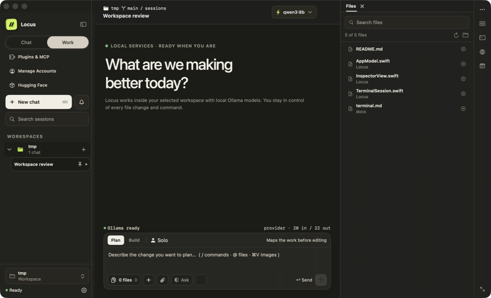
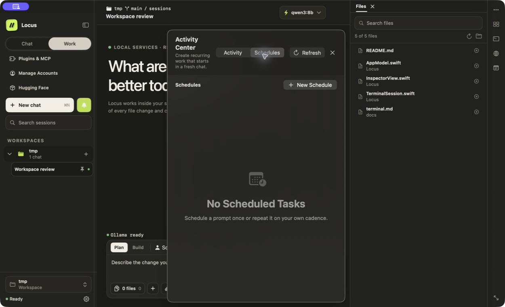
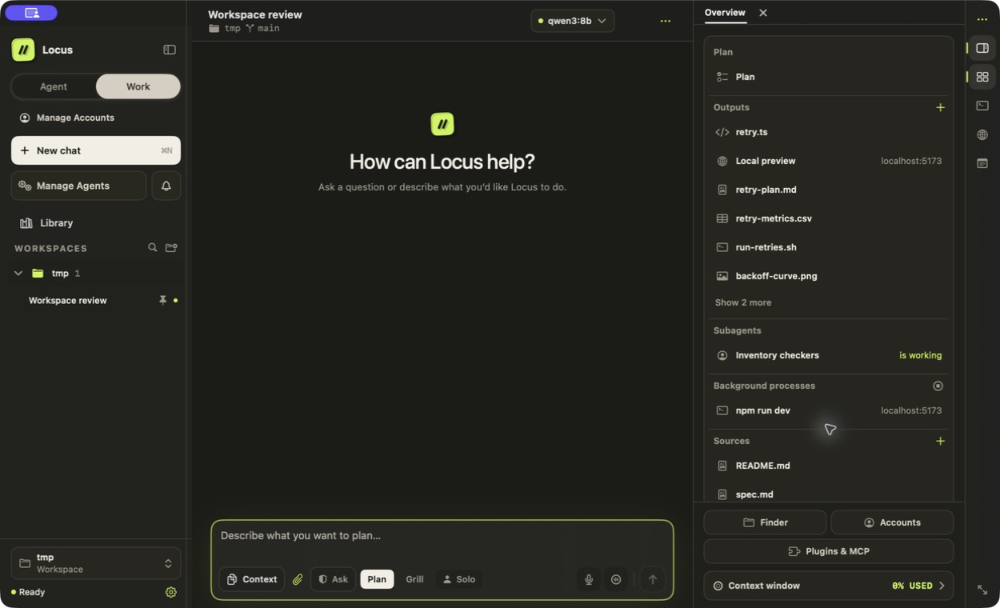
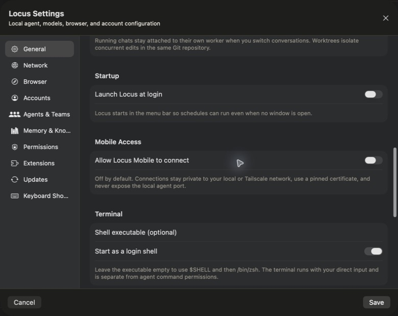

# Locus for macOS

Locus is a native AI workspace for building software with local or hosted models. It brings chat, planning, file context, change review, a terminal, agent teams, and an agent-drivable browser into one SwiftUI app.

Local Ollama is the default. ChatGPT plans and API-backed providers are used only after you add and select an account.

[Website](https://locushost.co) · [Download the latest release](https://github.com/nahid-sparktales/locus/releases/latest) · [Changelog](CHANGELOG.md)



## What Locus does

- **Works in your project.** Add files and folders to context, search the workspace, review diffs, use a retained terminal, and preview sites without leaving the conversation.
- **Browses like a browser.** The agent shares your tabs: it reads pages as addressable elements, clicks and types with real input rather than synthetic events, aims at coordinates for canvases and maps, captures regions of the viewport, watches the console and network, and presents itself as a phone when you ask for a mobile viewport. Find in page, page zoom and per-tab device settings are there for you too.
- **Plans before it changes things.** Use Chat, Plan, or Build mode and choose how often file, command, browser, Computer Control, and MCP actions require approval.
- **Runs solo or as a team.** Adaptive Work can route tasks to specialists, or you can define explicit agent teams with model, tool, memory, and runtime limits.
- **Keeps runs inspectable.** Timelines, evidence, costs, checkpoints, pause/resume state, and recovery actions stay available in the Runs inspector.
- **Works from your phone.** The optional [Locus Mobile](https://github.com/nahid-sparktales/locus-mobile) companion for iOS and Android pairs directly over your LAN or Tailscale, with no Locus cloud relay.
- **Supports local and hosted models.** Use Ollama, a ChatGPT plan, OpenAI, Anthropic Claude, Moonshot Kimi, or an OpenAI-compatible endpoint.
- **Stores work locally by default.** Sessions, run records, and encrypted memory live on your Mac. Hosted providers receive prompts only when you select them.



## Inspector

The right-hand inspector keeps project tools beside the conversation:

- Changes and files
- Terminal and checkpoints
- Runs and `AGENTS.md`
- Plans and browser tabs
- Model Router scorecards and proxy management

Panels open when they are useful and can be collapsed when you want more room.



## Mobile companion

Mobile Access is off by default. When enabled, Locus creates a private TLS gateway on your Mac and pairs phones with a five-minute, one-use code. The phone pins the Mac certificate, and no provider credentials, local-agent ports, or cloud relay are exposed.

<table>
  <thead>
    <tr>
      <th>Mac setup</th>
      <th>iOS and Android pairing</th>
    </tr>
  </thead>
  <tbody>
    <tr>
      <td><a href="Docs/locus-mobile-access-dark.png"></a></td>
      <td align="center"><a href="Docs/locus-mobile-pairing-dark.png"></a></td>
    </tr>
  </tbody>
</table>

The first mobile release can create and continue chats, follow streaming work, stop runs, answer one-time approvals, and run or pause schedules. Terminal, browser, file editing, permanent permissions, account settings, and destructive session actions remain Mac-only. See the [Locus Mobile repository](https://github.com/nahid-sparktales/locus-mobile) for platform setup and development instructions.

## Models and accounts

Locus starts with local Ollama and never silently switches to a paid route.

| Account | Authentication | Notes |
| --- | --- | --- |
| Ollama | Local service | Default; model weights stay on your machine |
| ChatGPT plan | OpenAI-managed browser sign-in | Uses eligible plan access, not an API key; needs a one-time component download |
| OpenAI API | API key | Separate from ChatGPT plan usage and billing |
| Claude | Anthropic API key | Native Anthropic messages route |
| Kimi / Kimi Code | Moonshot API key | Standard and coding endpoints |
| Custom endpoint | Provider API key | Any compatible OpenAI-style base URL |

The model picker can also browse and install compatible GGUF models from Hugging Face. Ollama and model weights are not bundled.

## Permissions and privacy

Locus has three permission modes:

- **Ask every time** approves file changes, commands, and fetches individually.
- **Accept file edits** applies edits inside the workspace while still asking for commands and outside access.
- **Bypass all** runs tools without asking and is intended only for disposable workspaces.

Credentials are stored in macOS Keychain or user-readable local credential stores and are sent only to the provider you configure. The bundled agent communicates with the app over authenticated loopback connections. Memory is encrypted with AES-256-GCM, with its key stored in Keychain.

The direct-download build can optionally provide guarded Computer Control. It is off by default and is not available in the sandboxed Mac App Store build. The built-in browser remains available in both distributions.

## Proxy routing

Manual HTTP/HTTPS and SOCKS5 proxies can cover Locus app requests, model and agent traffic, the built-in browser, downloads, Git, and the integrated terminal. SOCKS5 routes use remote DNS. Loopback services and Ollama remain direct so the app can reach its own local runtime.

The Proxy Manager in the right inspector adds named profiles, traffic-class, workspace, and provider assignments, strict tunnel mode, and health-ranked failover. Strict mode ignores custom bypass entries and blocks external traffic when no configured route is available. Health checks report latency and the externally observed exit address; when automatic failover is enabled, Locus checks the pool every minute and selects the fastest healthy standby. These controls apply to Locus, not to other Mac apps or the operating system as a whole.

## Requirements

- Apple Silicon Mac
- macOS 14 or newer
- One model source: Ollama with a tool-capable model, an eligible ChatGPT plan, or a supported API account

The release bundle includes its Python agent runtime. End users do not need Python, Homebrew, Rust, Codex CLI, the Codex app, or the ChatGPT app.

The helpers behind ChatGPT-plan accounts are a separate download. They are large, they are idle unless you sign in to a plan, and most people never need them — so Locus offers them the first time you add a ChatGPT-plan account rather than bundling them for everyone. See [ChatGPT plan support](#chatgpt-plan-support).

## Install

1. Download `Locus-macOS.zip` (about 62 MB) from [locushost.co](https://locushost.co) or [GitHub Releases](https://github.com/nahid-sparktales/locus/releases/latest).
2. Move Locus to Applications and open it.
3. Choose a workspace and model, then start in Chat, Plan, or Build mode.

Direct-download builds from 1.14.0 onward check the stable release channel and can install signed updates when Locus quits. Mac App Store installations use the App Store update service.

## ChatGPT plan support

ChatGPT-plan accounts are served by two helpers from OpenAI's Codex project. They come to about 268 MB installed and do nothing unless a plan is signed in, so the direct download does not carry them: Locus offers the component when you add a ChatGPT-plan account, downloads about 104 MB once, and keeps it until you remove it. Ollama, API-key and custom-endpoint accounts never download it.

The component is signed by SparkTales. Because it lands outside the app's notarized seal, Locus verifies the archive's checksum and then checks each binary against SparkTales' code-signing identity before anything is moved into place or run — a payload that fails either check installs nothing and leaves any previous install untouched. Removing the component reclaims the space and can be undone by adding a plan account again.

Mac App Store builds still bundle the helpers, because the App Store does not permit downloading executable code.

## Build from source

The checked-in Xcode project can be opened directly. Clone with `--recurse-submodules` if you also want the pinned Locus Mobile source. Install [XcodeGen](https://github.com/yonaskolb/XcodeGen) only when changing `project.yml` or adding source files.

Source builds require Xcode 26 and Rust 1.95 through [rustup](https://rustup.rs/):

```bash
brew install xcodegen
rustup toolchain install 1.95.0 --profile minimal --component rust-src
rustup target add aarch64-apple-darwin x86_64-apple-darwin --toolchain 1.95.0
xcodegen generate
open Locus.xcodeproj
```

Select the **Locus** scheme and run **My Mac**. The first build downloads the relocatable Python runtime and pinned Codex dependencies, then compiles the required helpers; later builds reuse those artifacts.

The `Release` configuration deliberately does not embed the Codex helpers; it records in `CodexAppServerProvenance.txt` that they are component-delivered, and `Tools/PackageComponents.sh <output-directory>` builds, strips, signs and publishes them together with the `components.json` feed the app reads. `Debug` and `ReleaseMAS` still embed them, so local ChatGPT work needs no download. Override with `LOCUS_BUNDLE_CODEX=build|component|skip`.

### Tests

Run the Swift tests:

```bash
xcodebuild test \
  -project Locus.xcodeproj \
  -scheme Locus \
  -destination 'platform=macOS' \
  -only-testing:LocusTests
```

Run the agent tests:

```bash
cd agent
python3 -m venv .venv
.venv/bin/pip install -e ".[dev]"
.venv/bin/python -m pytest -q
```

Run the mobile checks and either native debug build:

```bash
cd mobile
flutter pub get
flutter analyze
flutter test
flutter build apk --debug
flutter build ios --simulator --no-codesign
```

## Architecture

The SwiftUI app owns the interface, workspace access, native terminal, Keychain integration, and permission surfaces. A bundled Python service owns agent orchestration, model streaming, tools, sessions, and run persistence. They communicate over authenticated REST and WebSocket endpoints bound to `127.0.0.1`.

ChatGPT-plan requests use a pinned Codex App Server child process over local JSONL/stdio while keeping Locus's permission manager and tool set in control. In the direct download that child is the downloaded component; in the App Store build it is bundled. Either way the agent resolves it from one path that it re-checks on demand, so installing the component takes effect without restarting the agent or losing a session.

```text
Locus/          SwiftUI application
LocusTests/     Swift unit tests
LocusUITests/   macOS UI tests
agent/          Bundled Python agent service
mobile/         Pinned Locus Mobile repository for iOS and Android
ProtocolFixtures/ Shared Mac/mobile protocol envelopes
Tools/          Build, packaging, and audit scripts
Docs/           Guides and screenshots
```

For protocol and orchestration details, see the [agent README](agent/README.md), [wire protocol](agent/PROTOCOL.md), and [Agent Teams guide](Docs/AGENT_TEAMS_FEATURE_GUIDE.md).

## Contributing

Read [CONTRIBUTING.md](CONTRIBUTING.md) before opening a change. Please include focused tests and update documentation when behavior changes.

## License

Licensed under the [Apache License 2.0](LICENSE), © 2026 SparkTales Inc. Third-party components retain their own licenses; the shipped inventory is documented in [ThirdPartyNotices.md](Locus/Resources/ThirdPartyNotices.md).
