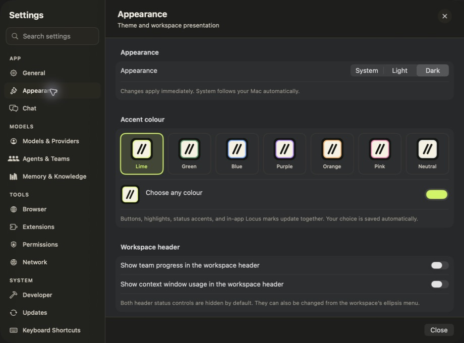

<p align="center">
  
</p>

<h1 align="center">Locus for macOS</h1>

<p align="center">
  Your models, projects, agents, and tools in one native macOS workspace.
</p>

<p align="center">
  <a href="https://github.com/nahid-sparktales/locus/actions/workflows/ci.yml"></a>
  <a href="LICENSE"></a>
</p>

Locus combines conversations, project files, a terminal, browser tabs, plans,
and recurring agents in a SwiftUI app. Use local Ollama, a ChatGPT plan, or your
preferred API provider. Local Ollama is the default; Locus never silently
switches to a paid account.

**The `main` branch builds wallet-free Locus.** Wallet functionality belongs to
the separate **LocusX** edition.

> [!NOTE]
> The latest public release, [v2.4.0](https://github.com/nahid-sparktales/locus/releases/tag/v2.4.0),
> predates this split. Its downloadable app still belongs to the earlier product.
> A public wallet-free release has not been published yet. Build the current
> app from source using the instructions below.


## What you can do

- **Work in a project.** Bring files into context, review changes, run commands,
  keep a terminal open, and preview sites beside the conversation.
- **Use the built-in browser.** Share tabs with the agent, inspect pages,
  interact with sites, and switch to a mobile viewport.
- **Plan and delegate.** Plan work, refine a request in Grill mode, or let an agent act. Follow tasks,
  tool activity, outputs, and agent teams from the Overview.
- **Run recurring agents.** Schedule work or connect event triggers, with
  dedicated chats, bounded permissions, and visible run history.
- **Choose your models.** Use Ollama, ChatGPT-plan access, OpenAI, Claude,
  Kimi, or an OpenAI-compatible endpoint. Voice controls are optional.
- **Continue from your phone.** The optional [Locus Mobile](https://github.com/nahid-sparktales/locus-mobile)
  companion pairs directly with your Mac over LAN or Tailscale.

## A look around

<details>
<summary>Overview — plans, sources, and outputs beside the conversation</summary>


</details>

<details>
<summary>Settings — appearance, model accounts, permissions, and tools</summary>



</details>

<details>
<summary>Scheduled agents — instructions, schedules, and recent runs</summary>


</details>

Screenshots show the current wallet-free app with demonstration data.

## Locus and LocusX

| Edition | Wallet | App data |
| --- | --- | --- |
| **Locus** | No wallet implementation, tools, or helpers | Keeps existing Locus chats, accounts, settings, and browser data |
| **LocusX** | Separate optional wallet implementation | Independent chats, accounts, settings, and browser profile |

Both editions share the regular desktop workspace. The Mac App Store build
target is also wallet-free. Existing wallet files and Keychain entries are left
untouched; wallet data is not automatically imported or migrated. LocusX Gmail sign-in
is unavailable until its separate Google OAuth registration is configured.

Current local editions use **manual app updates**. They do not start the legacy
app updater, including when old automatic-update preferences are present.
Public release feeds for the split editions remain unconfigured. See the
[editions guide](Docs/Editions.md) for build boundaries and profile details.

## Models and requirements

Use an Apple Silicon Mac running macOS 14 or later, plus one model source:

| Model source | Sign-in |
| --- | --- |
| Ollama | Local service and a downloaded model |
| ChatGPT plan | OpenAI-managed browser sign-in for eligible plan access |
| OpenAI, Claude, Kimi, or a compatible endpoint | Provider API key |

Packaged apps include their Python agent runtime. Ollama and model weights are
separate installations. ChatGPT-plan access and API billing are separate.

ChatGPT-plan accounts use pinned Codex helpers. Debug and Mac App Store builds
bundle them; direct Release builds normally offer a separate component download.
Builds can also explicitly bundle the helpers. Downloaded components must pass
checksum and SparkTales code-signing checks before installation or execution.
Ollama and API-key accounts do not need this component.

## Permissions and privacy

Chats, run records, and memory are stored locally. Hosted providers receive the
prompts and context sent through the account you select. You control approval
settings for file changes, commands, browser actions, and other tools.

Credentials use macOS Keychain or app-owned local files, depending on the
integration. Backend memory content is encrypted with AES-256-GCM; its
encryption key is a local `master.key` file with user-only access. The native
app and agent communicate over authenticated loopback connections.

Computer Control and Mobile Access are optional and off by default. Mobile
pairing uses a private TLS gateway and a pinned Mac certificate, without a
Locus cloud relay. Computer Control is excluded from the Mac App Store target;
the built-in browser is available in both distributions.

## Build from source

Use Xcode 26 and [XcodeGen](https://github.com/yonaskolb/XcodeGen). From the
repository root, this builds wallet-free Locus for Ollama and API accounts:

```sh
brew install xcodegen
xcodegen generate
xcodebuild -project Locus.xcodeproj -scheme Locus -configuration Debug \
  -destination 'platform=macOS' -derivedDataPath build/locus \
  CODE_SIGN_IDENTITY=- DEVELOPMENT_TEAM= \
  LOCUS_DIRECT_ENTITLEMENTS=Config/LocusDirectAdHoc.entitlements \
  LOCUS_BUNDLE_CODEX=skip build
open build/locus/Build/Products/Debug/Locus.app
```

The first build downloads the standalone Python runtime. `LOCUS_BUNDLE_CODEX=skip`
omits the optional ChatGPT helpers and avoids their Rust build. To include them,
install Rust through rustup and remove that setting; the pinned Codex source
selects its toolchain. LocusX additionally requires the signer toolchain pinned
in `WalletSignerCore/rust-toolchain.toml`.

Use separate build directories for Locus and LocusX. `project.yml` is the source
of truth for the generated Xcode project. See [Contributing](CONTRIBUTING.md)
for signing and development details, and [Editions](Docs/Editions.md) for the
LocusX and Mac App Store build commands.

### Tests

For common native tests, replace the final `build` in the command above with
`test -only-testing:LocusTests`. LocusX hosts common and wallet tests in
`LocusXTests` using the `LocusX` scheme and its own build directory.

Run the Python suite from the repository root with Python 3.10 or later
(CI uses Python 3.14):

```sh
python3 -m venv agent/.venv
agent/.venv/bin/pip install -e './agent[dev]'
agent/.venv/bin/python -m pytest -q
```

The Python tests use disposable application data. Build, protocol, packaging,
and interface checks are defined in the [CI workflow](.github/workflows/ci.yml).

## Documentation and contributing

- [Architecture and ownership](Docs/Architecture.md)
- [Agent teams](Docs/AGENT_TEAMS_FEATURE_GUIDE.md)
- [Backend development](agent/README.md) and [wire protocol](agent/PROTOCOL.md)
- [Locus Mobile](https://github.com/nahid-sparktales/locus-mobile)
- [Changelog](CHANGELOG.md) and [earlier releases](https://github.com/nahid-sparktales/locus/releases)
- [Contributing](CONTRIBUTING.md) — commits require a Developer Certificate of Origin sign-off
- [Security policy](.github/SECURITY.md) — report vulnerabilities privately

## License

[Apache License 2.0](LICENSE), © 2026 SparkTales Inc. Third-party components
retain their own licenses; see the [shipped notices](Locus/Resources/ThirdPartyNotices.md).
