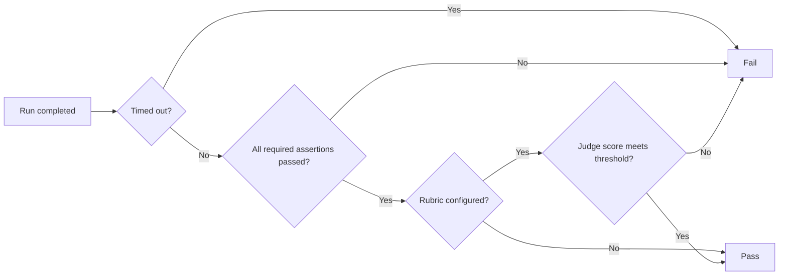

> For the complete documentation index, see [llms.txt](https://locus-3.gitbook.io/locus-docs/llms.txt). Markdown versions of documentation pages are available by appending `.md` to page URLs; this page is available as [Markdown](https://locus-3.gitbook.io/locus-docs/agent-teams/recovery-and-evaluation.md).

# Recovery & Evaluation

Resume interrupted work, run durable background services, and compare agent configurations safely.

Locus keeps long-running work recoverable and makes agent quality measurable without silently changing the source workspace.

## Recovery

Every team run is written to a local SQLite store before events reach the interface. The durable record includes timelines, attempts, dependencies, checkpoints, visible output, redacted tool evidence, routing decisions, usage, and errors. It excludes credentials, authorization headers, secure input, provider signatures, and hidden reasoning.

Locus checkpoints after dispatch validation, specialist waves, writer turns, review, revision, and synthesis. When an interrupted run is found, you can:

* **Resume** from the latest valid checkpoint.
* **Inspect** without spending tokens.
* **Discard Run** while leaving project files untouched.

If a required model, credential, profile, team, or checkout is missing, Runs shows a repair checklist instead of guessing.

## Job-level controls

| Control                              | What it does                                                                                |
| ------------------------------------ | ------------------------------------------------------------------------------------------- |
| **Pause at Safe Boundary**           | Cooperatively stops streams and cancellable tools, then writes a checkpoint.                |
| **Retry with Same Agent**            | Creates a new attempt and invalidates only dependent jobs.                                  |
| **Reassign**                         | Moves an eligible unfinished job to another member of the same team without raising access. |
| **Replay Same Baseline**             | Starts a comparable run from the original task state.                                       |
| **Duplicate from Current Workspace** | Starts from the project as it exists now.                                                   |
| **Stop Run**                         | Cancels active orchestration.                                                               |
| **Clean Up Managed Checkout**        | Separately removes an unused private checkout.                                              |

## Managed background services

Development servers, watchers, and queue workers should run as **managed services**, not as finite terminal commands. The service process belongs to the local backend, so stopping the chat task only stops the wait for readiness; it does not kill the server. A service keeps running until you press **Stop** beside it or quit Locus.

The screenshot shows two different launch attempts:

* **npm - Exited 127** is an earlier failed process retained for diagnostics. Use **Dismiss** to remove an exited row.
* **lumen-dev - green** is the active server on port 3000. **Stop** terminates its process group and removes the row immediately.
* Name and PID distinguish attempts even when they use the same port.

Locus verifies readiness by opening the requested port on both IPv4 loopback (`127.0.0.1`) and IPv6 loopback (`::1`). This matters for Vite-based servers that print `http://localhost:3000` but listen only on IPv6. Once either loopback address accepts a connection, the launch returns control to the agent; the agent can then open the URL in Browser for an application-level check.


A port accepting a connection proves that a listener exists, not that the app is correct. After readiness succeeds, verify the page in Browser and check recent service output for runtime errors.


## Evaluation Lab

Evaluation suites compare Solo and team configurations against fixed local fixtures. They measure quality, reliability, latency, model calls, tokens, estimated cost, patch size, retries, and failure categories without applying evaluation output to the source workspace.

### Suite controls

| Control                                     | Meaning                                                                                        |
| ------------------------------------------- | ---------------------------------------------------------------------------------------------- |
| **Add Suite**                               | Creates a local suite for the current workspace.                                               |
| **Import JSON**                             | Loads a portable suite definition and validates its workspace, cases, budgets, and assertions. |
| **Allow explicitly read-only MCP evidence** | Lets a case read from approved MCP tools; mutating MCP operations remain unavailable.          |
| **Pinned**                                  | Keeps successful disposable evaluation fixtures from age-based cleanup.                        |

A suite contains a name, description, tags, a read-only MCP policy, and one or more cases. Git workspaces receive managed fixed fixtures so repeated runs use the same baseline rather than the current moving source tree.

### Case configuration

| Field                    | Options and behavior                                                                                             |
| ------------------------ | ---------------------------------------------------------------------------------------------------------------- |
| **Mode**                 | **Coding** runs in a disposable managed worktree. **Read only** can inspect the source checkout without writing. |
| **Target**               | **Team** uses a selected team manifest. **Solo** uses one evaluation agent.                                      |
| **Timeout**              | 30 seconds to 120 minutes. A timeout is recorded as its own failure category.                                    |
| **Orchestration budget** | Caps jobs, rounds, model calls, concurrent calls, and hosted tokens.                                             |
| **Rubric**               | Optional natural-language quality criteria.                                                                      |
| **Blind judge**          | An eligible reviewer profile; provider, model, and agent identities are hidden from its prompt.                  |
| **Passing score**        | A 0-100 threshold applied when a subjective rubric score is produced.                                            |

### Deterministic assertions

A case can check:

* Command exit codes, with a bounded per-command timeout.
* Path existence or absence.
* Exact file content, substring matches, or regular expressions.
* Allowed and forbidden changed-path globs.
* JSON Pointer equality or minimal JSON Schema rules.
* Final visible output by substring or regular expression.

Each assertion can be **Required** or informational. A required failure hard-fails the case.

### How pass/fail is decided

A subjective score cannot override a deterministic failure. Non-required assertions remain visible as evidence but do not hard-fail the case.

### Reading results

Each result records pass/fail state, assertion evidence, changed paths, duration, retries, model calls, prompt and completion tokens, estimated cost, patch bytes, optional rubric score and reason, and one failure category: timeout, provider/runtime, deterministic assertion, or subjective rubric.

For a fair Solo-versus-team comparison, keep the fixture, prompt, assertions, rubric, threshold, timeout, and budget constant. Compare pass rate and rubric quality before comparing latency and cost, and repeat noisy cases.


Locus never automatically resumes a run, spends hosted tokens at startup, merges a team checkout, commits changes, applies evaluation output, or enables Computer Control in an evaluation.


## Optional telemetry

Telemetry exports completed team-run events as OTLP/HTTP JSON traces. It is independent of Evaluation Lab and off by default.

| Control                                           | Behavior                                                                                                                  |
| ------------------------------------------------- | ------------------------------------------------------------------------------------------------------------------------- |
| **Export completed team runs**                    | After the first durable completion event is processed, posts one trace for that run.                                      |
| **Collector endpoint**                            | Must be an absolute HTTP(S) URL. Remote collectors require HTTPS; loopback may use HTTP.                                  |
| **Authorization header**                          | Optional full header value stored separately in Locus's local credential store and sent only to the configured collector. |
| **Include visible conversation and tool content** | Adds the sanitized visible event payload to each span. This is a separate opt-in.                                         |

Metadata includes event operation, agent ID, run ID, sequence, schema version, timing, status, team name, and provider/model/job ID when present. Requests time out after 20 seconds and redirects are not followed.

Credentials, secure input, provider signatures, and hidden reasoning are excluded before export. Visible conversation and tool content is also sanitized and is sent only when its separate switch is enabled.
