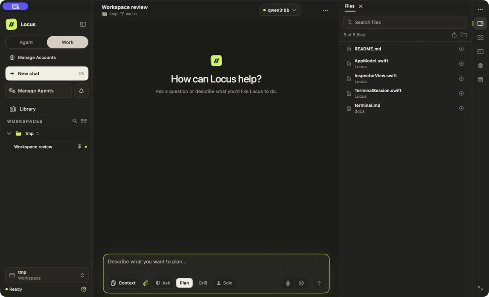

# Locus

Your models, projects, agents, and tools in one native macOS workspace.

Locus 2.6 brings conversations, files, a terminal, browser tabs, plans, recurring Agents, and saved deliverables together. Use local Ollama, an eligible ChatGPT plan, or a provider API account. Local Ollama is the default; Locus never silently switches to a paid account.

*The wallet-free workspace with demonstration data. The Files panel keeps project material beside the conversation.*

[Download Locus 2.6.0](https://github.com/nahid-sparktales/locus/releases/tag/v2.6.0) · [Product website](https://locushost.co) · [Release notes](release-notes.md)

## Start with the work you want to do

| Your task | Start here |
| --- | --- |
| Connect a model and complete your first request | [Getting Started](getting-started.md) |
| Work with project files, the browser, and a terminal | [Working in Locus](working-in-locus.md) |
| Search documents and keep deliverable versions | [Library, Documents & Outputs](working-in-locus/library-documents-and-outputs.md) |
| Run work on a schedule or incoming event | [Agents & Automation](working-in-locus/agents-and-automation.md) |
| Keep a chat working toward an objective | [Persistent Goals](working-in-locus/persistent-goals.md) |
| Plan with one model and implement with another | [Task Capsules](working-in-locus/task-capsules.md) |
| Delegate to helpers or a configured team | [Agent Teams](agent-teams.md) |
| Reuse private profile details with explicit review | [Identity Vault](safety-and-privacy/identity-vault.md) |

## What is new in 2.6

**Agents have a clearer home.** Search configured Agents, review instructions and triggers, inspect connection health, and follow exact runs. Connections and shared Runtime settings have their own sections. Reusable model profiles are labeled **Specialists & teams**.

**Answers and files are easier to use.** Structured answers can show file collections, writing drafts, deliverables, and source references. Writing drafts support editing, copying, recovery of the original, and export. Tables can copy or export all rows even when their display is collapsed. Files browses generated folders and all file types, with path search and an explicit hidden-file control.

**Longer work keeps its context.** Persistent goals, saved Task Capsules, the workspace Library, and versioned Outputs carry progress between turns. The current release also includes clearer compact controls and more reliable mobile transcript refresh.

## Requirements and editions

Use an Apple Silicon Mac running macOS 14 or later. Packaged apps include the agent runtime. Local Ollama and model weights are separate installations; hosted accounts use their own access and billing.

**Locus is wallet-free.** Wallet functionality belongs to the separate **LocusX** edition. Identity Vault is a private profile-and-document feature and does not provide cryptocurrency wallets. Installing Locus preserves existing Locus chats, accounts, settings, and browser data; it does not import or delete wallet data.

These docs describe the **2.6.0 release**. This release uses **manual app updates**. See [Install Locus](getting-started/install-locus.md) before upgrading an older installation.

Screenshots use demonstration data. Your selected model, files, and activity will differ.
