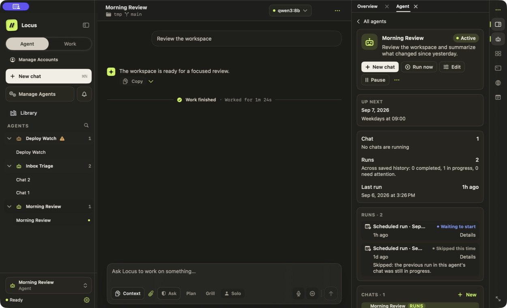

# Mobile, Schedules & Background Work

Continue work from your phone, schedule tasks, and supervise durable background activity.

Locus can continue work through its local runtime while the app remains running. The mobile companion connects directly to that Mac.

## Scheduled Agents

Open **Manage Agents** to create a schedule and review its instructions, model, cadence, and workspace. Each scheduled Agent owns a stable primary conversation across runs. Its Agent panel shows controls, the next occurrence, and recorded runs. Use Pause or Run now as needed; the mobile companion also supports schedule controls.

*Demonstration data. Enabled status and actual running chats are shown separately.*

Use **Activity** for recent records and **Attention** for decisions or recoveries. See [Agents & Automation](agents-and-automation.md) for event triggers, connected-service access, and workflows.

Locus must be running and the Mac available for scheduled work to execute. Closing a window is different from quitting the app. The schedule is not a hosted cloud worker.

## Managed background services

Use managed background services for dev servers, watchers, and queue workers that should outlive a single agent turn. They appear above Terminal, remain associated with their workspace, and stop only when you explicitly stop them or the owning backend quits.

## Locus Mobile

Mobile Access is off by default. When enabled, Locus creates a private TLS gateway on your Mac and pairs an iOS or Android device with a five-minute, one-use code. The companion pins the Mac certificate and connects over your LAN or Tailscale; there is no Locus cloud relay.

The companion can:

* create and continue chats;
* follow streaming work;
* stop runs;
* answer one-time approvals; and
* run or pause schedules.

Terminal, Browser, file editing, permanent permissions, provider settings, and destructive session actions remain Mac-only. Provider credentials and local agent ports are never exposed to the phone.
